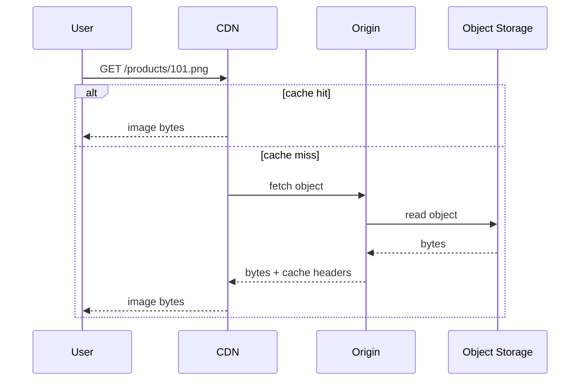
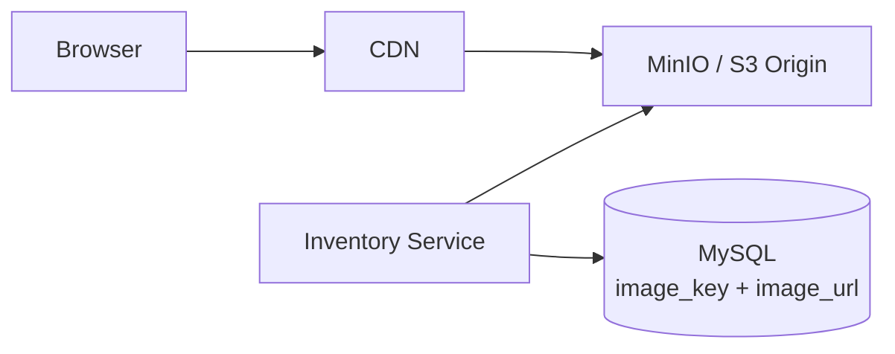

# Content Delivery Network

A Content Delivery Network is a geographically distributed edge network that
caches and serves content closer to users.

CDNs reduce latency, reduce origin load, improve availability for static
content, and absorb traffic spikes.

## CDN Flow



## What To Serve Through CDN

Good CDN candidates:

- product images;
- static frontend assets;
- CSS, JavaScript, fonts;
- public documents;
- downloadable files;
- cacheable public API responses.

Poor CDN candidates:

- highly personalized responses;
- sensitive user data;
- write operations;
- frequently changing data without invalidation strategy.

## Cache Hit And Miss

| Term | Meaning |
|---|---|
| cache hit | CDN already has object and serves it |
| cache miss | CDN fetches object from origin |
| origin | source system such as MinIO, S3, or application server |
| TTL | how long CDN can keep cached content |
| invalidation | removing/refreshing stale CDN content |

## Cache-Control Example

```http
Cache-Control: public, max-age=86400
```

This means public caches may store the response for 24 hours.

For versioned assets:

```text
/assets/app.a8f31c.js
/products/101-v3.png
```

long TTLs are safer because a new URL is generated when content changes.

## CDN With Object Storage



Shopverse currently serves product images directly from MinIO in local Docker.
Production-style design would put a CDN in front of object storage and store
the CDN URL in product metadata.

## Public Versus Private Content

| Content | Suggested approach |
|---|---|
| public product images | public CDN URL |
| invoices | private object + presigned URL |
| user documents | authenticated backend or signed CDN URL |
| static JS/CSS | public CDN with long TTL |

Do not make private user data publicly cacheable.

## CDN Failure Considerations

Design questions:

- What happens if origin is down?
- Can CDN serve stale content temporarily?
- How are bad deployments invalidated?
- Are signed URLs required?
- Is cache poisoning possible?
- Are headers consistent across services?

## Interview Questions

<ExpandableAnswer title="How Does CDN Improve Latency?">

It serves content from an edge location closer to the user, reducing network
round trips to the origin.

</ExpandableAnswer>
<ExpandableAnswer title="How Does CDN Reduce Origin Load?">

Repeated requests for the same object are served from cache, so the origin
receives fewer requests.

</ExpandableAnswer>
<ExpandableAnswer title="What Is Cache Invalidation?">

Invalidation removes stale content from CDN caches before TTL expiry. It is
useful for urgent updates but can be expensive or rate-limited.

</ExpandableAnswer>
## References

- [Content Delivery Network in System Design - GeeksforGeeks](https://www.geeksforgeeks.org/system-design/what-is-content-delivery-networkcdn-in-system-design/)
