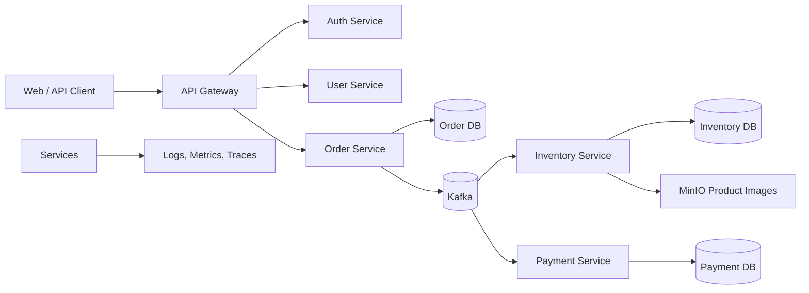

# Introduction To High-Level Design

High-Level Design describes the architecture of a system before implementation
details are finalized. It explains major components, responsibilities,
communication, data ownership, scaling approach, failure handling, and
trade-offs.

HLD is not a class diagram and it is not a code package structure. It is a
system-level design artifact.

## What HLD Answers

| Question | Example answer |
|---|---|
| What are the main components? | API Gateway, Auth, Order, Inventory, Payment, Kafka, databases |
| How do components communicate? | REST through Gateway, Kafka for SAGA events |
| Who owns data? | Order owns orders; Inventory owns stock; Payment owns payment records |
| How does the system scale? | horizontal service replicas, Kafka partitions, database tuning |
| How does the system fail safely? | retries, outbox, DLT, compensation, idempotency |
| How is it secured? | JWT, Gateway security, method security, resource ownership |
| How is it observed? | logs, metrics, traces, dashboards, correlation IDs |

## HLD Inputs

Before drawing architecture, collect:

1. functional requirements;
2. non-functional requirements;
3. traffic and capacity assumptions;
4. data model and ownership;
5. consistency requirements;
6. external integrations;
7. security and compliance constraints;
8. operational requirements.

Skipping this step usually creates architecture that looks impressive but does
not solve the actual problem.

## HLD Output

A useful HLD normally includes:

- context diagram;
- component/container diagram;
- request/event flow;
- API boundary summary;
- database and data ownership summary;
- cache/search/queue choices;
- availability and failure strategy;
- scaling and capacity assumptions;
- observability and deployment strategy;
- trade-offs and rejected alternatives.

## Example: Shopverse HLD

This diagram answers:

- Gateway is the public entry point.
- Services own separate databases.
- Checkout uses Kafka for choreography SAGA.
- Product images are stored in object storage.
- Observability is cross-cutting.

## HLD Design Process

Use this order:

1. clarify requirements;
2. estimate capacity;
3. define APIs and external contracts;
4. identify services and ownership;
5. choose storage and communication patterns;
6. define consistency guarantees;
7. define availability and failure handling;
8. define security and observability;
9. document trade-offs.

## Common HLD Mistakes

| Mistake | Better approach |
|---|---|
| starting with microservices | start with business capabilities and data ownership |
| drawing every component in one diagram | use multiple readable diagrams |
| ignoring NFRs | define latency, availability, consistency, scale |
| choosing Kafka everywhere | use async only where it solves coupling/failure/scale |
| ignoring failure flows | design retry, timeout, compensation, replay |
| no ownership boundaries | every data entity must have an owning service |

## HLD Interview Template

<ExpandableAnswer title="What should an architect explain about Introduction To High-Level Design?">

For **Introduction To High-Level Design**, a strong answer starts with the runtime responsibility and the invariant that must remain true. It then walks through one Shopverse request or event, names the important boundary, and explains the failure behavior rather than describing only the happy path. Close with the trade-off, the production signal that verifies the design, and the condition that would justify a different approach. This structure demonstrates practical judgment without memorizing isolated definitions.

</ExpandableAnswer>

For most system-design interviews:

1. Requirements
2. Capacity estimates
3. APIs
4. Data model
5. High-level architecture
6. Deep dive into one or two components
7. Scaling strategy
8. Reliability and failure handling
9. Security
10. Observability
11. Trade-offs

## References

- [Introduction to High Level Design - GeeksforGeeks](https://www.geeksforgeeks.org/system-design/what-is-high-level-design-learn-system-design/)
