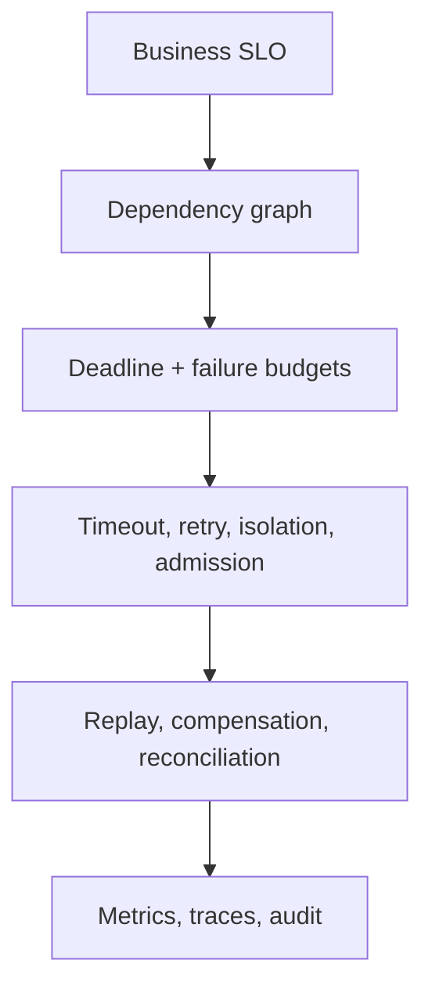

# Microservices Architect Path

<DocLabels items={[
  {label: 'Lead and architect', tone: 'advanced'},
  {label: 'Production trade-offs', tone: 'production'},
  {label: 'Decision framework', tone: 'shopverse'},
]} />

## Decision Stack

| Decision | Required question | Evidence |
|---|---|---|
| boundary | who owns policy and writes? | change coupling and invariant map |
| synchronous call | what answer is required now? | shared deadline and availability budget |
| event | what durable fact was accepted? | replay, ordering and schema contract |
| consistency | what may be temporarily inconsistent? | user-visible state machine and reconciliation |
| resilience | where is overload rejected? | pool, queue and retry metrics |
| observability | can one request/event be reconstructed? | trace, correlation, lag and audit evidence |
| platform | what is standardized versus service-owned? | paved-road contract and escape hatch |

## Avoid These Architecture Smells

- chatty synchronous request chains;
- retries at gateway, client and service simultaneously;
- events without ownership, versioning or replay policy;
- shared database writes disguised by repository modules;
- central “orchestrator” containing every domain decision;
- dashboards without customer-impact and saturation signals.

## Migration Rule

Change one boundary at a time behind a stable application port. Preserve contract
tests, dual-run only with an explicit source of truth, define rollback, and remove
the old path after traffic and reconciliation evidence agree.

## Interview Question

**How do you prevent one slow service from exhausting the whole call chain?**

<ExpandableAnswer title="Expand architect answer">

Propagate an end-to-end deadline, allocate smaller downstream time budgets, bound
connections/threads/queues, retry only safe transient failures within the remaining
budget, isolate bulkheads, and shed load before saturation. A circuit breaker reduces
repeated calls after failure detection but does not replace capacity controls.

</ExpandableAnswer>

## Official References

- [OpenTelemetry concepts](https://opentelemetry.io/docs/concepts/)
- [Kubernetes Services](https://kubernetes.io/docs/concepts/services-networking/service/)

## Recommended Next

Practise failure reasoning in [Microservices Incident Labs](./MICROSERVICES-INCIDENT-LABS.md).
