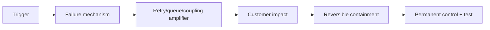

# Microservices Production Incident Labs

<DocLabels items={[
  {label: 'Incident labs', tone: 'production'},
  {label: 'Causal evidence', tone: 'advanced'},
  {label: 'Shopverse', tone: 'shopverse'},
]} />

| Lab | Symptoms | Hidden mechanism | Required control |
|---|---|---|---|
| retry storm | moderate CPU, exploding downstream RPS | retries multiplied at three layers | one retry owner, jitter, budget, admission |
| Kafka lag | growing lag and DB pool saturation | replay exceeds consumer completion rate | rate-limited replay and capacity alignment |
| partial checkout | payment succeeds, order remains pending | ambiguous acknowledgement after timeout | idempotency, reconciliation, state machine |
| ownership drift | deployments require coordinated schema changes | services write shared tables | exclusive write owner and contract migration |

## Lab Method

1. State impact and the first bad signal on a timeline.
2. Draw the request/event dependency graph and mark scarce resources.
3. Separate trigger, mechanism, amplifier, and missing control.
4. Choose reversible containment with explicit stop conditions.
5. Prove recovery through customer SLO, queue drain, correctness and reconciliation.
6. Add a failure test, operational alert, owner and review date.

## Interview Question

**Consumer lag is rising. Should you immediately add consumers?**

<ExpandableAnswer title="Expand architect answer">

First compare arrival and completion rates, partition count, processing latency,
database/remote saturation and rebalance errors. Concurrency cannot exceed useful
partition parallelism and may overload the real bottleneck. Contain replay/admission,
fix the constrained stage, then scale with measured spare downstream capacity.

</ExpandableAnswer>

## Official References

- [Kafka consumer design](https://kafka.apache.org/documentation/#consumerapi)
- [Kubernetes debugging](https://kubernetes.io/docs/tasks/debug/debug-application/)

## Recommended Next

Use [Microservices Interview Workbook](./MICROSERVICES-INTERVIEW-WORKBOOK.md) to defend the decisions.
