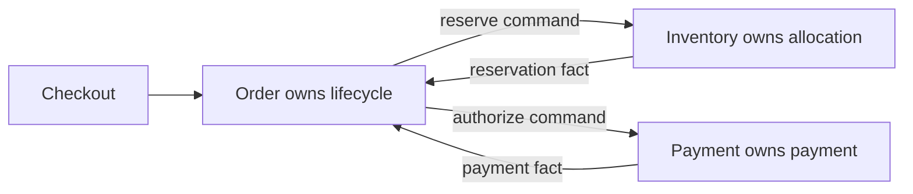

# Service Boundaries And Data Ownership

<DocLabels items={[
  {label: 'Boundary design', tone: 'advanced'},
  {label: 'Data ownership', tone: 'production'},
  {label: 'Shopverse', tone: 'shopverse'},
]} />

## Boundary Tests

| Test | Healthy signal | Warning signal |
|---|---|---|
| business capability | one vocabulary and policy owner | “utility service” grouping unrelated behavior |
| transaction | local invariant commits together | routine cross-service ACID requirement |
| data | one service owns writes | shared tables or direct foreign-schema updates |
| change cadence | deployable independently | coordinated releases for ordinary changes |
| failure | degraded behavior is explicit | one unavailable service stops the entire graph |
| team ownership | one accountable team | every feature touches every team |

## Extraction Sequence

1. Identify the capability and invariants before selecting a framework.
2. Create an application port inside the monolith and route existing callers through it.
3. Assign authoritative tables and forbid new cross-boundary writes.
4. Introduce a versioned API/event contract and idempotency behavior.
5. Move reads through an API or local projection; remove shared joins deliberately.
6. Extract deployment only after ownership and observability are clear.

<DocCallout type="mistake" title="A database per service is an ownership rule">

Separate physical servers are not required on day one. The invariant is exclusive
write ownership and no hidden cross-schema coupling. Physical isolation can follow
when scaling, blast radius, compliance, or team autonomy justifies it.

</DocCallout>

## Interview Question

**When should two candidate services remain one service?**

<ExpandableAnswer title="Expand architect answer">

Keep them together when they share one language and owner, require frequent atomic
invariants, change together, and gain little independent scaling or isolation.
Premature separation converts local calls and transactions into network contracts,
partial failure and operational overhead without delivering autonomy.

</ExpandableAnswer>

## Official References

- [Microsoft domain analysis guidance](https://learn.microsoft.com/azure/architecture/microservices/model/domain-analysis)

## Recommended Next

Continue with [Microservices Architect Path](./MICROSERVICES-ARCHITECT-PATH.md).
