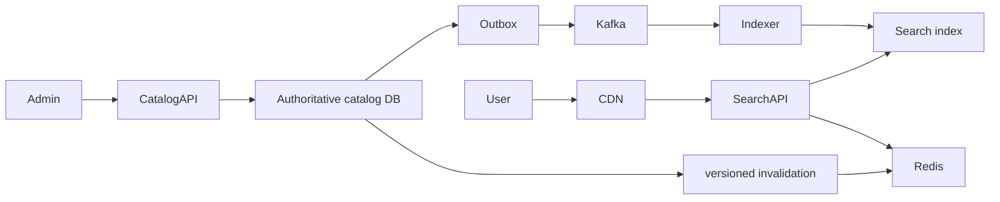

# Catalog And Search System Design

<DocLabels items={[
  {label: 'System-design capstone', tone: 'advanced'},
  {label: 'Read scale', tone: 'production'},
  {label: 'Shopverse catalog', tone: 'shopverse'},
]} />

Assume 20 million products, 100,000 browse/search requests/s peak, 200 product
updates/s, p95 search under 200 ms, and projection freshness under 30 seconds.
Search is a derived read model; product and accepted checkout price remain under
authoritative transactional ownership.

| Concern | Decision |
|---|---|
| writes | validate and commit product/version plus outbox atomically |
| search | denormalized index optimized for query/filter/rank |
| cache | cache-aside for hot product views with version/TTL/invalidation |
| freshness | measurable event-to-visible SLO, not “eventually consistent” |
| checkout | revalidate current price/availability at authoritative boundary |
| recovery | rebuild index from source snapshot plus ordered change catch-up |

Protect administrative writes with strong authentication, least privilege, audit
and four-eyes controls for sensitive bulk changes. Treat search queries as untrusted,
bound complexity and page depth, and prevent private/unpublished products from
entering public projections.

Monitor query latency by shape, cache hit/load, indexing lag, rejected mappings,
document-count/version drift, zero-result rate and rebuild progress.

**How do you deploy a breaking search mapping change?**

<ExpandableAnswer title="Expand architect answer">

Create a versioned index, backfill from the authoritative source, catch up changes,
compare counts and representative queries, then switch an alias atomically. Keep the
old index for rollback during a bounded window. Never mutate a live incompatible
mapping and hope every document reindexes correctly.

</ExpandableAnswer>

## Canonical Detail

- [Data pipelines and search operations](../../data/DATA-PIPELINES-SEARCH-OPERATIONS.md)
- [Catalog lookup during checkout](../../reliability/problems/runtime/CATALOG-LOOKUP-CHECKOUT.md)

## Official References

- [Elasticsearch aliases](https://www.elastic.co/docs/manage-data/data-store/aliases)

## Recommended Next

Return to the [Shopverse Capstones](./README.md) and practise the interview rubric.
