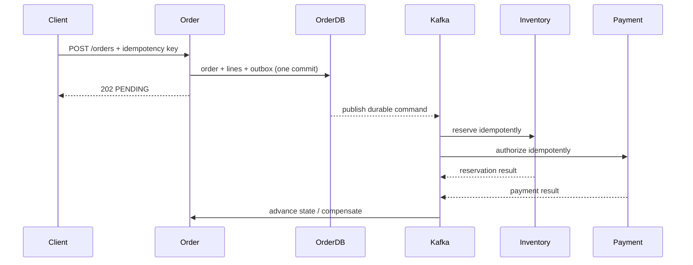

# Checkout And Order System Design

<DocLabels items={[
  {label: 'System-design capstone', tone: 'advanced'},
  {label: 'Distributed checkout', tone: 'production'},
  {label: 'Shopverse', tone: 'shopverse'},
]} />

## Requirements And Capacity

Assume 2 million monthly buyers, 250 orders/s peak, 3× flash-sale burst, 5 order
lines average, p95 acceptance under 500 ms, and no duplicate accepted order per
idempotency key. At 750 orders/s, the order write path produces roughly 3,750 line
rows/s plus one order and outbox record per request; size database and Kafka from
measured bytes, indexes, replication and retention rather than request count alone.

## Decisions

| Concern | Decision | Reason |
|---|---|---|
| acknowledgement | `202 PENDING` after local durable commit | remote calls cannot be atomic with order DB |
| duplicate request | unique customer/idempotency key + stored response | retry returns same logical order |
| publication | transactional outbox | no DB-commit/event-loss window |
| progress | explicit order state machine | visible convergence and terminal failure |
| recovery | idempotent consumers + compensation + reconciliation | handles duplicate and ambiguous outcomes |

Security requires authenticated subject, server-derived customer ownership, price
revalidation, bounded request body, rate limits and audit events without payment
or token leakage. Observe acceptance latency separately from completion latency,
plus outbox age, consumer lag, state age, compensation and reconciliation counts.

## Evolution

Start as one modular transaction for order creation. Introduce ports, outbox and
state machine before extracting services. Move Inventory and Payment behind stable
commands only when ownership/scaling/isolation benefits justify distributed failure.

**Why not keep the HTTP request open until payment and inventory finish?**

<ExpandableAnswer title="Expand architect answer">

It couples user latency and Order capacity to two remote tail latencies and failure
budgets. Async acceptance provides durable progress and recovery. A synchronous
design can work at small scale, but needs one deadline, idempotent downstream calls,
clear ambiguous-outcome handling and no claim of cross-service atomicity.

</ExpandableAnswer>

## Canonical Detail

- [Shopverse whole-system design](../SYSTEM-DESIGN.md)
- [Distributed checkout problem](../../reliability/problems/runtime/DISTRIBUTED-CHECKOUT.md)
- [Idempotent checkout](../../reliability/problems/runtime/IDEMPOTENT-CHECKOUT.md)

## Official References

- [Kafka design](https://kafka.apache.org/documentation/#design)

## Recommended Next

Continue with [Inventory Reservation Design](./INVENTORY-RESERVATION-DESIGN.md).
