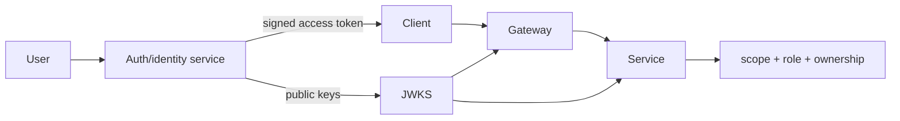

# Identity And Access System Design

<DocLabels items={[
  {label: 'System-design capstone', tone: 'advanced'},
  {label: 'Identity boundary', tone: 'production'},
  {label: 'Shopverse access', tone: 'shopverse'},
]} />

Assume 10 million accounts, login peak 1,000/s, ordinary authenticated API traffic
50,000/s, access-token lifetime 10 minutes, and key rotation without downtime.
Password hashing capacity belongs on the login path; resource-server validation
must remain local/cached so ordinary traffic does not query the account database.

| Decision | Control |
|---|---|
| login | adaptive password hash, generic errors, rate/abuse controls |
| token | issuer, audience, expiry, allowed algorithm, minimal claims |
| keys | managed private key, distinct `kid`, overlapping public-key rotation |
| authorization | gateway coarse policy; service request, method and ownership policy |
| revocation | short lifetime plus risk-based deny/version or introspection strategy |
| service identity | separate workload credential, never shared user token by default |

Observe login failures without account enumeration, hash latency, token-validation
reasons, unknown `kid`, denied ownership, key age and rotation drill results. Threats
include credential stuffing, token theft, signing-key exposure, confused deputy,
cross-tenant access and excessive administrator privilege.

**Why not call the identity service for every API request?**

<ExpandableAnswer title="Expand architect answer">

It centralizes immediate policy but adds latency, cost and a platform-wide availability
dependency. Locally validated short-lived JWTs scale well but accept claims until
expiry unless additional revocation/version controls exist. Choose from revocation
SLA and risk; cache safely and fail closed when required evidence expires.

</ExpandableAnswer>

## Canonical Detail

- [Security learning guide](../../security/README.md)
- [Spring Security learning guide](../../security/SPRING-SECURITY-GENERIC.md)

## Official References

- [OAuth 2.0 Security BCP](https://www.rfc-editor.org/rfc/rfc9700)

## Recommended Next

Continue with [Catalog And Search Design](./CATALOG-SEARCH-DESIGN.md).
