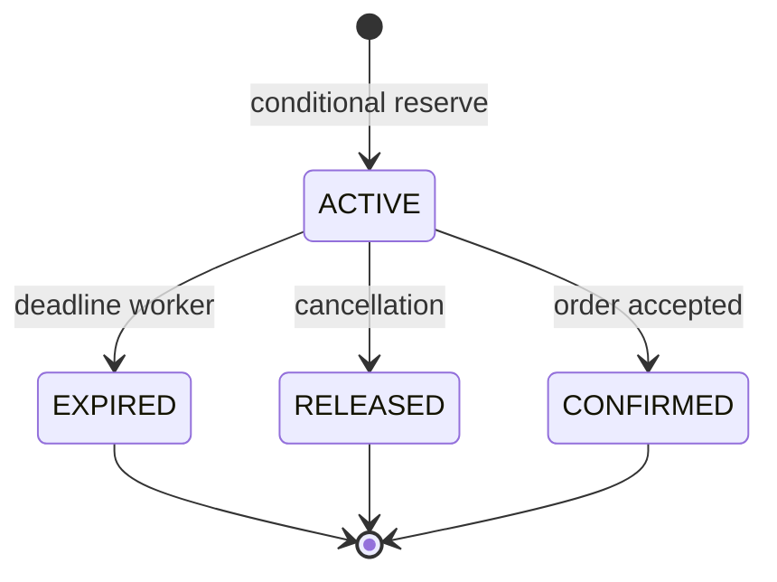

# Inventory Reservation System Design

<DocLabels items={[
  {label: 'System-design capstone', tone: 'advanced'},
  {label: 'Concurrency control', tone: 'production'},
  {label: 'Shopverse inventory', tone: 'shopverse'},
]} />

## Invariant And Load

The authoritative invariant is `available >= 0` for each stock pool. Assume 750
checkout attempts/s peak, five lines/order, and a hot SKU receiving 20% of demand:
up to 750 reservation-line attempts/s may target one row/key. Average throughput
therefore hides the contention design problem.

## Write Model

Use one authoritative database transaction to conditionally decrement availability
and insert a reservation keyed by order/line or event id. Duplicate commands return
the stored result. Expiry workers claim bounded batches with database ownership or
partition ownership; release is an idempotent state transition. Redis may serve
availability hints but cannot promise allocation unless it owns the invariant.

| Failure | Control |
|---|---|
| concurrent hot-SKU requests | atomic conditional update/optimistic retry or serialized partition |
| duplicate event | unique idempotency key and stored outcome |
| expiry worker crash | lease/claim plus retryable state transition |
| confirmation arrives after expiry | explicit late-event policy and reconciliation |
| stale catalog availability | label as hint; validate on reserve |

Observe reservation latency, conflict/retry rate, hot-key distribution, active
reservation age, expiry backlog, negative-stock invariant and reconciliation drift.

**Would partitioning Kafka by SKU solve overselling?**

<ExpandableAnswer title="Expand architect answer">

It can serialize commands for a SKU within one well-operated topic/consumer path,
but database writers, replays and alternate paths must preserve the same invariant.
Partition ordering is an execution aid, not the source-of-truth constraint. Keep an
atomic database guard and design hot-partition capacity and recovery.

</ExpandableAnswer>

## Official References

- [PostgreSQL explicit locking](https://www.postgresql.org/docs/current/explicit-locking.html)

## Recommended Next

Continue with [Payment Reliability Design](./PAYMENT-RELIABILITY-DESIGN.md).
