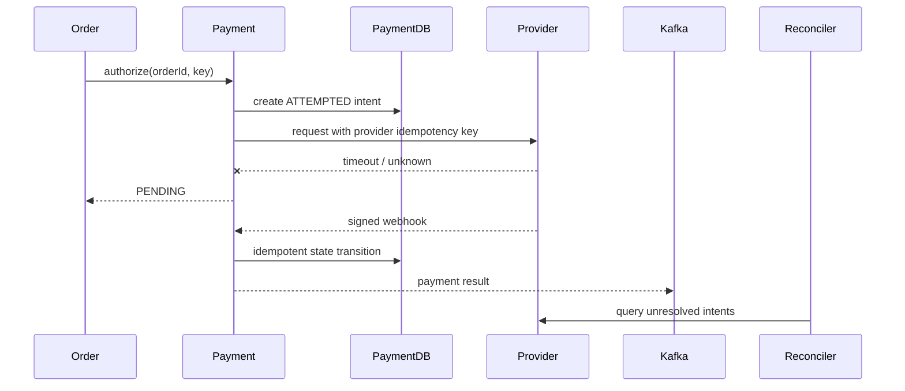

# Payment Reliability System Design

<DocLabels items={[
  {label: 'System-design capstone', tone: 'advanced'},
  {label: 'Financial correctness', tone: 'production'},
  {label: 'Shopverse payment', tone: 'shopverse'},
]} />

Assume 250 payment attempts/s peak, provider p99 of 2 seconds, callbacks delayed up
to minutes, and a requirement that one order is captured at most once. A timeout
means “outcome unknown,” not failure.

| Boundary | Control |
|---|---|
| client/order retry | stable order/payment idempotency key |
| provider request | provider-supported idempotency key |
| webhook | signature, timestamp/replay defense, event uniqueness |
| state | append evidence plus guarded transition; never overwrite history blindly |
| ambiguity | `PENDING/UNKNOWN`, provider query, reconciliation |
| money | integer minor units, currency, immutable accepted amount |

Isolate payment credentials, minimize sensitive data, never log authorization
headers or payment instruments, and audit operator adjustments. Monitor unresolved
intent age, duplicate callbacks, provider outcome mismatch, reconciliation repair,
and payment/order state divergence—not only HTTP success rate.

**Should a timeout trigger an immediate second payment request?**

<ExpandableAnswer title="Expand architect answer">

Only with the same provider idempotency key and a provider contract guaranteeing
safe retry. Otherwise the first request may have succeeded. Record the ambiguous
intent, query or await a verified callback, reconcile, and keep customer/order state
pending rather than creating a second financial effect.

</ExpandableAnswer>

## Canonical Detail

- [Payment timeout reconciliation](../../reliability/problems/runtime/PAYMENT-TIMEOUT-RECONCILIATION.md)
- [Late payment after expiry](../../reliability/problems/runtime/LATE-PAYMENT-AFTER-EXPIRY.md)

## Official References

- [PCI DSS document library](https://www.pcisecuritystandards.org/document_library/)

## Recommended Next

Continue with [Identity And Access Design](./IDENTITY-ACCESS-DESIGN.md).
