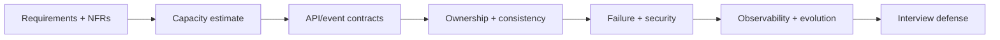

# Shopverse System-Design Capstones

<DocLabels items={[
  {label: 'Architect capstones', tone: 'advanced'},
  {label: 'Interview ready', tone: 'production'},
  {label: 'Shopverse', tone: 'shopverse'},
]} />

Each capstone follows one reasoning chain and links to canonical implementation
guides instead of repeating framework mechanics.

<TopicCards items={[
  {title: 'Checkout And Orders', href: './CHECKOUT-ORDER-DESIGN', description: 'Design idempotent acceptance, saga progress and customer-visible recovery.', icon: 'route', tags: ['Saga', 'Outbox']},
  {title: 'Inventory Reservation', href: './INVENTORY-RESERVATION-DESIGN', description: 'Prevent overselling with reservation, expiry and reconciliation.', icon: 'boxes', tags: ['Concurrency', 'Consistency']},
  {title: 'Payment Reliability', href: './PAYMENT-RELIABILITY-DESIGN', description: 'Handle timeouts, webhooks, idempotency and financial reconciliation.', icon: 'security', tags: ['Ledger', 'Recovery']},
  {title: 'Identity And Access', href: './IDENTITY-ACCESS-DESIGN', description: 'Design login, token issuance, authorization and key operations.', icon: 'security', tags: ['JWT', 'OAuth2']},
  {title: 'Catalog And Search', href: './CATALOG-SEARCH-DESIGN', description: 'Separate authoritative catalog writes from scalable search projections.', icon: 'network', tags: ['Search', 'CDC']},
]} />

## Interview Deliverable

For every design state assumptions, calculate an order-of-magnitude load/storage
model, draw the critical path, assign write ownership, define acknowledgement,
model degraded states, identify abuse cases, choose signals, and explain how the
architecture evolves without a big-bang rewrite.

## Capstone Working Method

1. Clarify actors, commands, queries, money/stock/security invariants, and what the
   initial acknowledgement promises.
2. Estimate peak requests, writes, event volume, hot keys, storage and bandwidth.
   Keep assumptions visible and use ranges when product data is unknown.
3. Draw the critical synchronous path separately from asynchronous convergence.
4. Assign one write owner per aggregate and name every derived projection.
5. Walk duplicate, delayed, reordered, timed-out and partially committed outcomes.
6. Add abuse cases and least-privilege identity at each trust boundary.
7. Define customer SLOs, saturation signals, reconciliation evidence and rollback.

## Architect Assessment Rubric

| Dimension | Weak answer | Strong answer |
|---|---|---|
| requirements | starts drawing services | clarifies invariants, scale and acknowledgement |
| capacity | says “autoscale” | estimates load and identifies hot/constrained resources |
| consistency | names CAP/saga | maps each invariant, stale window and repair path |
| reliability | adds retries | budgets deadlines and designs idempotency/reconciliation |
| security | says JWT/HTTPS | models identity, ownership, secrets and abuse cases |
| evolution | proposes final architecture | provides incremental migration and rollback evidence |

<DocCallout type="tip" title="State assumptions before defending a component">

An interview design is not judged on matching one hidden diagram. A strong answer
makes assumptions testable, explains why a component satisfies a requirement, and
changes the design coherently when the interviewer changes scale or consistency.

</DocCallout>

**Should every capstone use Kafka, Redis, and microservices?**

<ExpandableAnswer title="Expand architect answer">

No. Begin with the simplest architecture that satisfies scale, ownership and failure
requirements. Add Kafka for durable asynchronous contracts/replay, Redis for a
measured latency or load constraint, and service separation for autonomy/isolation.
Each addition creates an operational and consistency cost that must be justified.

</ExpandableAnswer>

## Official References

- [AWS Well-Architected Framework](https://docs.aws.amazon.com/wellarchitected/latest/framework/welcome.html)

## Recommended Next

Begin with [Checkout And Order Design](./CHECKOUT-ORDER-DESIGN.md).
