# Fifteen System Design Visual Blueprints

These are educational starting points, not claims about a named company's private
architecture. Every diagram needs requirements, estimates, schemas, failure tests,
and rejected alternatives from the [case-study workbook](./CASE-STUDY-WORKBOOK.md).

## 1. URL Shortener

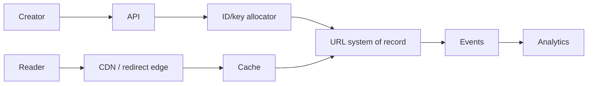

The database owns key-to-target mapping; cache and analytics are derived. Protect
against enumeration, malicious destinations, hot links, and expiration races.

## 2. Distributed Rate Limiter

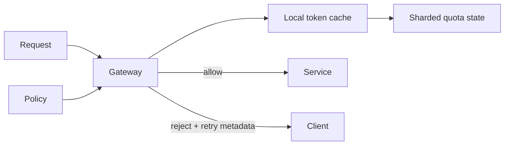

Define quota identity, burst, refill, regional allocation, clock behavior, and
whether temporary over-admission or unavailability is preferred during partition.

## 3. Notification Service

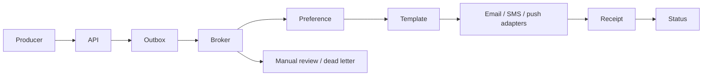

Use a stable notification identity, preference snapshot policy, provider idempotency,
bounded retries, receipts, suppression, and channel-specific rate limits.

## 4. Distributed Scheduler

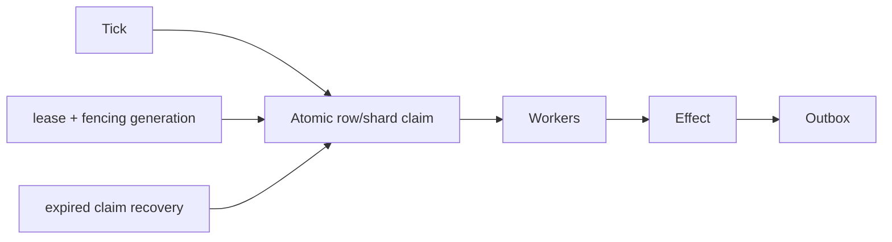

Claims own records, not merely method execution. Remote effects remain idempotent
and stale workers are rejected using claim tokens/fencing.

## 5. WhatsApp-Like Chat

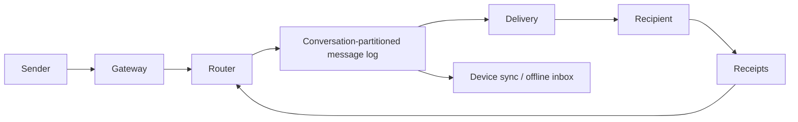

Preserve per-conversation order, stable message IDs, durable history, device cursors,
bounded presence, reconnect replay, encryption key lifecycle, and hot-group handling.

## 6. Social Feed

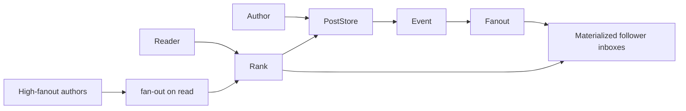

Use a hybrid fan-out model, cursor-based pagination, deletion propagation, ranking
versioning, and isolation for celebrity traffic.

## 7. Video Streaming

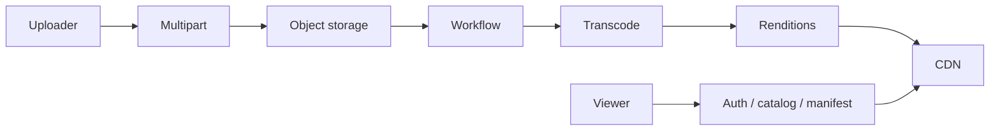

Separate control and media planes. Track resumable upload state, idempotent workflow
steps, codec/bitrate renditions, signed playback, origin shielding, and rights.

## 8. Uber-Like Ride Matching

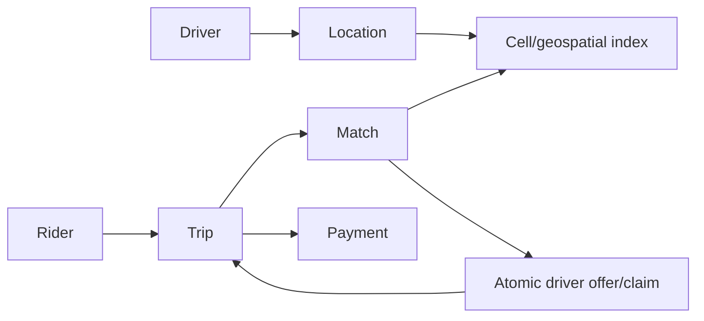

Location is ephemeral and high-volume; trip and payment state are durable. Candidate
search is not assignment—the atomic claim decides the winner.

## 9. Web Search

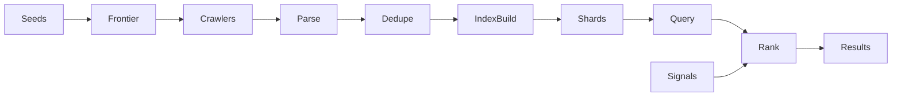

Bound politeness and crawl traps, canonicalize/deduplicate content, publish versioned
index segments, isolate query latency, and evaluate ranking on labeled queries.

## 10. Dropbox-Like File Sync

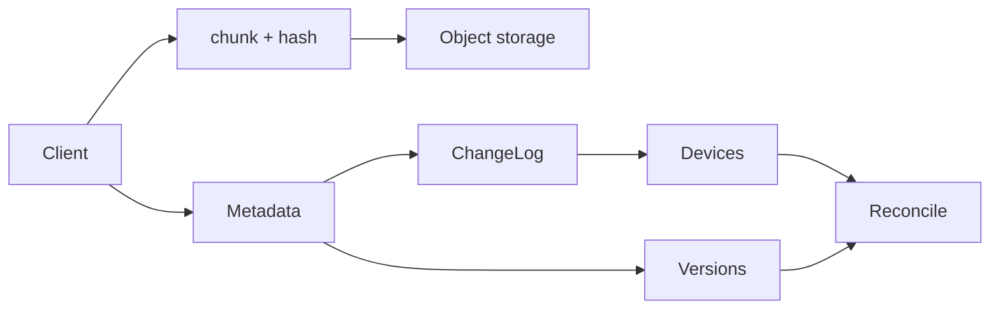

Metadata owns paths, versions and authorization; blobs own immutable bytes. Handle
offline conflicts, resumable chunks, dedupe privacy, tombstones and device cursors.

## 11. Gmail-Like Mail

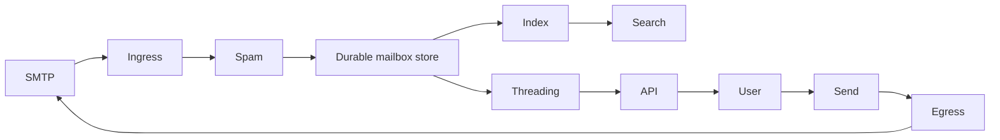

Separate durable delivery from searchable projections. Define message identity,
threading, quota, spam decisions, attachment storage and outbound retry semantics.

## 12. Stripe-Like Payment Ledger

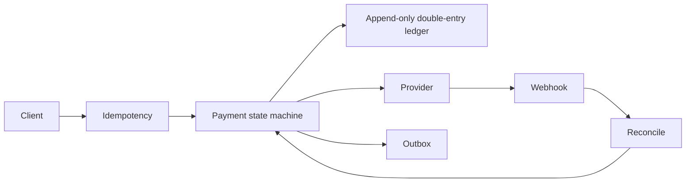

The ledger and payment state are authoritative. Treat provider timeouts as unknown,
reconcile by stable IDs, constrain transitions, and never use cache-only deduplication.

## 13. Amazon-Like Commerce

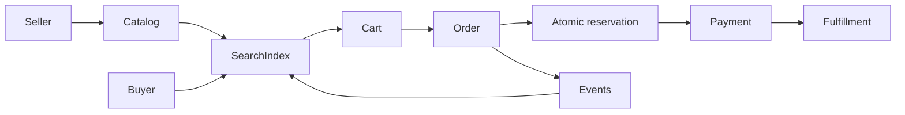

Search is derived; checkout revalidates price and stock. Model reservation expiry,
idempotent payment, saga compensation, seller isolation and order history.

## 14. Discord/Zoom-Like Realtime Media

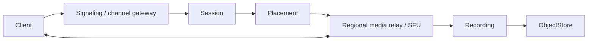

Separate durable chat/session metadata, signaling connections and high-bandwidth
media. Design regional placement, reconnect, permissions, congestion and recording.

## 15. Metrics And Logging Platform

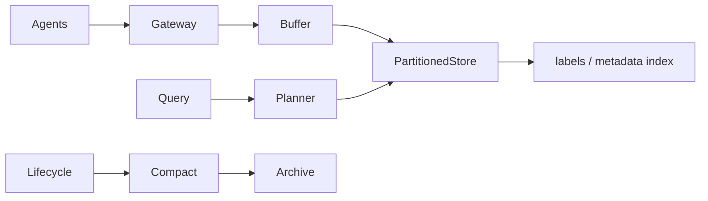

Bound label cardinality, batch/compress ingestion, partition by time and tenant,
apply retention, isolate expensive queries, and preserve backpressure under bursts.

## Official References

- [Google SRE Book](https://sre.google/sre-book/table-of-contents/)
- [AWS Well-Architected Framework](https://docs.aws.amazon.com/wellarchitected/latest/framework/welcome.html)
- [Apache Kafka design documentation](https://kafka.apache.org/documentation/#design)
- [RFC 9110 — HTTP Semantics](https://www.rfc-editor.org/rfc/rfc9110)

## Recommended Next Page

Score a complete answer with the [System Design Interview Evaluation Rubric](./INTERVIEW-RUBRIC.md).
