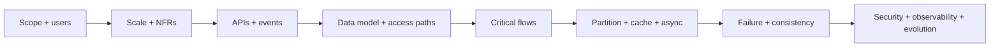

# System Design Interview Problem Catalog

This catalog covers the common interview problem families while keeping the
answer method consistent. Product names are shorthand for workloads; do not
reproduce a company's private architecture. Derive the design from stated
requirements, scale, and invariants.

## Universal Answer Shape

For every prompt, explicitly state:

1. functional scope and exclusions;
2. traffic, storage, bandwidth, concurrency, and growth assumptions;
3. latency, availability, durability, consistency, recovery, and security targets;
4. external APIs/events and data ownership;
5. the critical read and write paths;
6. partitioning, replication, caching, and asynchronous work;
7. overload, partial failure, duplicate, and recovery behavior;
8. monitoring, cost, privacy, and an incremental evolution path.

## Content And Media Streaming

| Prompt | Design focus | Failure or trade-off to discuss |
|---|---|---|
| Netflix-like video streaming | upload/transcode pipeline, metadata, manifests, CDN, adaptive bitrate | regional origin loss, hot release, cache invalidation, DRM |
| YouTube-like video sharing | resumable upload, processing states, search, recommendations, moderation | failed transcode, duplicate upload, viral content, abuse |
| Spotify-like music streaming | catalog, playlists, rights by region, audio delivery, offline sync | entitlement changes, device sync conflicts, hot tracks |
| TikTok-like short-video feed | write ingestion, ranking, prefetch, media CDN, engagement stream | ranking freshness, celebrity fan-out, moderation latency |
| Zoom-like conferencing | signaling, SFU/MCU topology, NAT traversal, media routing | packet loss, region failover, participant limits, recording |

## Social Networks And Communities

| Prompt | Design focus | Failure or trade-off to discuss |
|---|---|---|
| Instagram-like media social network | follow graph, upload, feed, likes/comments, notification | fan-out-on-write/read, celebrity users, privacy changes |
| Twitter/X-like feed | post service, timeline materialization, trends/search, graph | hot keys, edit/delete propagation, ranking consistency |
| Reddit-like community forum | communities, posts, threaded comments, votes, ranking | vote abuse, deep threads, hot communities, moderation |

## Messaging And Realtime Communication

| Prompt | Design focus | Failure or trade-off to discuss |
|---|---|---|
| WhatsApp-like chat | connection gateway, conversation partition, sequence, delivery/read receipts, media | offline devices, multi-device sync, ordering, duplicate delivery |
| Messenger-like platform | chat plus presence, groups, attachments, push notification | presence staleness, group fan-out, blocked users, reconnect |
| Notification service | preference/routing, templates, provider adapters, queue, delivery ledger | retries, deduplication, rate limits, provider outage |

## Search, Suggestions, And Ranking

| Prompt | Design focus | Failure or trade-off to discuss |
|---|---|---|
| Search autocomplete | prefix index/trie, popularity aggregation, personalization, caching | freshness versus latency, offensive suggestions, hot prefixes |
| Web search | crawl frontier, parsing, inverted index, ranking, serving | duplicate pages, recrawl policy, shard loss, index rollout |
| Product/local search | ingestion/CDC, text and faceted index, ranking, filters | stale price/stock, reindex, typo tolerance, tenant isolation |

## Maps, Location, And Ride Services

| Prompt | Design focus | Failure or trade-off to discuss |
|---|---|---|
| Google Maps-like navigation | map tiles, road graph, geospatial index, routing, traffic stream | stale traffic, route recomputation, offline regions |
| Uber-like ride matching | driver location stream, geospatial cells, matching, trip state, pricing | double match, location staleness, surge stability, regional outage |
| Yelp-like local reviews | business catalog, geo/text search, reviews, photos, ranking | fake reviews, duplicate businesses, index freshness |

## Commerce, Booking, And Payments

| Prompt | Design focus | Failure or trade-off to discuss |
|---|---|---|
| Amazon-like commerce | catalog, search, cart, inventory reservation, order, payment, fulfillment | oversell, duplicate checkout, partial workflow, flash sale |
| BookMyShow-like ticketing | show/seat model, temporary hold, expiry, payment, confirmation | concurrent seat claims, hold expiry, late payment, hotspot |
| UPI-like realtime payments | account/address resolution, idempotent transfer, ledger, risk, reconciliation | ambiguous timeout, duplicate request, reversal, audit |
| Airline reservation | flight schedule, fare inventory, hold, ticket, itinerary, check-in | overbooking policy, schedule change, distributed inventory |

## File Storage And Delivery

| Prompt | Design focus | Failure or trade-off to discuss |
|---|---|---|
| Dropbox-like file sync | chunking, hashing, metadata, object storage, version/vector conflict, sharing | concurrent edits, partial upload, ransomware recovery |
| Content delivery network | DNS/anycast routing, edge cache, origin shield, purge, signed access | stale content, origin failure, cache stampede, purge propagation |

## Distributed Infrastructure

| Prompt | Design focus | Failure or trade-off to discuss |
|---|---|---|
| Kafka-like message log | partitioned append log, leader/replica, consumer offset, retention | leader loss, duplicate processing, rebalance, hot partition |
| Distributed job scheduler | durable schedule, shard ownership, lease/fencing, execution history | duplicate run, missed run, clock skew, long-running job |
| Distributed rate limiter | token/sliding window state, key partitioning, local/global quota | state-store outage, regional drift, fairness, fail-open/closed |
| Authentication platform | identity lifecycle, credential/MFA, session/token, key rotation, audit | credential stuffing, token theft, revocation, IdP outage |
| Metrics/logging platform | ingestion, buffering, partitioning, indexing, retention, query | cardinality explosion, overload, late data, tenant isolation |

## Compact Real-World Exercises

| Prompt | HLD focus | LLD extension |
|---|---|---|
| URL shortener | key generation, redirect cache, storage, analytics, abuse | key policy, link aggregate, expiry and idempotent create |
| Parking lot | entrances, occupancy, pricing/payment, display integration | spot allocation, ticket state, concurrent claim |
| Online code editor/judge | document collaboration or submission, sandbox execution, queue, result | submission state, language runner port, resource limits |
| Vending machine fleet | device telemetry, inventory sync, pricing/config rollout, payment | state machine, denomination chain, dispense recovery |

## Cross-Problem Decision Matrix

| Workload signal | Likely mechanism | Questions before adopting it |
|---|---|---|
| globally popular immutable media | CDN and object storage | invalidation, rights, signed access, origin protection? |
| high write volume by independent key | partition by stable high-cardinality key | skew, rebalancing, cross-key operation? |
| slow or failure-prone side effect | durable queue and idempotent consumer | ordering, retry, poison work, reconciliation? |
| expensive repeated read | cache-aside or materialized view | freshness, invalidation, stampede, fallback? |
| scarce item allocation | authoritative conditional write/lock | hold expiry, fairness, late completion, repair? |
| realtime client updates | WebSocket/SSE gateway plus durable source | reconnect, missed events, backpressure, presence? |
| money or entitlement | immutable ledger/audit plus idempotency | double entry, reversal, privacy, reconciliation? |

## Practice Deliverable

For each prompt, produce one page containing:

- five functional and five measurable non-functional requirements;
- a back-of-the-envelope estimate;
- context and container diagrams;
- two APIs and two events;
- the primary data model and partition key;
- one critical sequence and one failure sequence;
- explicit consistency and idempotency rules;
- overload/degradation behavior and five production signals;
- one rejected alternative and an evolution trigger.

Use the [Interview Evaluation Rubric](./INTERVIEW-RUBRIC.md) to score the result.

## Worked Blueprints And Capstones

- [Fifteen System Design Visual Blueprints](./FIFTEEN-CASE-STUDY-VISUALS.md)
- [Sixteen System Design Case Studies](../hld-lld/SIXTEEN-SYSTEM-DESIGN-CASE-STUDIES.md)
- [Case-Study Workbook](./CASE-STUDY-WORKBOOK.md)
- [End-To-End Design Method](./END-TO-END-DESIGN-METHOD.md)
- [Shopverse Capstones](../shopverse-capstones/README.md)

## References

- [Most Commonly Asked System Design Interview Questions - GeeksforGeeks](https://www.geeksforgeeks.org/system-design/most-commonly-asked-system-design-interview-problems-questions/)
- [System Design Interview Questions And Answers - GeeksforGeeks](https://www.geeksforgeeks.org/system-design/top-low-level-system-designlld-interview-questions-2024/)
