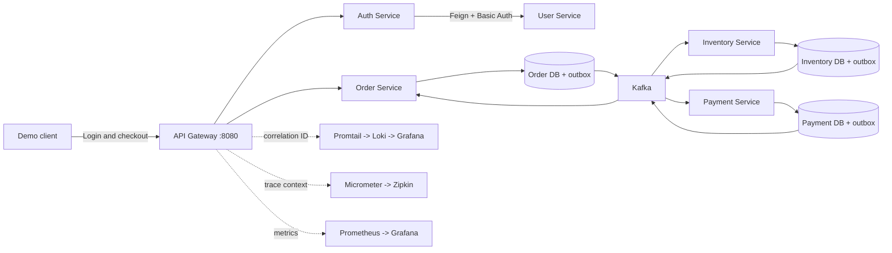
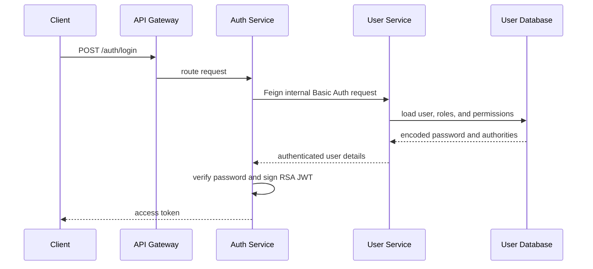

import {ReadingGuide} from '@site/src/components/DocumentationLanding';

# Complete Shopverse Demo

Read this page if you want one runnable end-to-end walkthrough that connects
authentication, idempotent checkout, SAGA, outbox, observability, DLT/replay,
and verification commands in a single flow.

This is the canonical demonstration runbook for the Shopverse POC. It uses the
API Gateway as the application entry point and connects each API action to the
state, events, logs, metrics, and traces it produces.

<ReadingGuide>

For the shortest automated proof, run `.\scripts\Smoke-Test.ps1`. Follow this
guide when presenting the architecture or inspecting each part of the checkout
journey manually.

</ReadingGuide>

## Demo Outcome

At the end of the happy path, you should have:

- a JWT issued by Auth Service after User Service validates the credentials;
- one persistent Order created through an idempotent API;
- an Inventory reservation protected by optimistic locking;
- a captured Payment;
- a queryable SAGA timeline ending in `ORDER_CONFIRMED`;
- published outbox records in the service databases;
- correlated JSON logs in Loki and Grafana;
- service metrics in Prometheus and Grafana;
- distributed HTTP spans in Zipkin.



## 1. Prerequisites

Use:

- Docker Desktop with Docker Compose v2;
- PowerShell 7 or Windows PowerShell;
- at least 8 GB of memory available to Docker;
- ports `8080`, `8081`, `8082`, `8083`, `8084`, `8086`, `8761`, `8888`,
  `9090`, `9411`, `3100`, and `3000` available.

Run every repository command from the Shopverse root:

```powershell
Set-Location "D:\BE Projects\shopverse"
```

Create the local environment file once:

```powershell
Copy-Item .env.example .env
```

Replace all `change-me-*` values in `.env`. These credentials are local POC
secrets and must not be committed.

## 2. Start The Platform

Validate the resolved Compose model before building:

```powershell
docker compose config
docker compose build
docker compose up -d
docker compose ps
```

`mysql-bootstrap` is a one-shot container. A successful exit code of `0` is
expected; it creates the independent `order_service`, `inventory_service`, and
`payment_service` databases.

Wait until application containers report `healthy`. For a compact status view:

```powershell
docker compose ps --format "table {{.Service}}\t{{.Status}}\t{{.Ports}}"
```

If a container is unhealthy:

```powershell
docker compose logs --tail=200 <service-name>
docker inspect --format "{{json .State.Health}}" shopverse-<service-name>
```

## 3. Verify Platform Infrastructure

Open these interfaces:

| Component | URL | Expected evidence |
|---|---|---|
| Config Server | `http://localhost:8888/ORDER-SERVICE/default` | common and Order property sources |
| Eureka | `http://localhost:8761` | application services registered |
| Gateway health | `http://localhost:8080/actuator/health` | `UP` |
| Grafana | `http://localhost:3000` | provisioned data sources and dashboards |
| Prometheus | `http://localhost:9090/targets` | Shopverse targets `UP` |
| Zipkin | `http://localhost:9411` | trace search interface |
| Loki readiness | `http://localhost:3100/ready` | `ready` |

Public routing can be tested without a token:

```powershell
$gateway = "http://localhost:8080"

Invoke-RestMethod "$gateway/api/v1/orders/public/health"
Invoke-RestMethod "$gateway/api/v1/inventory/public/health"
Invoke-RestMethod "$gateway/api/v1/payments/public/health"
Invoke-RestMethod "$gateway/api/v1/orders/public/catalog"
```

The catalog request demonstrates a synchronous path:

```text
Client -> Gateway -> Order Service -> Feign -> Inventory Service
```

## 4. Authenticate As The Demo Administrator

Shopverse seeds five local demonstration accounts through Liquibase:

| Purpose | Username | Role |
|---|---|---|
| administration and recovery APIs | `admin` | `ROLE_ADMIN` |
| customer ownership demos | `customer1` | `ROLE_CUSTOMER` |
| cross-customer denial demos | `customer2` | `ROLE_CUSTOMER` |
| support/read-only demonstrations | `support1` | `ROLE_SUPPORT` |
| inventory permission demonstrations | `inventory1` | `ROLE_INVENTORY_MANAGER` |

Passwords are maintained in the ignored root file
`demo-credentials.local.md`. The current local administrator password remains
`Admin@123`. The stored database value is an encoded or delegated password
representation; do not send that stored value as the login password.

```powershell
$loginBody = @{
    username = "admin"
    password = "Admin@123"
} | ConvertTo-Json

$login = Invoke-RestMethod `
    -Method Post `
    -Uri "$gateway/auth/login" `
    -ContentType "application/json" `
    -Body $loginBody

$token = $login.token
$token.Substring(0, [Math]::Min(40, $token.Length))
```

Expected result: the response contains a non-empty `token`.

The authentication path is:



Inspect the public signing keys:

```powershell
Invoke-RestMethod "$gateway/auth/.well-known/jwks.json" |
    ConvertTo-Json -Depth 10
```

Resource services use this JWKS document to verify the signature. They also
validate standard JWT constraints, including expiry and issuer
`shopverse-auth-service`.

## Large API Seed Data Set

For a richer local walkthrough, seed realistic customer, product, and order
data through the Gateway instead of inserting it directly into service
databases. The script exercises the production-shaped API path: JWT login,
permission checks, validation, inventory upsert, checkout idempotency, the
Kafka SAGA, transactional outbox, JSON logs, metrics, and trace propagation.

```powershell
$env:SHOPVERSE_ADMIN_PASSWORD = "Admin@123"
powershell -NoProfile -ExecutionPolicy Bypass -File .\scripts\Seed-ShopverseData.ps1
Remove-Item Env:SHOPVERSE_ADMIN_PASSWORD
```

Defaults are 20 named customers, 20 catalog items, and 120 checkout requests.
Checkout jobs run in batches of four to avoid overwhelming a laptop-sized
Compose stack. Re-running uses the same `api-seed-checkout-####` idempotency
keys, so a completed checkout is returned rather than duplicated.

The ignored `demo-credentials.local.md` file receives the generated customer
login details. `.tmp/shopverse-api-seed-manifest.json` records each order ID,
order number, correlation ID, and idempotency key. For example, inspect the
first order and use its correlation ID in Loki:

```powershell
$seed = Get-Content .\.tmp\shopverse-api-seed-manifest.json -Raw | ConvertFrom-Json
$seed.orders | Where-Object OrderIndex -eq 1 | Format-List
```

For a smaller first run, use `-CustomerCount 5 -ProductCount 10 -OrderCount 20
-BatchSize 2`. This is local POC data only; the script should never target a
shared or production environment.

### Verify Seeded Users And Roles

```powershell
docker compose exec mysql sh -lc '
  MYSQL_PWD="$MYSQL_ROOT_PASSWORD" mysql -uroot user_service -e "
    SELECT u.id, u.username, u.email, u.status, r.role_name
    FROM users u
    LEFT JOIN user_roles ur ON ur.user_id = u.id
    LEFT JOIN roles r ON r.id = ur.role_id
    ORDER BY u.id, r.role_name;
  "
'
```

Expected users include `admin`, `customer1`, `customer2`, `support1`, and
`inventory1`.

## 5. Create An Idempotent Checkout

Create stable identifiers for this demonstration:

```powershell
$suffix = [DateTimeOffset]::UtcNow.ToUnixTimeMilliseconds()
$correlationId = "demo-$suffix"
$idempotencyKey = "checkout-$suffix"

$headers = @{
    Authorization      = "Bearer $token"
    "X-Correlation-Id" = $correlationId
    "Idempotency-Key"  = $idempotencyKey
}

$checkoutBody = @{
    items = @(
        @{
            productId = 101
            quantity  = 1
        }
    )
} | ConvertTo-Json -Depth 5

$order = Invoke-RestMethod `
    -Method Post `
    -Uri "$gateway/api/v1/orders/checkout" `
    -Headers $headers `
    -ContentType "application/json" `
    -Body $checkoutBody

$order | ConvertTo-Json -Depth 10
```

Retain the identifiers used by later steps:

```powershell
$orderId = $order.id
$orderNumber = $order.orderNumber
```

The initial response can arrive before the asynchronous SAGA finishes. The
checkout transaction atomically stores the Order, its first timeline entry, and
an outbox event. A background publisher later sends that outbox event to Kafka.

## 6. Follow The SAGA Timeline

Poll the order until it reaches a terminal state:

```powershell
do {
    Start-Sleep -Seconds 1
    $currentOrder = Invoke-RestMethod `
        -Uri "$gateway/api/v1/orders/$orderId" `
        -Headers @{ Authorization = "Bearer $token" }

    Write-Host "Order status: $($currentOrder.status)"
} until ($currentOrder.status -in @(
    "CONFIRMED",
    "INVENTORY_REJECTED",
    "PAYMENT_FAILED",
    "CANCELLED"
))
```

Read the durable business timeline:

```powershell
$timeline = Invoke-RestMethod `
    -Uri "$gateway/api/v1/orders/$orderId/timeline" `
    -Headers @{ Authorization = "Bearer $token" }

$timeline | Format-Table stage, occurredAt, correlationId, detail -AutoSize
```

The happy path must contain:

```text
ORDER_CREATED
INVENTORY_RESERVED
PAYMENT_PROCESSING
PAYMENT_COMPLETED
ORDER_CONFIRMED
```

Inspect the payment record:

```powershell
Invoke-RestMethod `
    -Uri "$gateway/api/v1/payments/orders/$orderNumber" `
    -Headers @{ Authorization = "Bearer $token" } |
    ConvertTo-Json -Depth 10
```

Expected payment status: `CAPTURED`.

### Prove Resource Ownership Authorization

Use the seeded `DEMO-ORD-1001` record to prove that authentication alone does
not grant access to another customer's data. The record and its Payment belong
to `customer1`.

```powershell
function Get-ShopverseToken($username, $password) {
    $body = @{
        username = $username
        password = $password
    } | ConvertTo-Json

    (Invoke-RestMethod `
        -Method Post `
        -Uri "$gateway/auth/login" `
        -ContentType "application/json" `
        -Body $body).token
}

$customer1Token = Get-ShopverseToken "customer1" "Customer@123"
$customer2Token = Get-ShopverseToken "customer2" "Buyer@123"

$customer1Orders = Invoke-RestMethod `
    -Uri "$gateway/api/v1/orders" `
    -Headers @{ Authorization = "Bearer $customer1Token" }

$ownedOrder = $customer1Orders |
    Where-Object orderNumber -eq "DEMO-ORD-1001" |
    Select-Object -First 1

$ownedOrderId = $ownedOrder.id
```

The owner can read both protected resources:

```powershell
Invoke-RestMethod `
    -Uri "$gateway/api/v1/orders/$ownedOrderId/timeline" `
    -Headers @{ Authorization = "Bearer $customer1Token" }

Invoke-RestMethod `
    -Uri "$gateway/api/v1/payments/orders/DEMO-ORD-1001" `
    -Headers @{ Authorization = "Bearer $customer1Token" }
```

Another authenticated customer receives `403 Forbidden` for both APIs:

```powershell
$otherCustomerTimeline = Invoke-WebRequest `
    -SkipHttpErrorCheck `
    -Uri "$gateway/api/v1/orders/$ownedOrderId/timeline" `
    -Headers @{ Authorization = "Bearer $customer2Token" }

$otherCustomerPayment = Invoke-WebRequest `
    -SkipHttpErrorCheck `
    -Uri "$gateway/api/v1/payments/orders/DEMO-ORD-1001" `
    -Headers @{ Authorization = "Bearer $customer2Token" }

$otherCustomerTimeline.StatusCode
$otherCustomerPayment.StatusCode
```

Expected output:

```text
403
403
```

The administrator token created earlier retains cross-customer access:

```powershell
Invoke-RestMethod `
    -Uri "$gateway/api/v1/orders/$ownedOrderId/timeline" `
    -Headers @{ Authorization = "Bearer $token" }

Invoke-RestMethod `
    -Uri "$gateway/api/v1/payments/orders/DEMO-ORD-1001" `
    -Headers @{ Authorization = "Bearer $token" }
```

For the underlying `@PreAuthorize` expressions, repository queries, Spring
Security interception flow, and tests, see
[Resource ownership authorization](../reliability/problems/runtime/RESOURCE-OWNERSHIP-AUTHORIZATION.md).

## 7. Prove Duplicate Request Handling

Repeat the exact checkout with the same `Idempotency-Key`:

```powershell
$duplicate = Invoke-RestMethod `
    -Method Post `
    -Uri "$gateway/api/v1/orders/checkout" `
    -Headers $headers `
    -ContentType "application/json" `
    -Body $checkoutBody

[pscustomobject]@{
    OriginalOrderId  = $order.id
    DuplicateOrderId = $duplicate.id
    SameOrder        = $order.id -eq $duplicate.id
}
```

`SameOrder` must be `True`. The unique database constraint is the final
concurrency guard, while the service returns the existing Order for a repeated
request instead of reserving stock or charging again.

## 8. Inspect Transactional Outbox Evidence

Read the MySQL password from your local `.env` and run:

```powershell
docker compose exec mysql sh -lc '
  MYSQL_PWD="$MYSQL_ROOT_PASSWORD" mysql -uroot -e "
    SELECT id, aggregate_id, event_type, topic, status, publish_attempts, correlation_id
    FROM order_service.outbox_events ORDER BY id DESC LIMIT 5;
    SELECT id, aggregate_id, event_type, topic, status, publish_attempts, correlation_id
    FROM inventory_service.outbox_events ORDER BY id DESC LIMIT 5;
    SELECT id, aggregate_id, event_type, topic, status, publish_attempts, correlation_id
    FROM payment_service.outbox_events ORDER BY id DESC LIMIT 5;
  "
'
```

Expected result: the relevant records progress to `PUBLISHED`. The database
transaction does not wait for Kafka; it commits domain state and an outbox row,
then a bounded worker claims and publishes the row separately.

Inspect the Order and timeline rows:

```powershell
docker compose exec mysql sh -lc '
  MYSQL_PWD="$MYSQL_ROOT_PASSWORD" mysql -uroot -e "
    SELECT id, order_number, customer_username, status, correlation_id, idempotency_key
    FROM order_service.orders ORDER BY id DESC LIMIT 5;
    SELECT order_number, stage, detail, occurred_at
    FROM order_service.order_timeline_events ORDER BY id DESC LIMIT 10;
  "
'
```

### Query One Complete SAGA In MySQL

Use the Order number captured during checkout:

```powershell
docker compose exec mysql sh -lc "
  MYSQL_PWD=\"\$MYSQL_ROOT_PASSWORD\" mysql -uroot -e \"
    SELECT o.id, o.order_number, o.customer_username, o.status,
           o.total_amount, o.correlation_id, o.payment_reference,
           i.product_id, i.product_name, i.quantity, i.unit_price
    FROM order_service.orders o
    JOIN order_service.order_items i ON i.order_id = o.id
    WHERE o.order_number = '$orderNumber';

    SELECT stage, detail, occurred_at
    FROM order_service.order_timeline_events
    WHERE order_number = '$orderNumber'
    ORDER BY occurred_at;

    SELECT order_number, customer_username, status, amount,
           payment_reference, failure_reason
    FROM payment_service.payments
    WHERE order_number = '$orderNumber';

    SELECT order_number, product_id, quantity, status, expires_at
    FROM inventory_service.inventory_reservations
    WHERE order_number = '$orderNumber';
  \"
"
```

Application services never perform this cross-schema query. It is an
operations/demo command that correlates independently owned service records by
`order_number`.

### Query By Correlation ID

```powershell
docker compose exec mysql sh -lc "
  MYSQL_PWD=\"\$MYSQL_ROOT_PASSWORD\" mysql -uroot -e \"
    SELECT order_number, status, correlation_id
    FROM order_service.orders
    WHERE correlation_id = '$correlationId';

    SELECT order_number, stage, detail, occurred_at
    FROM order_service.order_timeline_events
    WHERE correlation_id = '$correlationId'
    ORDER BY occurred_at;

    SELECT aggregate_type, aggregate_id, event_type, topic,
           status, publish_attempts, last_error
    FROM order_service.outbox_events
    WHERE correlation_id = '$correlationId';
  \"
"
```

### Inspect Seeded Historical Scenarios

The seed data gives immediate examples before a live checkout is triggered:

| Order | Owner | Final state | Scenario |
|---|---|---|---|
| `DEMO-ORD-1001` | `customer1` | `CONFIRMED` | successful payment |
| `DEMO-ORD-1002` | `customer1` | `PAYMENT_FAILED` | declined payment |
| `DEMO-ORD-1003` | `customer2` | `INVENTORY_REJECTED` | unavailable stock |
| `DEMO-ORD-1004` | `customer2` | `PAYMENT_PROCESSING` | timed-out payment awaiting reconciliation |
| `DEMO-ORD-1005` | `customer1` | `CANCELLED` | administrator cancellation |
| `DEMO-ORD-1006` | `customer2` | `CONFIRMED` | captured monitor purchase |
| `DEMO-ORD-1007` | `customer1` | `CONFIRMED` | historical multi-item order |
| `DEMO-ORD-1008` | `customer2` | `CANCELLED` | refunded payment history |
| `DEMO-ORD-1009` | `customer1` | `INVENTORY_REJECTED` | expired reservation |

```powershell
docker compose exec mysql sh -lc '
  MYSQL_PWD="$MYSQL_ROOT_PASSWORD" mysql -uroot -e "
    SELECT o.order_number, o.customer_username, o.status, o.total_amount,
           GROUP_CONCAT(CONCAT(i.product_name, \" x\", i.quantity)
                        ORDER BY i.id SEPARATOR \", \") AS items
    FROM order_service.orders o
    JOIN order_service.order_items i ON i.order_id = o.id
    WHERE o.order_number LIKE \"DEMO-ORD-%\"
    GROUP BY o.id, o.order_number, o.customer_username, o.status, o.total_amount
    ORDER BY o.order_number;
  "
'
```

These rows are historical examples only. They do not create Kafka or outbox
events during migration. Use `POST /api/v1/orders/checkout` to demonstrate the
live choreography SAGA.

Inspect timeline history, reservation state, and matching payment records:

```powershell
docker compose exec mysql sh -lc '
  MYSQL_PWD="$MYSQL_ROOT_PASSWORD" mysql -uroot -e "
    SELECT order_number, stage, detail, occurred_at
    FROM order_service.order_timeline_events
    WHERE order_number LIKE \"DEMO-ORD-%\"
    ORDER BY order_number, occurred_at;

    SELECT order_number, product_id, quantity, status, expires_at
    FROM inventory_service.inventory_reservations
    WHERE order_number LIKE \"DEMO-ORD-%\"
    ORDER BY order_number;

    SELECT order_number, customer_username, status, amount,
           payment_reference, failure_reason
    FROM payment_service.payments
    WHERE order_number LIKE \"DEMO-ORD-%\"
    ORDER BY order_number;
  "
'
```

### Inspect Inventory And Lock Versions

```powershell
docker compose exec mysql sh -lc '
  MYSQL_PWD="$MYSQL_ROOT_PASSWORD" mysql -uroot inventory_service -e "
    SELECT product_id, product_name, unit_price, available_quantity,
           reserved_quantity, version
    FROM inventory_items
    ORDER BY product_id;
  "
'
```

The `version` column is Hibernate's optimistic-lock token. A successful
reservation changes quantities and increments this value. A stale concurrent
update whose old version no longer matches affects zero rows and is rejected.

## 9. Demonstrate Payment Failure And Recovery

The in-memory payment stub supports `SUCCESS`, `DECLINE`, and `TIMEOUT`.
Changing the mode requires the administrator token.

Set timeout mode:

```powershell
Invoke-RestMethod `
    -Method Post `
    -Uri "$gateway/api/v1/payments/admin/simulation?mode=TIMEOUT" `
    -Headers @{ Authorization = "Bearer $token" }
```

Create another checkout using new correlation and idempotency values. Payment
will enter `TIMED_OUT`, representing an uncertain external-provider result.
Then reconcile it:

```powershell
Invoke-RestMethod `
    -Method Post `
    -Uri "$gateway/api/v1/payments/admin/orders/<order-number>/reconcile" `
    -Headers @{ Authorization = "Bearer $token" }
```

Replace `<order-number>` with the timeout demo Order number. Reconciliation
publishes completion through the outbox so the Order can finish.

Always restore the default mode after the demo:

```powershell
Invoke-RestMethod `
    -Method Post `
    -Uri "$gateway/api/v1/payments/admin/simulation?mode=SUCCESS" `
    -Headers @{ Authorization = "Bearer $token" }
```

For a deterministic inventory failure, submit a checkout for product `101`
with a quantity larger than the catalog's available quantity. The expected
Order terminal status is `INVENTORY_REJECTED`; Payment must not be charged.

## 10. Inspect DLT Recovery APIs

Retryable Kafka listeners send exhausted poison events to a DLT. Shopverse
persists one unresolved recovery record per failed source event and audits
replay attempts.

```powershell
$adminHeaders = @{ Authorization = "Bearer $token" }

Invoke-RestMethod "$gateway/api/v1/orders/admin/dead-letters" -Headers $adminHeaders
Invoke-RestMethod "$gateway/api/v1/inventory/admin/dead-letters" -Headers $adminHeaders
Invoke-RestMethod "$gateway/api/v1/payments/admin/dead-letters" -Headers $adminHeaders
```

Replay an existing record:

```powershell
Invoke-RestMethod `
    -Method Post `
    -Uri "$gateway/api/v1/orders/admin/dead-letters/<id>/replay" `
    -Headers $adminHeaders
```

Use the corresponding Inventory or Payment endpoint for records owned by those
services. Replay fields include count, timestamp, and operator identity.

:::note

The public application API intentionally does not provide an endpoint that
injects arbitrary malformed Kafka payloads. DLT creation is demonstrated by
integration tests or controlled local Kafka tooling.

:::

## 11. Find The Journey In Loki And Grafana

Open Grafana Explore at `http://localhost:3000/explore`, select `Loki`, and
query the correlation ID created in step 5:

```logql
{log_type="application"}
| json
| correlationId="CORRELATION_ID"
```

Replace `CORRELATION_ID` with:

```powershell
$correlationId
```

Useful queries:

```logql
{application="ORDER-SERVICE"}
```

```logql
{log_type="application"}
| json
| level="ERROR"
```

```logql
{log_type="application"} |= "ORDER_NUMBER"
```

Health logs are deliberately separated:

```logql
{log_type="health"}
```

Application logs come from each service's rolling JSON file volume. Promtail
parses those records, promotes bounded fields such as `application` and
`level` to labels, and pushes batches to Loki. Correlation and trace IDs remain
JSON fields to avoid high-cardinality labels.

## 12. Inspect Metrics

Open Prometheus at `http://localhost:9090` and run:

```promql
up{job="shopverse-services"}
```

```promql
sum by (stage) (
  increase(shopverse_saga_transitions_total[15m])
)
```

```promql
sum by (status) (
  increase(shopverse_payment_outcomes_total[15m])
)
```

```promql
sum by (outcome) (
  increase(shopverse_outbox_publish_total[15m])
)
```

```promql
sum by (application, status) (
  rate(http_server_requests_seconds_count[5m])
)
```

In Grafana, open the provisioned **Shopverse Commerce Operations** dashboard.
It includes active SAGA estimates, SAGA transitions, payment outcomes,
inventory conflicts, and expired reservations.

## 13. Inspect Distributed Traces

Open Zipkin at `http://localhost:9411`:

1. select `API-GATEWAY` or leave the service filter empty;
2. choose a time range containing the demo request;
3. select **Run Query**;
4. open the checkout trace and inspect gateway and HTTP service spans.

Micrometer Tracing propagates W3C trace headers across synchronous HTTP and
Feign calls. Kafka business events preserve the explicit correlation ID, but
asynchronous consumer work can start a separate trace. Use:

- `traceId` for one instrumented execution path;
- `correlationId` for the complete business journey across HTTP, Kafka,
  retries, outbox publication, and compensation.

## 14. Run The Automated Proof

The repository smoke test performs login, checkout, terminal-state polling, and
timeline validation:

```powershell
.\scripts\Smoke-Test.ps1
```

Credentials can be overridden:

```powershell
.\scripts\Smoke-Test.ps1 `
    -Username "admin" `
    -Password "Admin@123" `
    -GatewayUrl "http://localhost:8080"
```

Use bounded verification modes for broader evidence:

```powershell
.\scripts\Verify-Shopverse.ps1 -Mode Quick -TimeoutMinutes 1
.\scripts\Verify-Shopverse.ps1 -Mode Integration -TimeoutMinutes 5
.\scripts\Verify-Shopverse.ps1 -Mode Full -TimeoutMinutes 10
```

| Mode | Scope | Target |
|---|---|---:|
| `Quick` | changed-service compile and unit tests | under 1 minute |
| `Integration` | MySQL, Kafka, outbox, and Testcontainers | 2-5 minutes |
| `Full` | Docker SAGA, security, recovery, and observability | under 10 minutes |

## 15. Stop Or Reset

Stop containers while preserving databases and observability volumes:

```powershell
docker compose down
```

Remove containers and all named volumes for a clean demonstration:

```powershell
docker compose down -v
```

The second command deletes local MySQL, Prometheus, Loki, Grafana, and service
log data.

## Troubleshooting Order

When a step fails, inspect evidence in this order:

1. `docker compose ps`;
2. `docker compose logs --tail=200 <service>`;
3. Eureka registration;
4. Config Server property output;
5. Order timeline and service database rows;
6. outbox status and publish attempts;
7. Kafka/DLT recovery records;
8. Loki correlation query;
9. Zipkin trace;
10. Prometheus targets and metrics.

Continue with:

- [API guide](../development/API-GUIDE.md) for the complete endpoint catalog;
- [Features and demonstrations](../reference/FEATURES-AND-DEMOS.md) for the implementation matrix;
- [SAGA and Outbox](../reliability/SAGA-OUTBOX.md) for transaction and event flow;
- [Observability operations](../observability/SHOPVERSE-OBSERVABILITY-OPERATIONS.md) for more LogQL and PromQL;
- [Debugging guide](../development/DEBUGGING.md) for failure diagnosis.
