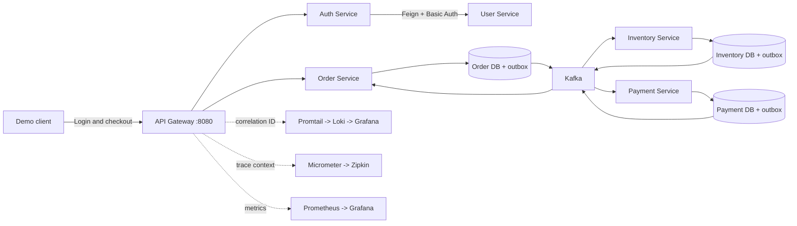
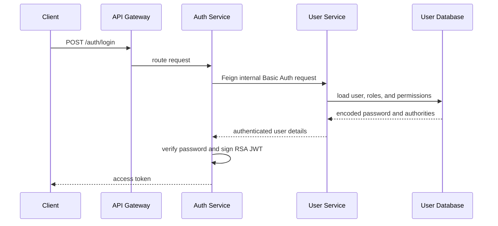

# Demo Platform And Authentication

<DocLabels items={[{label: 'Advanced', tone: 'advanced'}, {label: 'Shopverse', tone: 'shopverse'}, {label: 'Production', tone: 'production'}]} />

## Demo Outcome

At the end of the happy path, you should have:

- a JWT issued by Auth Service after User Service validates the credentials;
- one persistent Order created through an idempotent API;
- an Inventory reservation protected by optimistic locking;
- a captured Payment;
- a queryable SAGA timeline ending in `ORDER_CONFIRMED`;
- published outbox records in the service databases;
- correlated JSON logs in Loki and Grafana;
- service metrics in Prometheus and Grafana;
- distributed HTTP spans in Zipkin.



## 1. Prerequisites

Use:

- Docker Desktop with Docker Compose v2;
- PowerShell 7 or Windows PowerShell;
- at least 8 GB of memory available to Docker;
- ports `8080`, `8081`, `8082`, `8083`, `8084`, `8086`, `8761`, `8888`,
  `9090`, `9411`, `3100`, and `3000` available.

Run every repository command from the Shopverse root:

```powershell
Set-Location "D:\BE Projects\shopverse"
```

Create the local environment file once:

```powershell
Copy-Item .env.example .env
```

Replace all `change-me-*` values in `.env`. These credentials are local POC
secrets and must not be committed.

## 2. Start The Platform

Validate the resolved Compose model before building:

```powershell
docker compose --profile apps --profile assets --profile observability config --quiet
docker compose --profile apps --profile assets --profile observability up --build -d
docker compose ps
```

`mysql-bootstrap` is a one-shot container. A successful exit code of `0` is
expected; it creates the independent `order_service`, `inventory_service`, and
`payment_service` databases.

Wait until application containers report `healthy`. For a compact status view:

```powershell
docker compose ps --format "table {{.Service}}\t{{.Status}}\t{{.Ports}}"
```

If a container is unhealthy:

```powershell
docker compose logs --tail=200 <service-name>
docker inspect --format "{{json .State.Health}}" shopverse-<service-name>
```

## 3. Verify Platform Infrastructure

Open these interfaces:

| Component | URL | Expected evidence |
|---|---|---|
| Config Server | `http://localhost:8888/ORDER-SERVICE/default` | common and Order property sources |
| Eureka | `http://localhost:8761` | application services registered |
| Gateway health | `http://localhost:8080/actuator/health` | `UP` |
| Grafana | `http://localhost:3000` | provisioned data sources and dashboards |
| Prometheus | `http://localhost:9090/targets` | Shopverse targets `UP` |
| Zipkin | `http://localhost:9411` | trace search interface |
| Loki readiness | `http://localhost:3100/ready` | `ready` |

Public routing can be tested without a token:

```powershell
$gateway = "http://localhost:8080"

Invoke-RestMethod "$gateway/api/v1/orders/public/health"
Invoke-RestMethod "$gateway/api/v1/inventory/public/health"
Invoke-RestMethod "$gateway/api/v1/payments/public/health"
Invoke-RestMethod "$gateway/api/v1/orders/public/catalog"
```

The catalog request demonstrates a synchronous path:

```text
Client -> Gateway -> Order Service -> Feign -> Inventory Service
```

## 4. Authenticate As The Demo Administrator

Shopverse seeds five local demonstration accounts through Liquibase:

| Purpose | Username | Role |
|---|---|---|
| administration and recovery APIs | `admin` | `ROLE_ADMIN` |
| customer ownership demos | `customer1` | `ROLE_CUSTOMER` |
| cross-customer denial demos | `customer2` | `ROLE_CUSTOMER` |
| support/read-only demonstrations | `support1` | `ROLE_SUPPORT` |
| inventory permission demonstrations | `inventory1` | `ROLE_INVENTORY_MANAGER` |

Passwords are maintained in the ignored root file
`demo-credentials.local.md`. The current local administrator password remains
`Admin@123`. The stored database value is an encoded or delegated password
representation; do not send that stored value as the login password.

```powershell
$loginBody = @{
    username = "admin"
    password = "Admin@123"
} | ConvertTo-Json

$login = Invoke-RestMethod `
    -Method Post `
    -Uri "$gateway/auth/login" `
    -ContentType "application/json" `
    -Body $loginBody

$token = $login.token
$token.Substring(0, [Math]::Min(40, $token.Length))
```

Expected result: the response contains a non-empty `token`.

The authentication path is:



Inspect the public signing keys:

```powershell
Invoke-RestMethod "$gateway/auth/.well-known/jwks.json" |
    ConvertTo-Json -Depth 10
```

Resource services use this JWKS document to verify the signature. They also
validate standard JWT constraints, including expiry and issuer
`shopverse-auth-service`.

## Recommended Next

Return to [Demo Setup And Checkout](./COMPLETE-DEMO-SETUP-CHECKOUT.mdx) to select the next focused guide.


## Official References

- [Spring Boot reference](https://docs.spring.io/spring-boot/reference/)
- [Apache Kafka documentation](https://kafka.apache.org/documentation/)
