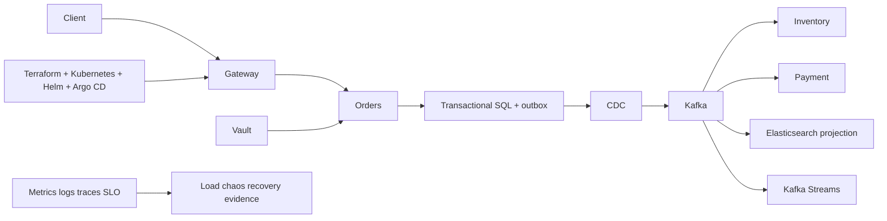

# ShopVerse Integrated Production Architecture Capstone

This capstone converts isolated knowledge into one defensible system. Keep it runnable and evidence-led;
do not force every database/tool into one service merely to display a logo.

## Required Capabilities

- versioned API/event contracts, idempotency, outbox/inbox and reconciliation;
- SQL transaction source, Cassandra only for a justified query model, Elasticsearch projection;
- Kafka Connect/CDC, Kafka Streams and Spring Kafka/Cloud Stream where each fits;
- reproducible signed Docker images with SBOM/provenance;
- Terraform/OpenTofu infrastructure, Kubernetes workloads and Helm packages;
- Argo CD promotion, drift and rollback with secret references only;
- Vault/workload identity, dynamic credentials and rotation;
- least privilege, network/admission policy and threat model;
- Prometheus/Grafana/OpenTelemetry with user and business SLOs;
- k6 capacity curve, fault injection, backup/restore and DR exercise.

## Delivery Stages

1. Baseline architecture, constraints, invariants, C4/sequence diagrams and ADRs.
2. Local Compose happy path plus unit, integration and contract tests.
3. Durable event consistency and replay-safe projections.
4. Container supply chain and vulnerability policy.
5. IaC cluster/platform foundations and GitOps deployment.
6. Identity, secrets, policy and audit controls.
7. Observability, SLO, dashboards, alerts and runbooks.
8. Load/capacity and ten controlled failure experiments.
9. Restore, regional DR design, reconciliation and postmortem.
10. Sanitized portfolio case and ninety-minute mock defence.

## Acceptance Evidence

Every claim links to configuration or raw evidence: commit/image digest, plan, manifests, contract tests,
metrics/trace/logs, load result, failure timeline, reconciliation query and recovery result. Record limitations
and representative versus real production scale honestly.

## Official References

- [Kubernetes production environment](https://kubernetes.io/docs/setup/production-environment/)
- [Google SRE workbook](https://sre.google/workbook/table-of-contents/)

## Recommended Next

Continue with [Capstone Implementation, Failure Programme, And Portfolio Defence](./production-capstone/CAPSTONE-IMPLEMENTATION-EVIDENCE.md).

