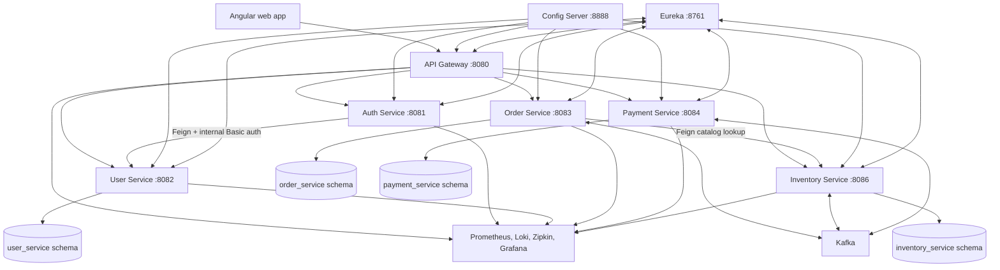
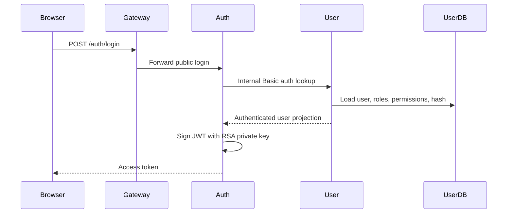
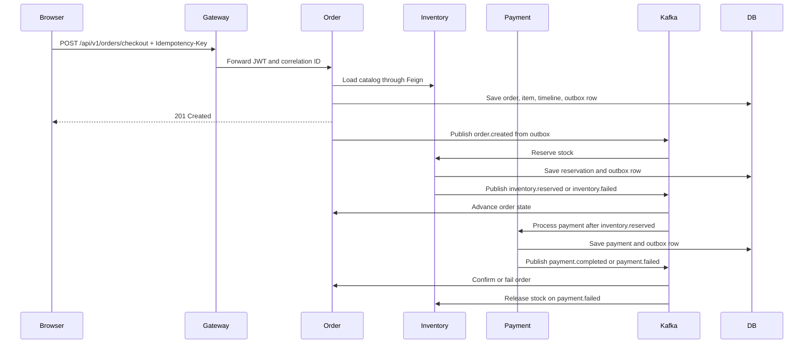

# Shopverse Architecture Current State

<DocLabels items={[{label: 'Advanced', tone: 'advanced'}, {label: 'Shopverse', tone: 'shopverse'}, {label: 'Production', tone: 'production'}]} />

For a compact interview-ready summary, use the
[Shopverse Architecture Revision Sheet](./SHOPVERSE-ARCHITECTURE-REVISION.md).

## Executive Summary

Shopverse is a Spring Boot and Angular commerce microservices proof of concept.
It uses an API Gateway, Config Server, Eureka discovery, service-owned MySQL
schemas, Kafka choreography, transactional outbox tables, JWT/JWKS security,
and a local observability stack.

The architecture has strong foundations for a learning and portfolio system:
service ownership is explicit, checkout is asynchronous, writes stay local to
each service, and observability is not treated as an afterthought.

The main production gaps are not in the overall direction. They are in
repeatable hardening: duplicated platform code across services, weak shared
event contracts, limited inbox/idempotency guarantees for consumers, single-node
infrastructure assumptions, broad internal exposure in Compose, custom auth
instead of full OAuth2/OIDC, and several scalability limits in API pagination,
cache strategy, outbox publishing, and reservation expiry.

## Runtime Architecture



## Service Ownership

| Service | Owns | Depends on | Notes |
|---|---|---|---|
| API Gateway | Edge routing, JWT validation, correlation header creation | Auth JWKS, Eureka | Should remain thin. No domain decisions. |
| Auth Service | Login, RSA JWT signing, JWKS | User Service | Current model is custom JWT issuing, not a full authorization server. |
| User Service | Users, roles, permissions, password history, internal auth endpoint | MySQL | Source of identity and authorization data. |
| Order Service | Checkout, orders, order items, order timeline, order outbox, order DLT records | Inventory catalog API, Kafka, MySQL | Owns the customer-facing order state machine. |
| Inventory Service | Product catalog details, stock, reservations, reservation expiry, inventory outbox, DLT records | Kafka, MySQL, MinIO image URLs | Current checkout runtime supports one item per order. |
| Payment Service | Payment attempts, payment state, provider stub, reconciliation, payment outbox, DLT records | Kafka, MySQL | Payment provider is intentionally simulated. |
| Config Server | Central runtime configuration | Local `cloud-configs` directory | Native file mode in local Compose. |
| Discovery Server | Eureka registry | None | Local service discovery. |

## Complete Data Flow

### Browser And API Gateway

1. The Angular app authenticates with `POST /auth/login`.
2. Auth Service returns an RSA-signed access token.
3. The Angular interceptor stores the token in `sessionStorage`, adds
   `Authorization: Bearer ...` for protected calls, and creates an
   `X-Correlation-Id` per request.
4. API Gateway validates JWTs for protected routes and forwards requests to
   services by Eureka logical names.
5. Resource services validate the JWT again and apply method/resource
   authorization locally.

### Login Flow



### Checkout Flow



The HTTP response means the order resource was created. It does not mean stock
and payment finished.

## Current Good Decisions

| Decision | Why it is good |
|---|---|
| Separate schemas per stateful service | Prevents accidental cross-service joins and keeps ownership visible. |
| Gateway plus downstream JWT validation | Avoids relying only on edge security. |
| Transactional outbox | Prevents local database commit and outgoing Kafka event from diverging silently. |
| Order timeline | Makes asynchronous SAGA progress queryable by support and users. |
| Correlation IDs and tracing | Gives operators a path through gateway, services, Kafka, and logs. |
| Liquibase migrations | Keeps schema evolution reviewable and repeatable. |
| Ownership checks for orders/payments | Blocks ID guessing across customer resources. |

## Bad Architecture Decisions And Risks

| Area | Current issue | Risk | Priority |
|---|---|---|---|
| Shared platform code | Security config, request logging, correlation context, exception handlers, outbox publisher, DLT recovery, and Kafka event parsing are copied across services. | Drift, inconsistent fixes, and expensive changes. | P1 |
| Event contracts | Events are local Java records serialized as JSON without a common event envelope, immutable event ID, schema version, producer metadata, or formal compatibility tests. | Breaking consumers during independent deployments. | P1 |
| Consumer idempotency | State checks exist, but there is no consistent inbox table keyed by event ID per consumer. | Duplicate Kafka delivery can still create repeated side effects in edge cases. | P1 |
| Outbox terminal state | Outbox rows cycle through pending/processing/published with retry counts, but no consistent terminal failed/backoff policy. | Poison events can churn forever and hide operational debt. | P1 |
| Reservation expiry | Inventory expiry scheduler scans rows in one service process and is documented as a baseline. | Multi-replica deployment can double-process unless claims are made atomic. | P1 |
| Custom auth | Auth Service signs custom JWTs directly and forwards user credentials to User Service through internal Basic auth. | Harder token lifecycle, refresh, revocation, client separation, and audit. | P1 |
| Catalog ownership | Checkout now uses direct Inventory product lookup; the cached full catalog is only for browsing. | Future multi-item checkout still needs a bulk lookup contract before scale testing. | P2 |
| API collection reads | Admin and customer list endpoints return unpaged lists in multiple services. | Slow queries and large responses under real data volume. | P2 |
| Caching | Order catalog reads use bounded local Caffeine cache with TTL and admin eviction; other local caches remain per-instance. | Multi-replica cache invalidation still needs events or distributed cache later. | P2 |
| Infrastructure exposure | Local Compose exposes service ports, Eureka, Config Server, MySQL, MinIO, Kafka, Prometheus, Loki, Zipkin, and Grafana to the host. | Acceptable locally, unsafe if reused beyond a developer machine. | P2 |
| Frontend token storage | JWT is stored in `sessionStorage`. | XSS can steal tokens; CSP and refresh-token strategy are missing. | P2 |
| Documentation mismatch risk | Some docs describe production goals beside implemented behavior. | Readers may confuse current runtime with roadmap hardening. | P3 |

## Duplicate Logic

The following code should move into shared libraries or starter modules once
the service contracts stabilize:

| Duplicate pattern | Current impact | Target |
|---|---|---|
| JWT resource-server config | Repeated issuer, JWKS, authority mapping, permitted actuator paths | `shopverse-security-starter` |
| Request logging filters | Repeated correlation extraction, MDC population, metric tagging | `shopverse-observability-starter` |
| Outbox entity/repository/publisher | Repeated claim, publish, stale-claim release, metric, and logging logic | `shopverse-outbox-starter` |
| DLT persistence/replay | Repeated failed event tables and recovery services | `shopverse-kafka-recovery-starter` |
| Event parsing | Repeated ObjectMapper try/catch in listeners | shared Kafka listener adapter |
| API error responses | Different exception-handler implementations | common error contract module |
| DTO page response helpers | Pagination utilities exist mostly in User Service | shared web module |

Do not create a large shared domain library. Shared code should be platform
infrastructure only. Domain types such as `Order`, `Payment`, and `Inventory`
should stay service-owned.

## Performance Bottlenecks

| Bottleneck | Why it matters | Improvement |
|---|---|---|
| Checkout loads the whole catalog and scans it in memory | Checkout latency grows with catalog size | Add `GET /api/v1/inventory/public/products/{productId}` or bulk lookup by IDs. |
| Unpaged `findAll` APIs | Memory and response size grow without bound | Require pageable/sortable endpoints with stable max page size. |
| Outbox publisher polls top 50 rows every second per service | Works locally but can lag under bursts | Add batch claiming, partitioned workers, backoff, and lag metrics. |
| Simple local caches | Cache invalidation does not work across replicas | Use Caffeine for single-node bounded cache or Redis for multi-node cache. |
| One-item checkout | Limits business capability and hides multi-item stock/payment complexity | Keep current behavior until event contract supports multiple line items. |
| Synchronous Kafka send wait in scheduler | Publisher thread blocks for broker latency | Use bounded async completion handling or a small worker pool. |
| Optimistic stock locking without retry policy around reservation conflicts | High-contention products may fail too aggressively | Add bounded retry for optimistic-lock failures and expose conflict metrics. |

## Scalability Risks

1. Kafka, MySQL, Prometheus, Loki, Grafana, Config Server, and Eureka are
   single-node in local Compose.
2. Per-service schedulers need atomic claim semantics before horizontal scale.
3. Local caches become inconsistent across service replicas.
4. Gateway circuit breaker is broad and route-level behavior is not tuned per
   dependency.
5. DLT replay and outbox replay are admin operations without a complete
   production approval/audit workflow.
6. The current event model does not guarantee compatibility during rolling
   deployments.
7. Metrics and logs may grow in cardinality if unbounded IDs are added as tags.

## Maintainability Issues

| Issue | Effect |
|---|---|
| Services are separate Gradle projects with repeated dependency and plugin configuration | Dependency upgrades are noisy and can drift. |
| Repeated packages with service-specific names | Refactoring common behavior requires copy edits. |
| Controllers mix transport, ownership, and minor policy checks in places | Harder to test business authorization consistently. |
| Some domain failures use `IllegalStateException` | API responses become less intentional than typed exceptions. |
| Event payloads are records near listeners | No independent contract artifact for producers/consumers. |
| Frontend components contain large inline templates/styles | UI behavior is harder to review and test as the app grows. |

## Security Lapses And Hardening Plan

| Finding | Current state | Production requirement |
|---|---|---|
| RSA private key in application resources | Good enough for local demo only | Load signing keys from secret manager or mounted secret, rotate with `kid`. |
| No refresh-token lifecycle in Auth Service | Access token only | Add short-lived access tokens, refresh-token rotation, reuse detection, logout/revoke. |
| Internal Basic auth with user password forwarding | Auth forwards credentials to User Service | Replace with internal service credential plus dedicated credential-verification endpoint, or use an authorization server. |
| No service-to-service mTLS | Network trust is Compose-only | Use mTLS/service mesh or signed internal service tokens. |
| Actuator metrics exposed without auth in local config | Useful for Prometheus | Restrict by network policy or management port, expose only to Prometheus. |
| CORS/CSP production posture is not explicit | Browser security depends on defaults/deployment | Add strict CSP, allowed origins, secure headers, and no wildcard CORS. |
| Session storage token | Simpler demo UX | Prefer BFF or HttpOnly secure cookies for browser apps. |
| MinIO public anonymous bucket | Product images are public in demo | Use least privilege bucket policy and CDN/object ACL review. |
| Docker Compose host port exposure | Good for local debugging | In production expose only gateway and public observability entrypoints behind auth. |
| Secrets in `.env` workflow | Local-only pattern | Use managed secrets, no checked-in real credentials, secret scanning in CI. |

## Clean Architecture Breakdown

Shopverse should keep the current service boundaries but make each service more
explicit internally:

```text
service
  api
    controller
    request/response DTOs
    exception mapper
  application
    use cases
    authorization policies
    transaction scripts
  domain
    aggregate entities
    value objects
    domain state transitions
  infrastructure
    repositories
    feign clients
    kafka producers/listeners
    outbox/inbox adapters
    observability adapters
```

Rules:

1. Controllers only translate HTTP to application commands.
2. Application services own transactions and call domain methods.
3. Domain objects enforce valid state transitions.
4. Infrastructure adapters are replaceable and contain framework details.
5. Event contracts are versioned and treated as public APIs.
6. Authorization policies are named classes, not scattered inline checks.

## Recommended Next

Return to [Shopverse Architecture Audit](./SHOPVERSE-ONBOARDING-ARCHITECTURE-AUDIT.md) to select the next focused guide.


## Official References

- [Spring Boot reference](https://docs.spring.io/spring-boot/reference/)
- [Apache Kafka documentation](https://kafka.apache.org/documentation/)
