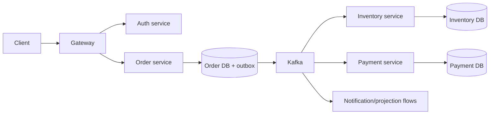

# Shopverse Architecture Revision Sheet

## Thirty-Second Summary

Shopverse is an event-driven commerce microservices learning platform built with
Spring Boot. The gateway fronts service-owned APIs; identity uses JWT/JWKS;
service-owned MySQL databases preserve local transactions; Kafka choreography and
transactional outboxes coordinate checkout; shared platform starters standardize
security, observability, Kafka recovery, and error behavior.

## Runtime Map

## Important Decisions

| Decision | Benefit | Cost/remaining risk |
|---|---|---|
| service-owned databases | clear ownership and local ACID | cross-service views and consistency need events/reconciliation |
| Kafka choreography | decoupled retained workflow events | ordering, duplicates, lag, DLT and observability complexity |
| transactional outbox | no unsafe DB/Kafka immediate dual write | relay duplicates and backlog operations remain |
| idempotent consumers | safe expected redelivery | stable identity and atomic uniqueness are required |
| gateway plus service security | centralized entry plus resource enforcement | internal workload identity and policy consistency need hardening |
| platform starters | reduce duplicated infrastructure behavior | versioning, ownership, adoption and compatibility must be governed |

## Checkout Invariants

- one checkout command creates at most one authoritative order;
- inventory reservation cannot oversell available stock;
- payment attempts use stable idempotency identity;
- terminal order state reflects payment/inventory outcomes;
- expired reservations cannot be silently consumed by late payment;
- every failed or uncertain workflow has durable recovery evidence.

## Interview Flow

Explain in this order:

1. client authentication and gateway routing;
2. idempotent checkout and local order transaction;
3. outbox publication to Kafka;
4. inventory and payment local transactions;
5. saga success, rejection, timeout, and compensation;
6. duplicate, late, and out-of-order protection;
7. logs, metrics, traces, DLT/failed-event store, and replay;
8. deployment, capacity, security, and production gaps.

## Strong Foundations

- explicit service and database ownership;
- asynchronous checkout with durable publication intent;
- idempotency and recovery treated as domain concerns;
- shared platform modules reduce drift;
- correlation, metrics, logs, and operational documentation exist;
- architecture decisions and current gaps are documented rather than hidden.

## Production Gaps To State Honestly

- production Kafka TLS/SASL and complete workload identity;
- stronger multi-replica/region deployment and DR evidence;
- schema registry and governed event compatibility;
- load, chaos, broker-loss, lag, and recovery game days;
- autoscaling tied to downstream and queue capacity;
- managed secret rotation and complete tenant/privacy controls;
- proven SLOs, alert ownership, and capacity baselines.

## Failure Prompts

Be ready to explain database commit with Kafka unavailable, payment success after
timeout, duplicate event after commit failure, consumer lag growth, hot partition,
DLT replay, inventory contention, replica restart, credential rotation, and regional
failure.

## Final Interview Checklist

- distinguish current implementation from proposed production hardening;
- trace normal and failure flows from code-level boundaries;
- state invariants before patterns;
- quantify capacity and recovery where evidence exists;
- explain trade-offs and credible alternatives;
- connect each gap to a verification or implementation next step.

Use the [Current-State Architecture](./SHOPVERSE-ARCHITECTURE-CURRENT-STATE.md) and
[Architecture Audit](./SHOPVERSE-ONBOARDING-ARCHITECTURE-AUDIT.md) for detail.
