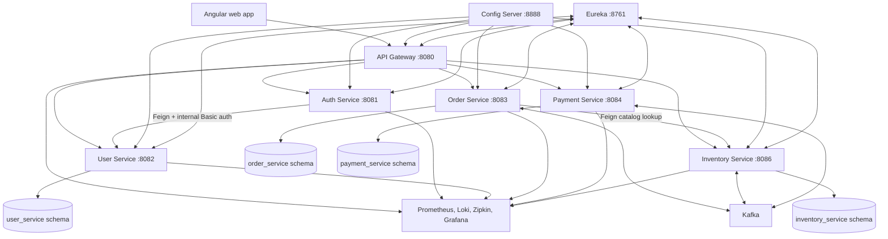
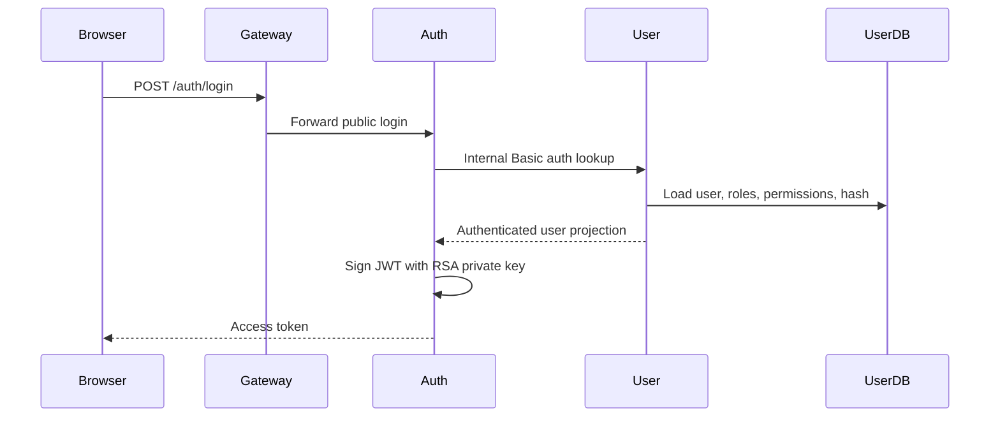
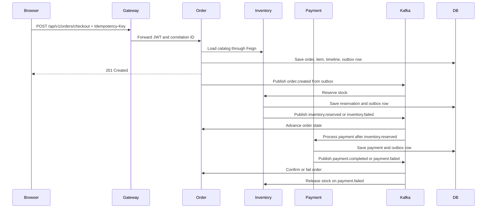

# Shopverse Architecture Onboarding And Audit

This guide is written from the perspective of a senior engineer joining the
Shopverse ecosystem with no prior codebase knowledge. It reverse engineers the
current architecture, traces the data flow, identifies the highest-risk design
areas, and defines a production-hardening refactoring path that preserves
current business behavior.

This audit is not a claim that Shopverse is production-ready today. Sections
that describe target state, production readiness, or hardening are roadmap
guidance unless the current-runtime tables explicitly mark the behavior as
implemented.

## Executive Summary

Shopverse is a Spring Boot and Angular commerce microservices proof of concept.
It uses an API Gateway, Config Server, Eureka discovery, service-owned MySQL
schemas, Kafka choreography, transactional outbox tables, JWT/JWKS security,
and a local observability stack.

The architecture has strong foundations for a learning and portfolio system:
service ownership is explicit, checkout is asynchronous, writes stay local to
each service, and observability is not treated as an afterthought.

The main production gaps are not in the overall direction. They are in
repeatable hardening: duplicated platform code across services, weak shared
event contracts, limited inbox/idempotency guarantees for consumers, single-node
infrastructure assumptions, broad internal exposure in Compose, custom auth
instead of full OAuth2/OIDC, and several scalability limits in API pagination,
cache strategy, outbox publishing, and reservation expiry.

## Runtime Architecture



## Service Ownership

| Service | Owns | Depends on | Notes |
|---|---|---|---|
| API Gateway | Edge routing, JWT validation, correlation header creation | Auth JWKS, Eureka | Should remain thin. No domain decisions. |
| Auth Service | Login, RSA JWT signing, JWKS | User Service | Current model is custom JWT issuing, not a full authorization server. |
| User Service | Users, roles, permissions, password history, internal auth endpoint | MySQL | Source of identity and authorization data. |
| Order Service | Checkout, orders, order items, order timeline, order outbox, order DLT records | Inventory catalog API, Kafka, MySQL | Owns the customer-facing order state machine. |
| Inventory Service | Product catalog details, stock, reservations, reservation expiry, inventory outbox, DLT records | Kafka, MySQL, MinIO image URLs | Current checkout runtime supports one item per order. |
| Payment Service | Payment attempts, payment state, provider stub, reconciliation, payment outbox, DLT records | Kafka, MySQL | Payment provider is intentionally simulated. |
| Config Server | Central runtime configuration | Local `cloud-configs` directory | Native file mode in local Compose. |
| Discovery Server | Eureka registry | None | Local service discovery. |

## Complete Data Flow

### Browser And API Gateway

1. The Angular app authenticates with `POST /auth/login`.
2. Auth Service returns an RSA-signed access token.
3. The Angular interceptor stores the token in `sessionStorage`, adds
   `Authorization: Bearer ...` for protected calls, and creates an
   `X-Correlation-Id` per request.
4. API Gateway validates JWTs for protected routes and forwards requests to
   services by Eureka logical names.
5. Resource services validate the JWT again and apply method/resource
   authorization locally.

### Login Flow



### Checkout Flow



The HTTP response means the order resource was created. It does not mean stock
and payment finished.

## Current Good Decisions

| Decision | Why it is good |
|---|---|
| Separate schemas per stateful service | Prevents accidental cross-service joins and keeps ownership visible. |
| Gateway plus downstream JWT validation | Avoids relying only on edge security. |
| Transactional outbox | Prevents local database commit and outgoing Kafka event from diverging silently. |
| Order timeline | Makes asynchronous SAGA progress queryable by support and users. |
| Correlation IDs and tracing | Gives operators a path through gateway, services, Kafka, and logs. |
| Liquibase migrations | Keeps schema evolution reviewable and repeatable. |
| Ownership checks for orders/payments | Blocks ID guessing across customer resources. |

## Bad Architecture Decisions And Risks

| Area | Current issue | Risk | Priority |
|---|---|---|---|
| Shared platform code | Security config, request logging, correlation context, exception handlers, outbox publisher, DLT recovery, and Kafka event parsing are copied across services. | Drift, inconsistent fixes, and expensive changes. | P1 |
| Event contracts | Events are local Java records serialized as JSON without a common event envelope, immutable event ID, schema version, producer metadata, or formal compatibility tests. | Breaking consumers during independent deployments. | P1 |
| Consumer idempotency | State checks exist, but there is no consistent inbox table keyed by event ID per consumer. | Duplicate Kafka delivery can still create repeated side effects in edge cases. | P1 |
| Outbox terminal state | Outbox rows cycle through pending/processing/published with retry counts, but no consistent terminal failed/backoff policy. | Poison events can churn forever and hide operational debt. | P1 |
| Reservation expiry | Inventory expiry scheduler scans rows in one service process and is documented as a baseline. | Multi-replica deployment can double-process unless claims are made atomic. | P1 |
| Custom auth | Auth Service signs custom JWTs directly and forwards user credentials to User Service through internal Basic auth. | Harder token lifecycle, refresh, revocation, client separation, and audit. | P1 |
| Catalog ownership | Order Service calls Inventory to read the full catalog during checkout and filters in memory. | Latency and memory grow with catalog size; checkout depends on a broad read path. | P2 |
| API collection reads | Admin and customer list endpoints return unpaged lists in multiple services. | Slow queries and large responses under real data volume. | P2 |
| Caching | Services use local simple cache with broad `allEntries` eviction. | Stale data across replicas and poor cache efficiency. | P2 |
| Infrastructure exposure | Local Compose exposes service ports, Eureka, Config Server, MySQL, MinIO, Kafka, Prometheus, Loki, Zipkin, and Grafana to the host. | Acceptable locally, unsafe if reused beyond a developer machine. | P2 |
| Frontend token storage | JWT is stored in `sessionStorage`. | XSS can steal tokens; CSP and refresh-token strategy are missing. | P2 |
| Documentation mismatch risk | Some docs describe production goals beside implemented behavior. | Readers may confuse current runtime with roadmap hardening. | P3 |

## Duplicate Logic

The following code should move into shared libraries or starter modules once
the service contracts stabilize:

| Duplicate pattern | Current impact | Target |
|---|---|---|
| JWT resource-server config | Repeated issuer, JWKS, authority mapping, permitted actuator paths | `shopverse-security-starter` |
| Request logging filters | Repeated correlation extraction, MDC population, metric tagging | `shopverse-observability-starter` |
| Outbox entity/repository/publisher | Repeated claim, publish, stale-claim release, metric, and logging logic | `shopverse-outbox-starter` |
| DLT persistence/replay | Repeated failed event tables and recovery services | `shopverse-kafka-recovery-starter` |
| Event parsing | Repeated ObjectMapper try/catch in listeners | shared Kafka listener adapter |
| API error responses | Different exception-handler implementations | common error contract module |
| DTO page response helpers | Pagination utilities exist mostly in User Service | shared web module |

Do not create a large shared domain library. Shared code should be platform
infrastructure only. Domain types such as `Order`, `Payment`, and `Inventory`
should stay service-owned.

## Performance Bottlenecks

| Bottleneck | Why it matters | Improvement |
|---|---|---|
| Checkout loads the whole catalog and scans it in memory | Checkout latency grows with catalog size | Add `GET /api/v1/inventory/public/products/{productId}` or bulk lookup by IDs. |
| Unpaged `findAll` APIs | Memory and response size grow without bound | Require pageable/sortable endpoints with stable max page size. |
| Outbox publisher polls top 50 rows every second per service | Works locally but can lag under bursts | Add batch claiming, partitioned workers, backoff, and lag metrics. |
| Simple local caches | Cache invalidation does not work across replicas | Use Caffeine for single-node bounded cache or Redis for multi-node cache. |
| One-item checkout | Limits business capability and hides multi-item stock/payment complexity | Keep current behavior until event contract supports multiple line items. |
| Synchronous Kafka send wait in scheduler | Publisher thread blocks for broker latency | Use bounded async completion handling or a small worker pool. |
| Optimistic stock locking without retry policy around reservation conflicts | High-contention products may fail too aggressively | Add bounded retry for optimistic-lock failures and expose conflict metrics. |

## Scalability Risks

1. Kafka, MySQL, Prometheus, Loki, Grafana, Config Server, and Eureka are
   single-node in local Compose.
2. Per-service schedulers need atomic claim semantics before horizontal scale.
3. Local caches become inconsistent across service replicas.
4. Gateway circuit breaker is broad and route-level behavior is not tuned per
   dependency.
5. DLT replay and outbox replay are admin operations without a complete
   production approval/audit workflow.
6. The current event model does not guarantee compatibility during rolling
   deployments.
7. Metrics and logs may grow in cardinality if unbounded IDs are added as tags.

## Maintainability Issues

| Issue | Effect |
|---|---|
| Services are separate Gradle projects with repeated dependency and plugin configuration | Dependency upgrades are noisy and can drift. |
| Repeated packages with service-specific names | Refactoring common behavior requires copy edits. |
| Controllers mix transport, ownership, and minor policy checks in places | Harder to test business authorization consistently. |
| Some domain failures use `IllegalStateException` | API responses become less intentional than typed exceptions. |
| Event payloads are records near listeners | No independent contract artifact for producers/consumers. |
| Frontend components contain large inline templates/styles | UI behavior is harder to review and test as the app grows. |

## Security Lapses And Hardening Plan

| Finding | Current state | Production requirement |
|---|---|---|
| RSA private key in application resources | Good enough for local demo only | Load signing keys from secret manager or mounted secret, rotate with `kid`. |
| No refresh-token lifecycle in Auth Service | Access token only | Add short-lived access tokens, refresh-token rotation, reuse detection, logout/revoke. |
| Internal Basic auth with user password forwarding | Auth forwards credentials to User Service | Replace with internal service credential plus dedicated credential-verification endpoint, or use an authorization server. |
| No service-to-service mTLS | Network trust is Compose-only | Use mTLS/service mesh or signed internal service tokens. |
| Actuator metrics exposed without auth in local config | Useful for Prometheus | Restrict by network policy or management port, expose only to Prometheus. |
| CORS/CSP production posture is not explicit | Browser security depends on defaults/deployment | Add strict CSP, allowed origins, secure headers, and no wildcard CORS. |
| Session storage token | Simpler demo UX | Prefer BFF or HttpOnly secure cookies for browser apps. |
| MinIO public anonymous bucket | Product images are public in demo | Use least privilege bucket policy and CDN/object ACL review. |
| Docker Compose host port exposure | Good for local debugging | In production expose only gateway and public observability entrypoints behind auth. |
| Secrets in `.env` workflow | Local-only pattern | Use managed secrets, no checked-in real credentials, secret scanning in CI. |

## Clean Architecture Breakdown

Shopverse should keep the current service boundaries but make each service more
explicit internally:

```text
service
  api
    controller
    request/response DTOs
    exception mapper
  application
    use cases
    authorization policies
    transaction scripts
  domain
    aggregate entities
    value objects
    domain state transitions
  infrastructure
    repositories
    feign clients
    kafka producers/listeners
    outbox/inbox adapters
    observability adapters
```

Rules:

1. Controllers only translate HTTP to application commands.
2. Application services own transactions and call domain methods.
3. Domain objects enforce valid state transitions.
4. Infrastructure adapters are replaceable and contain framework details.
5. Event contracts are versioned and treated as public APIs.
6. Authorization policies are named classes, not scattered inline checks.

## Critical Problem Areas

### 1. Event Contract And Idempotency

Add a standard envelope and inbox before increasing Kafka complexity.

```java
public record ShopverseEvent<T>(
        String eventId,
        String eventType,
        int schemaVersion,
        String aggregateType,
        String aggregateId,
        String correlationId,
        Instant occurredAt,
        T data
) {}
```

Consumer rule:

```java
@Transactional
public void handle(ShopverseEvent<InventoryReservedData> event) {
    if (!inbox.tryRecord(event.eventId(), "order-service")) {
        return;
    }

    orderWorkflow.markInventoryReservedAndPaymentProcessing(
            event.data().orderNumber()
    );
}
```

Database requirement:

```sql
create table inbox_events (
  event_id varchar(80) not null,
  consumer_name varchar(80) not null,
  processed_at timestamp(6) not null,
  primary key (event_id, consumer_name)
);
```

### 2. Outbox Publisher

Keep the existing outbox behavior but move it behind a reusable abstraction.
The production shape should include terminal failure, exponential backoff, and
claim ownership.

```java
public interface OutboxEventStore {
    List<OutboxMessage> claimBatch(String workerId, int batchSize, Duration lease);
    void markPublished(String eventId, KafkaMetadata metadata);
    void markRetryableFailure(String eventId, Throwable cause, Instant nextAttemptAt);
    void markTerminalFailure(String eventId, Throwable cause);
}
```

### 3. Reservation Expiry

Replace open-ended scheduler scans with atomic claims.

```sql
update inventory_reservations
set status = 'EXPIRING', updated_at = current_timestamp(6)
where status = 'RESERVED'
  and expires_at < current_timestamp(6)
order by expires_at
limit 100;
```

Then publish one inventory-failed event per claimed reservation inside the same
transaction as stock release and status transition.

### 4. Checkout Catalog Lookup

Current checkout gets the entire public catalog from Inventory and filters in
Order Service. Preserve behavior but replace the broad dependency with a
targeted catalog lookup.

```java
public interface CatalogService {
    Map<Long, CatalogItemResponse> getAvailableItems(Set<Long> productIds);
}
```

For the current one-item API, this still returns one product. It also prepares
the architecture for multi-item checkout later.

### 5. Auth And Token Lifecycle

Current behavior should remain for the POC, but production should move toward:

1. Auth Server or Spring Authorization Server.
2. Access token TTL measured in minutes.
3. Refresh token rotation and reuse detection.
4. `kid`-based signing key rotation.
5. Token audience validation per service.
6. Internal service authentication independent of customer passwords.

## Refactoring Strategy

### Phase 1: Stabilize Contracts

- Introduce event envelope with `eventId`, `schemaVersion`, and `occurredAt`.
- Add contract tests for all Kafka event producers and consumers.
- Add shared API error response schema.
- Add strict max page size to list endpoints.

### Phase 2: Extract Platform Starters

- `shopverse-observability-starter`: request logging, correlation, MDC, metrics.
- `shopverse-security-starter`: JWT decoder, authority mapping, actuator permit list.
- `shopverse-outbox-starter`: entity base, store interface, publisher, metrics.
- `shopverse-kafka-starter`: event envelope, listener adapter, DLT recording.

Keep these libraries versioned and small.

### Phase 3: Harden Distributed Processing

- Add inbox table to Order, Inventory, and Payment consumers.
- Add terminal outbox failure and retry backoff.
- Add atomic reservation expiry claims.
- Add admin replay workflow with audit trail and approval states.

### Phase 4: Productionize Security

- Move RSA keys out of resources.
- Add key rotation and `kid`.
- Add refresh-token rotation or BFF cookie-based session.
- Restrict actuator, Eureka, Config Server, Kafka, MySQL, and observability ports.
- Add TLS/mTLS for service traffic.

### Phase 5: Scale Read And Write Paths

- Add pagination everywhere a list can grow.
- Replace full-catalog checkout lookup with targeted product lookup.
- Move local simple caches to bounded Caffeine or Redis.
- Add route-specific gateway resilience settings.
- Add database indexes for owner and timeline queries if missing under load tests.

## Improved Production-Grade Code Targets

These are target shapes, not behavior changes to apply blindly.

### Typed Domain Exception

```java
public final class IdempotencyKeyConflictException extends RuntimeException {
    public IdempotencyKeyConflictException(String key) {
        super("Idempotency key is already owned by another customer: " + key);
    }
}
```

### Controller Stays Thin

```java
@PostMapping("/checkout")
public ResponseEntity<OrderResponse> checkout(
        @Valid @RequestBody CheckoutRequest request,
        @RequestHeader("Idempotency-Key") @NotBlank @Size(max = 100) String key,
        Authentication authentication
) {
    OrderResponse response = checkoutUseCase.checkout(
            new CheckoutCommand(request.items(), authentication.getName(), key)
    );

    return ResponseEntity.status(HttpStatus.CREATED).body(response);
}
```

### Event Envelope Usage

```java
outbox.enqueue(ShopverseEvent.of(
        "OrderCreated",
        "ORDER",
        saved.getOrderNumber(),
        saved.getCorrelationId(),
        new OrderCreatedData(
                saved.getId(),
                saved.getOrderNumber(),
                saved.getCustomerUsername(),
                lineItems(saved),
                saved.getTotalAmount()
        )
));
```

### Pageable List Endpoint

```java
@GetMapping("/admin/all")
@PreAuthorize("hasRole('ADMIN')")
public PageResponse<OrderResponse> allOrders(
        @PageableDefault(size = 25, sort = "createdAt", direction = Sort.Direction.DESC)
        Pageable pageable
) {
    return orderQueryService.getAllOrders(PageLimit.enforce(pageable, 100));
}
```

### Security Starter Shape

```java
@Configuration(proxyBeanMethods = false)
@EnableMethodSecurity
public class ShopverseResourceServerAutoConfiguration {
    @Bean
    JwtAuthenticationConverter shopverseJwtAuthenticationConverter() {
        JwtGrantedAuthoritiesConverter authorities = new JwtGrantedAuthoritiesConverter();
        authorities.setAuthoritiesClaimName("permissions");
        authorities.setAuthorityPrefix("");

        JwtAuthenticationConverter converter = new JwtAuthenticationConverter();
        converter.setJwtGrantedAuthoritiesConverter(authorities);
        return converter;
    }
}
```

## Performance Improvements

| Improvement | Expected result |
|---|---|
| Targeted catalog lookup | Lower checkout latency and less Inventory payload transfer. |
| Pageable reads | Predictable memory, response size, and database load. |
| Bounded cache provider | Safer memory behavior and explicit TTL/size policy. |
| Outbox batch claims | Higher publish throughput and cleaner multi-replica scale. |
| Consumer inbox | Safe at-least-once Kafka processing. |
| Atomic scheduler claims | Reservation expiry remains correct with multiple replicas. |
| Load tests around checkout | Confirms optimistic locking and outbox lag under contention. |

## Production Security Target State

No system is permanently finished, so this section defines the operational
target required before real production exposure. These items are hardening
criteria, not current POC guarantees:

1. All external traffic enters through a TLS-terminated gateway or ingress.
2. Services are private by default and communicate over mTLS or signed internal
   service tokens.
3. JWTs validate issuer, audience, expiry, signature, algorithm, and `kid`.
4. RSA private keys are never packaged in application resources.
5. Access tokens are short-lived; refresh tokens are rotated, hashed at rest,
   device-bound where possible, and revocable.
6. Actuator endpoints are split by management port and restricted to monitoring
   infrastructure.
7. Admin APIs require role checks, audit logs, and replay/change justification.
8. Secrets come from a managed secret store and CI performs secret scanning.
9. Browser sessions use HttpOnly secure cookies or a BFF pattern for production.
10. CSP, secure headers, allowed origins, dependency scanning, image scanning,
    and SBOM generation are part of CI/CD.

## Recommended Onboarding Path

1. Read `README.md` for service map and local run commands.
2. Read `documentation/docs/architecture/SYSTEM-DESIGN.md` for intended
   architecture.
3. Trace `OrderController.checkout` into `OrderServiceImpl.checkout`.
4. Follow the outbox publisher in Order, Inventory, and Payment.
5. Follow the Kafka listeners for inventory reserved, payment completed, and
   payment failed.
6. Review `SecurityConfig` in Gateway, User, Order, Inventory, and Payment.
7. Run the complete demo and inspect order timeline, logs, traces, and outbox
   tables.
8. Start refactoring only after adding contract tests around the flow being
   touched.

## Production Readiness Checklist

This checklist defines the target bar for production exposure. It should be
used as a gap assessment, not as a statement that all items are already in the
runtime.

| Area | Ready when |
|---|---|
| Events | Envelope, schema versioning, event IDs, contract tests, and compatibility rules exist. |
| Consumers | Inbox idempotency exists for every Kafka listener. |
| Outbox | Batch claims, retry backoff, terminal failure, lag metrics, and replay audit exist. |
| Security | Key rotation, refresh lifecycle, service auth, restricted internals, and TLS/mTLS exist. |
| APIs | Pagination, max limits, typed errors, and ownership checks are consistent. |
| Data | Indexes are validated with realistic volume and query plans. |
| Caching | Cache provider, TTL, max size, and invalidation model match deployment topology. |
| Observability | Dashboards, alerts, trace sampling, log retention, and runbooks are defined. |
| Delivery | CI runs unit, slice, contract, integration, image, and secret/dependency scans. |
| Operations | Backup, restore, incident response, DLT replay, and rollback procedures are documented. |

## Bottom Line

The current architecture is a solid microservices learning platform. The
highest-value next move is not more business features. It is extracting the
repeated platform patterns, formalizing event contracts, adding inbox
idempotency, hardening outbox/replay behavior, and moving security from
local-demo posture to production posture.

Those changes preserve the current functionality while improving scalability,
maintainability, security, and operational confidence.
