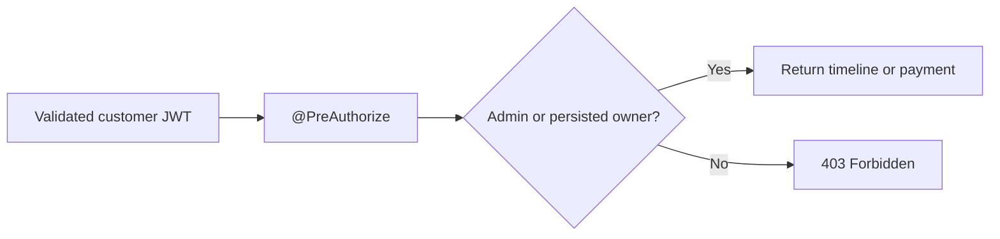

import {
  DocFigure,
  ReadingGuide,
  ShopverseHome,
} from '@site/src/components/DocumentationLanding';

<ShopverseHome />

## Architecture At A Glance

<DocFigure
  src="/img/diagrams/shopverse-architecture-flow.svg"
  alt="Shopverse microservices architecture showing gateway, services, Kafka, databases, security, and observability"
  caption="The complete Shopverse runtime topology. Select the image to open the full-size diagram."
/>

<ReadingGuide>

Start with the [complete Shopverse demo](COMPLETE-DEMO.mdx) when you want to
run the POC. Read [System design](../architecture/SYSTEM-DESIGN.md) when you
want to understand ownership boundaries, authentication, synchronous calls,
Kafka choreography, persistence, observability, and deployment topology.

</ReadingGuide>

## Recommended Case-Study Order

| Step | Guide | Question answered |
|---:|---|---|
| 1 | [Complete demo](COMPLETE-DEMO.mdx) | How do I run and present the POC end to end? |
| 2 | [System design](../architecture/SYSTEM-DESIGN.md) | What components exist and how do they communicate? |
| 3 | [Service catalog](../services/SERVICE-CATALOG.md) | What does each service own? |
| 4 | [Features and demos](../reference/FEATURES-AND-DEMOS.md) | What is implemented and how can it be demonstrated? |
| 5 | [API guide](../development/API-GUIDE.md) | How do clients use the platform? |
| 6 | [SAGA and Outbox](../reliability/SAGA-OUTBOX.md) | How does checkout remain recoverable across services? |
| 7 | [Security implementation](../security/JWT-OAUTH2-SPRING-SECURITY.md) | How are authentication and authorization enforced? |
| 8 | [Resource ownership](../reliability/problems/runtime/RESOURCE-OWNERSHIP-AUTHORIZATION.md) | Why can customers read only their own Order timelines and Payment records? |
| 9 | [Observability](../observability/OBSERVABILITY.md) | How are logs, metrics, and traces connected? |
| 10 | [Testing strategy](../development/TESTING.md) | How is the ecosystem verified without unbounded resource use? |
| 11 | [Problems and solutions](../reliability/PROBLEMS-AND-SOLUTIONS.md) | Which production-relevant defects were found and fixed? |

## What The Case Study Demonstrates

| Area | Implemented behavior |
|---|---|
| Platform | API Gateway, Config Server, Eureka discovery, load balancing, and Feign |
| Security | RSA JWT signing, JWKS, roles, permissions, issuer/expiry validation, and ownership |
| Commerce | idempotent checkout, persistent orders, inventory reservations, payment state, and timeline |
| Consistency | local transactions, transactional outbox, Kafka choreography, compensation, and DLT replay |
| Concurrency | optimistic locking, uniqueness constraints, and a single-worker reservation-expiry baseline; [multi-replica expiry remains planned](../reliability/problems/runtime/MULTI-REPLICA-RESERVATION-EXPIRY.md) |
| Observability | JSON logs, MDC correlation, Prometheus metrics, Grafana dashboards, Loki, and Zipkin |
| Delivery | multi-stage Docker images, GitHub Actions, Jenkins, Testcontainers, and bounded verification |

## Resource Ownership In The Case Study

Shopverse distinguishes authentication from resource authorization. A valid
customer JWT permits access to protected APIs, but it does not permit reading
another customer's data by guessing an Order ID or order number.

Order Service checks `orderId + customerUsername`; Payment Service checks
`orderNumber + customerUsername`. Administrators bypass the owner query for
support operations. Read the
[dedicated ownership case](../reliability/problems/runtime/RESOURCE-OWNERSHIP-AUTHORIZATION.md)
for implementation details and use the
[complete demo](COMPLETE-DEMO.mdx) to prove owner, non-owner, and administrator
behavior.

## Theory Before Implementation

When a project guide introduces an unfamiliar concept, study its reusable
counterpart first:

| Shopverse implementation | Generic study guide |
|---|---|
| Checkout SAGA | [SAGA and Outbox patterns](../reliability/SAGA-GENERIC.md) |
| Transaction boundaries | [Spring transactions](../spring/SPRING-TRANSACTIONS.md) |
| JWT resource servers | [Spring Security](../security/SPRING-SECURITY-GENERIC.md) |
| API contracts | [REST API design](../development/REST-API-GENERIC.md) |
| Resilience annotations | [Resilience4j patterns](../reliability/RESILIENCE4J-GENERIC.md) |
| Service topology | [Microservice architecture](../architecture/MICROSERVICES-GENERIC.md) |

## Implementation Status

The case study distinguishes:

- **Implemented:** present in code and verified;
- **Partial:** baseline implementation with known hardening work;
- **Planned:** study or roadmap material, not current runtime behavior.

This prevents generic best practices from being confused with features already
implemented by Shopverse.
