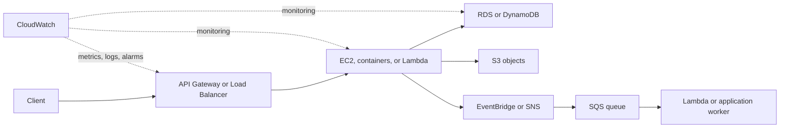

# Cloud Computing

Cloud computing provides infrastructure, platforms, and complete applications
over a network with on-demand capacity, metered cost, and automation. This
section starts with the provider-neutral service models and then maps them to
AWS.

## Read In This Order

| Goal | Page |
|---|---|
| Understand cloud concepts and responsibility models | [Cloud Fundamentals](./CLOUD-FUNDAMENTALS.md) |
| See the complete AWS service map | [AWS Umbrella](./aws/AWS-UMBRELLA.md) |
| Learn AWS networking | [VPC And Networking](./aws/AWS-VPC-NETWORKING.md) |
| Learn compute, scaling, storage, and API entry points | [Compute, EBS, Load Balancing And API Gateway](./aws/AWS-COMPUTE-EBS-SCALING.md) |
| Learn relational and NoSQL databases | [RDS And DynamoDB](./aws/AWS-DATABASES.md) |
| Learn events, queues, topics, and object storage | [EventBridge, SQS, SNS And S3](./aws/AWS-EVENTS-STORAGE.md) |
| Learn serverless and Lambda trade-offs | [Lambda And Serverless](./aws/AWS-LAMBDA-SERVERLESS.md) |
| Learn metrics, dashboards, alarms, and logs | [CloudWatch Monitoring](./aws/AWS-CLOUDWATCH.md) |

## A Typical AWS Request And Event Flow

These are generic reference designs, not claims about the current Shopverse
deployment.
