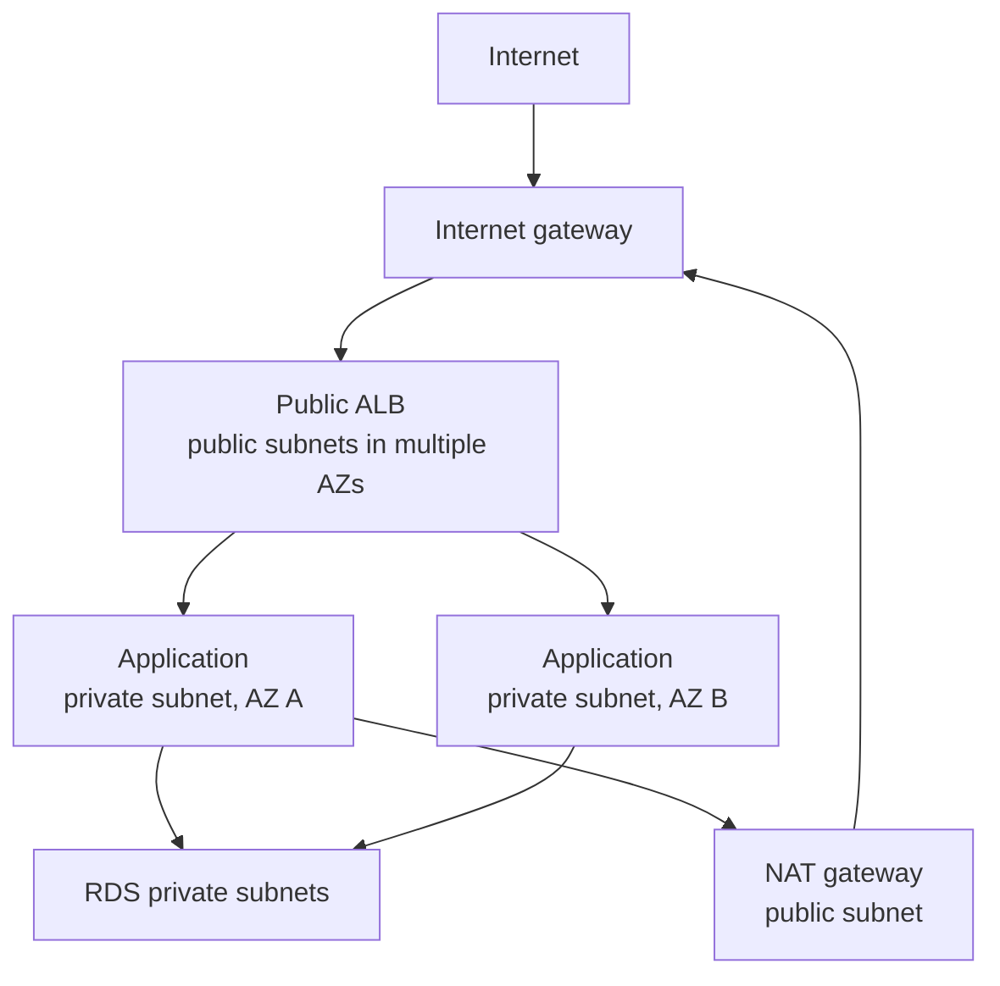

# AWS VPC And Networking

A Virtual Private Cloud is a logically isolated regional network. Its CIDR
range is divided into subnets, and each subnet belongs to exactly one
Availability Zone (AZ).

## Public And Private Subnets

A **public subnet** has a route to an internet gateway. A resource is not
public merely because it is in that subnet: it also needs a public address and
security rules that permit the traffic.

A **private subnet** has no direct route to an internet gateway. Private
workloads can initiate internet access through a NAT gateway in a public subnet,
or use VPC endpoints to reach supported AWS services without traversing the
public internet. A NAT gateway does not accept unsolicited inbound connections.

## Route Tables And Gateways

- A route table chooses the next hop using the most-specific matching destination.
- Every subnet is associated with one route table; a table can serve many subnets.
- The local route enables traffic inside the VPC CIDR.
- An internet gateway connects eligible public-address traffic to the internet.
- A NAT gateway gives private resources outbound IPv4 access; deploy per AZ when cross-AZ dependency and charges matter.
- Gateway or interface VPC endpoints provide private access to supported services.
- A transit gateway connects many VPCs and on-premises networks at hub scale.

## Security Layers

**Security groups** are stateful rules attached to network interfaces. Prefer
referencing another security group, such as allowing the application group to
reach the database group, instead of broad CIDR rules.

**Network ACLs** are stateless subnet-boundary rules. They are useful for coarse
controls but are not a substitute for security groups. DNS, ephemeral ports,
return paths, and asymmetric routes are common troubleshooting areas.

## Production Checklist

- Use at least two AZs for load-balanced production tiers.
- Keep databases and application instances private; expose a load balancer or API gateway.
- Avoid overlapping CIDRs if networks may later connect.
- Enable VPC Flow Logs where investigation and compliance require them.
- Use endpoints for high-volume AWS-service traffic when security and cost justify them.
- Monitor NAT, endpoint, load-balancer, and cross-AZ data costs.
- Treat routing, security groups, and endpoints as reviewed infrastructure code.
