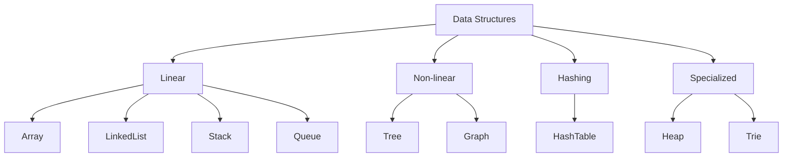

# Data Structures Fundamentals

A data structure is a way to organize data so it can be accessed, searched,
inserted, deleted, and updated efficiently.

Choosing the wrong structure can turn simple code into slow code.

## Concrete Versus Abstract Data Structures

An **abstract data type** describes behavior. A **data structure** describes
one implementation of that behavior.

| Abstract type | Behavior | Possible implementation |
|---|---|---|
| List | ordered sequence | array list, linked list |
| Stack | last in, first out | array, linked list, deque |
| Queue | first in, first out | circular array, linked list |
| Map | key-value lookup | hash table, tree |
| Set | unique values | hash table, tree |
| Priority queue | remove highest/lowest priority first | binary heap |

This distinction matters in interviews and design. For example, "use a queue"
describes behavior; `ArrayDeque` or `LinkedList` describes implementation.

## Why Data Structures Matter

| Need | Better structure |
|---|---|
| fast indexed access | array / ArrayList |
| fast key lookup | hash table |
| sorted traversal | tree |
| FIFO processing | queue |
| LIFO processing | stack |
| priority ordering | heap |
| relationship traversal | graph |

## Complexity Basics

| Complexity | Meaning |
|---|---|
| O(1) | constant time |
| O(log n) | logarithmic time |
| O(n) | linear time |
| O(n log n) | common efficient sorting |
| O(n^2) | nested-loop scale |

Big-O describes growth, not exact runtime. Constants, memory locality,
contention, and I/O also matter.

## Main Categories

| Category | Examples | Typical use |
|---|---|---|
| Linear | array, linked list, stack, queue, deque | ordered traversal and sequential processing |
| Non-linear | tree, graph, heap, trie | hierarchy, relationship traversal, priority, prefix search |
| Hash-based | hash map, hash set | fast lookup and duplicate detection |
| Concurrent | concurrent map, blocking queue | safe access across threads |
| Persistent/immutable | immutable list/map implementations | safe sharing and functional-style updates |

## Interview Questions

### Array vs linked list?

Array gives fast indexed access and better cache locality. Linked list gives
cheap insertion/removal only when you already have the node reference.

### Hash table vs tree?

Hash table gives average O(1) lookup without ordering. Tree gives O(log n)
lookup and sorted/range operations.

### Stack vs queue?

Stack is LIFO. Queue is FIFO.
