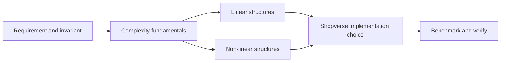

# Algorithms And Data Structures

<DocLabels items={[{label: 'Foundation', tone: 'foundation'}, {label: 'Java', tone: 'intermediate'}, {label: 'Shopverse examples', tone: 'shopverse'}]} />

Use this track to move from complexity and selection rules to concrete linear and non-linear structures. The goal is not memorizing implementations: it is choosing a structure from access pattern, ordering, mutation, concurrency, and memory requirements.

<TopicCards items={[
  {title: 'Selection fundamentals', href: '/data-structures/DATA-STRUCTURES-FUNDAMENTALS', description: 'Complexity, invariants, and selection workflow.', icon: 'route', tags: ['Complexity', 'Selection']},
  {title: 'Linear structures', href: '/data-structures/LINEAR-DATA-STRUCTURES', description: 'Arrays, lists, stacks, queues, and deques.', icon: 'layers', tags: ['Sequence', 'Queue']},
  {title: 'Non-linear structures', href: '/data-structures/NON-LINEAR-DATA-STRUCTURES', description: 'Trees, heaps, graphs, and traversal choices.', icon: 'network', tags: ['Tree', 'Graph']},
  {title: 'Java DSA interview bank', href: '/data-structures/DSA-INTERVIEW-QUESTION-BANK', description: 'Search 245 curated questions across eleven pattern families plus a consolidated Top 50.', icon: 'brain', tags: ['Interview', 'Searchable']},
]} />

<DocCallout type="shopverse" title="Choose from the workload">

For checkout commands, ordering and bounded waiting may dominate. For catalog traversal, hierarchy or graph relationships may dominate. State the workload before naming the structure.

</DocCallout>

## Recommended Next

Continue with [Java Collections](../java/JAVA-COLLECTIONS.md) to connect abstract structures to Java contracts and production implementations.

## Official References

- [Java Collections Framework](https://docs.oracle.com/en/java/javase/25/docs/api/java.base/java/util/package-summary.html)
- [Java Object Layout](https://openjdk.org/projects/code-tools/jol/)
