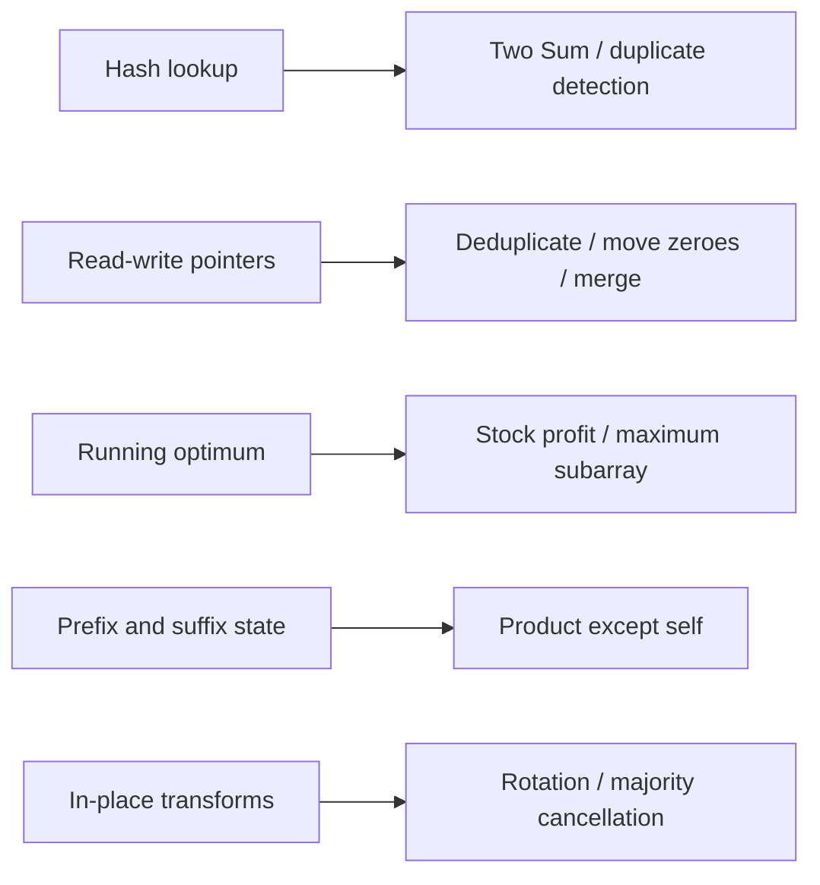

# Array Problems 1-10: Core Patterns

Each solution names the invariant that should drive your interview explanation.
Assume non-null input unless the method validates otherwise; clarify that contract
before coding.



## 1. Two Sum

**Pattern:** prefix lookup. **Invariant:** the map contains only earlier indices.

```java
static int[] twoSum(int[] nums, int target) {
    Map<Integer, Integer> indexByValue = new HashMap<>();
    for (int i = 0; i < nums.length; i++) {
        long wanted = (long) target - nums[i];
        if (wanted >= Integer.MIN_VALUE && wanted <= Integer.MAX_VALUE) {
            Integer earlier = indexByValue.get((int) wanted);
            if (earlier != null) return new int[]{earlier, i};
        }
        indexByValue.put(nums[i], i);
    }
    return new int[]{-1, -1};
}
```

<ExpandableAnswer title="How the Two Sum code works">

- `indexByValue` stores values from indices strictly before `i`.
- Compute the required complement in `long` so subtraction cannot overflow.
- If the complement is already stored, return its earlier index with `i`; the
  same position can never be reused because lookup happens before insertion.
- Otherwise store the current value/index and continue. Each element is visited
  once, giving expected `O(n)` time and `O(n)` space.

</ExpandableAnswer>

<ExpandableAnswer title="Dry run: [2, 7, 11, 15], target = 9">

1. At index `0`, the wanted value is `7`. It is absent, so store `2 -> 0`.
2. At index `1`, the wanted value is `2`. The map contains `2 -> 0`.
3. Return indices `[0, 1]`; their values add to `9`.

</ExpandableAnswer>

Expected `O(n)` time, `O(n)` space. See the [complete Two Sum family](./TWO-SUM-FAMILY.md).

## 2. Best Time To Buy And Sell Stock

**Pattern:** running optimum. **Invariant:** `minimum` is the lowest price before
or at the current day; `best` is the best legal buy-before-sell profit seen.

```java
static int maxProfit(int[] prices) {
    int minimum = Integer.MAX_VALUE;
    int best = 0;
    for (int price : prices) {
        minimum = Math.min(minimum, price);
        best = Math.max(best, price - minimum);
    }
    return best;
}
```

<ExpandableAnswer title="How the stock-profit code works">

- `minimum` is the cheapest price seen up to the current day.
- `price - minimum` is the best profit for a sale on the current day, because
  buying at any higher earlier price cannot improve it.
- Update `best` with that candidate, then continue the scan.
- Starting `best` at zero represents the allowed no-transaction result. The
  single pass uses `O(n)` time and `O(1)` space.

</ExpandableAnswer>

<ExpandableAnswer title="Dry run: prices = [7, 1, 5, 3, 6, 4]">

- Price `7`: `minimum = 7`, `best = 0`.
- Price `1`: `minimum = 1`, `best = 0`.
- Price `5`: selling now gives `4`, so `best = 4`.
- Price `3`: profit is `2`; keep `best = 4`.
- Price `6`: profit is `5`, so `best = 5`. Price `4` cannot improve it.

The best trade is buy at `1`, sell at `6`, and return `5`.

</ExpandableAnswer>

`O(n)` time and `O(1)` space. The zero result means no profitable transaction.
The unlimited-transactions variant uses a different contract and sums every
positive adjacent increase.

## 3. Remove Duplicates From Sorted Array

**Pattern:** slow/fast pointers. **Invariant:** indices `[0, write)` contain the
unique prefix in final order.

```java
static int removeDuplicates(int[] nums) {
    if (nums.length == 0) return 0;
    int write = 1;
    for (int read = 1; read < nums.length; read++) {
        if (nums[read] != nums[write - 1]) {
            nums[write++] = nums[read];
        }
    }
    return write;
}
```

<ExpandableAnswer title="How sorted deduplication works">

- Sorted input places equal values next to one another.
- `[0, write)` is always the final unique prefix; `read` scans the remaining
  values.
- A value different from `nums[write - 1]` is the next unique value, so copy it
  to `nums[write]` and advance `write`.
- Return `write` as the logical length. The algorithm is stable, in-place,
  `O(n)` time, and `O(1)` space.

</ExpandableAnswer>

<ExpandableAnswer title="Dry run: [1, 1, 2, 2, 3]">

- Start with `write = 1`; the unique prefix is `[1]`.
- Skip the second `1`. Copy `2` to index `1`, making the prefix `[1, 2]`.
- Skip the second `2`. Copy `3` to index `2`.
- Return `write = 3`; the meaningful prefix is `[1, 2, 3]`.

</ExpandableAnswer>

`O(n)` time, `O(1)` space, input mutated. Values beyond the returned logical
length are unspecified.

## 4. Move Zeroes

**Pattern:** stable compaction. First move every non-zero into the write prefix,
then fill the remaining suffix with zeroes.

```java
static void moveZeroes(int[] nums) {
    int write = 0;
    for (int value : nums) {
        if (value != 0) nums[write++] = value;
    }
    while (write < nums.length) nums[write++] = 0;
}
```

<ExpandableAnswer title="How Move Zeroes works">

- `write` marks the next position in the compacted non-zero prefix.
- The first loop copies each non-zero value in encounter order, which preserves
  relative order even when source and destination overlap.
- After every non-zero is placed, all positions from `write` onward are unused;
  fill that suffix with zeroes.
- Each position is processed a constant number of times: `O(n)` time and
  `O(1)` space.

</ExpandableAnswer>

<ExpandableAnswer title="Dry run: [0, 1, 0, 3, 12]">

- Compact non-zero values in order: write `1`, then `3`, then `12`.
- The array prefix becomes `[1, 3, 12]` and `write = 3`.
- Fill indices `3` and `4` with zeroes.
- Final array: `[1, 3, 12, 0, 0]`.

</ExpandableAnswer>

`O(n)` time, `O(1)` space. This preserves relative order. A swapping version can
reduce writes for some inputs but still needs a clearly stated stability policy.

## 5. Maximum Subarray

**Pattern:** Kadane dynamic programming. **Invariant:** `endingHere` is the best
sum of a non-empty subarray ending at the current index.

```java
static long maximumSubarray(int[] nums) {
    if (nums.length == 0) throw new IllegalArgumentException("empty array");
    long endingHere = nums[0];
    long best = nums[0];
    for (int i = 1; i < nums.length; i++) {
        endingHere = Math.max(nums[i], endingHere + nums[i]);
        best = Math.max(best, endingHere);
    }
    return best;
}
```

<ExpandableAnswer title="How Kadane's maximum-subarray code works">

- `endingHere` is the best non-empty subarray sum that must end at index `i`.
- At each value, either start a new subarray there or extend the previous best
  ending subarray; `Math.max` keeps the better choice.
- `best` records the largest `endingHere` observed anywhere.
- Initializing both variables from the first element preserves correctness for
  all-negative input. The scan is `O(n)` time and `O(1)` space.

</ExpandableAnswer>

<ExpandableAnswer title="Dry run: [-2, 1, -3, 4, -1, 2, 1, -5, 4]">

- The successive `endingHere` values are `-2, 1, -2, 4, 3, 5, 6, 1, 5`.
- `best` improves to `1`, then `4`, `5`, and finally `6`.
- The winning subarray is `[4, -1, 2, 1]`, whose sum is `6`.

</ExpandableAnswer>

Initialize from the first value, not zero, or an all-negative array is handled
incorrectly. `O(n)` time and `O(1)` space.

## 6. Contains Duplicate

**Pattern:** membership set.

```java
static boolean containsDuplicate(int[] nums) {
    Set<Integer> seen = new HashSet<>();
    for (int value : nums) {
        if (!seen.add(value)) return true;
    }
    return false;
}
```

<ExpandableAnswer title="How Contains Duplicate works">

- `seen.add(value)` returns `true` only when the set did not already contain the
  value.
- A `false` return therefore proves an earlier equal value exists, so return
  immediately.
- If every insertion succeeds, all values were unique.
- Hash-set operations are expected `O(1)`, producing expected `O(n)` time and
  `O(n)` space.

</ExpandableAnswer>

<ExpandableAnswer title="Dry run: [1, 2, 3, 1]">

- Insert `1`, `2`, and `3`; every `add` call returns `true`.
- The final `1` is already in the set, so `add(1)` returns `false`.
- Return `true` immediately because a duplicate has been proved.

</ExpandableAnswer>

Expected `O(n)` time, `O(n)` space. Sorting gives `O(n log n)` time and may avoid
hash storage, but mutates input unless copied.

## 7. Rotate Array Right By K

**Pattern:** three reversals. Normalize `k`, reverse the whole array, then reverse
the rotated prefix and suffix.

```java
static void rotateRight(int[] nums, int k) {
    if (nums.length == 0) return;
    k = Math.floorMod(k, nums.length);
    reverse(nums, 0, nums.length - 1);
    reverse(nums, 0, k - 1);
    reverse(nums, k, nums.length - 1);
}

static void reverse(int[] nums, int left, int right) {
    while (left < right) {
        int temporary = nums[left];
        nums[left++] = nums[right];
        nums[right--] = temporary;
    }
}
```

<ExpandableAnswer title="How the three-reversal rotation works">

- Normalize `k` so it lies in `0..n-1`; `floorMod` also defines negative input.
- Reversing the whole array brings the last `k` elements to the front, but both
  groups are internally reversed.
- Reverse the first `k` positions and then the remaining suffix to restore each
  group's order.
- `reverse` swaps symmetric endpoints until they meet. Across three passes the
  work is `O(n)` and uses `O(1)` extra space.

</ExpandableAnswer>

<ExpandableAnswer title="Dry run: [1, 2, 3, 4, 5, 6, 7], k = 3">

1. Reverse the whole array: `[7, 6, 5, 4, 3, 2, 1]`.
2. Reverse the first three values: `[5, 6, 7, 4, 3, 2, 1]`.
3. Reverse the remaining suffix: `[5, 6, 7, 1, 2, 3, 4]`.

</ExpandableAnswer>

`Math.floorMod` gives defined behavior for negative rotation counts. `O(n)` time,
`O(1)` space, input mutated.

## 8. Merge Sorted Arrays In Place

Given `first` with capacity for both inputs, merge from the end so unread values
in `first` are not overwritten.

```java
static void merge(int[] first, int m, int[] second, int n) {
    int i = m - 1;
    int j = n - 1;
    int write = m + n - 1;

    while (j >= 0) {
        if (i >= 0 && first[i] > second[j]) {
            first[write--] = first[i--];
        } else {
            first[write--] = second[j--];
        }
    }
}
```

<ExpandableAnswer title="How the in-place merge works">

- `i` and `j` point to the largest unread values; `write` points to the final
  free destination slot.
- Write the larger tail value and move that source pointer left.
- Working backward prevents overwriting unread values already stored in
  `first`.
- Only `second` must be exhausted: any remaining prefix of `first` is already in
  its correct location. Total time is `O(m+n)` and extra space `O(1)`.

</ExpandableAnswer>

<ExpandableAnswer title="Dry run: first = [1, 2, 3, 0, 0, 0], second = [2, 5, 6]">

- Compare tails and write from index `5`: place `6`, then `5`, then `3`.
- Compare `2` and `2`; place the value from `second`, then its remaining prefix.
- Final `first`: `[1, 2, 2, 3, 5, 6]`. No unread value in `first` is overwritten.

</ExpandableAnswer>

`O(m + n)` time, `O(1)` space. Only `second` must be exhausted; any remaining
prefix of `first` is already correctly placed.

## 9. Product Of Array Except Self

**Pattern:** prefix and suffix products. The result first stores the product to
the left, then multiplies by a running product from the right.

```java
static long[] productExceptSelf(int[] nums) {
    long[] result = new long[nums.length];
    long prefix = 1;
    for (int i = 0; i < nums.length; i++) {
        result[i] = prefix;
        prefix *= nums[i];
    }

    long suffix = 1;
    for (int i = nums.length - 1; i >= 0; i--) {
        result[i] *= suffix;
        suffix *= nums[i];
    }
    return result;
}
```

<ExpandableAnswer title="How Product Except Self works">

- The left-to-right pass stores in `result[i]` the product of values strictly
  before `i`, then extends `prefix` with `nums[i]`.
- The right-to-left pass maintains the product strictly after `i` in `suffix`.
- Multiplying the stored prefix by `suffix` produces every value except
  `nums[i]`, without division.
- The two passes are `O(n)`; only the output array grows with input size.

</ExpandableAnswer>

<ExpandableAnswer title="Dry run: [1, 2, 3, 4]">

- Prefix pass stores `[1, 1, 2, 6]`.
- Traverse right to left with suffix products `1, 4, 12, 24`.
- Multiplying each stored prefix by its right-side suffix gives
  `[24, 12, 8, 6]`.

</ExpandableAnswer>

`O(n)` time and `O(1)` auxiliary space excluding output. It naturally handles
zeroes, unlike division. Even `long` can overflow unless constraints bound products.

## 10. Majority Element

**Pattern:** Boyer-Moore cancellation. Different values cancel; if a strict
majority exists, it survives as the candidate.

```java
static int majorityElement(int[] nums) {
    int candidate = 0;
    int votes = 0;
    for (int value : nums) {
        if (votes == 0) candidate = value;
        votes += value == candidate ? 1 : -1;
    }
    return candidate;
}
```

<ExpandableAnswer title="How Boyer-Moore majority vote works">

- When `votes` reaches zero, the processed prefix has fully cancelled, so the
  current value becomes a new candidate.
- Matching values add a vote; different values remove one, pairing the candidate
  with an opponent.
- A strict majority occurs more often than all other values combined, so it
  cannot be completely cancelled and survives as the candidate.
- The guarantee-free version needs a second counting pass. Candidate selection
  itself is `O(n)` time and `O(1)` space.

</ExpandableAnswer>

<ExpandableAnswer title="Dry run: [2, 2, 1, 1, 1, 2, 2]">

- The first two `2`s build two votes; the next two `1`s cancel them.
- With votes at zero, the next `1` becomes candidate.
- The following `2` cancels it; the last `2` becomes the new candidate.
- Return `2`, the strict majority.

</ExpandableAnswer>

`O(n)` time, `O(1)` space. If the problem does not guarantee a majority, make a
second pass to verify the candidate occurs more than `n / 2` times.

## Review Questions

- Why does merging from the front corrupt unread input?
- Why is Kadane initialized from `nums[0]`?
- What does Boyer-Moore return when no majority exists?
- Which solutions mutate input and how would you preserve it?
- Which arithmetic needs `long`, and can even `long` overflow?
