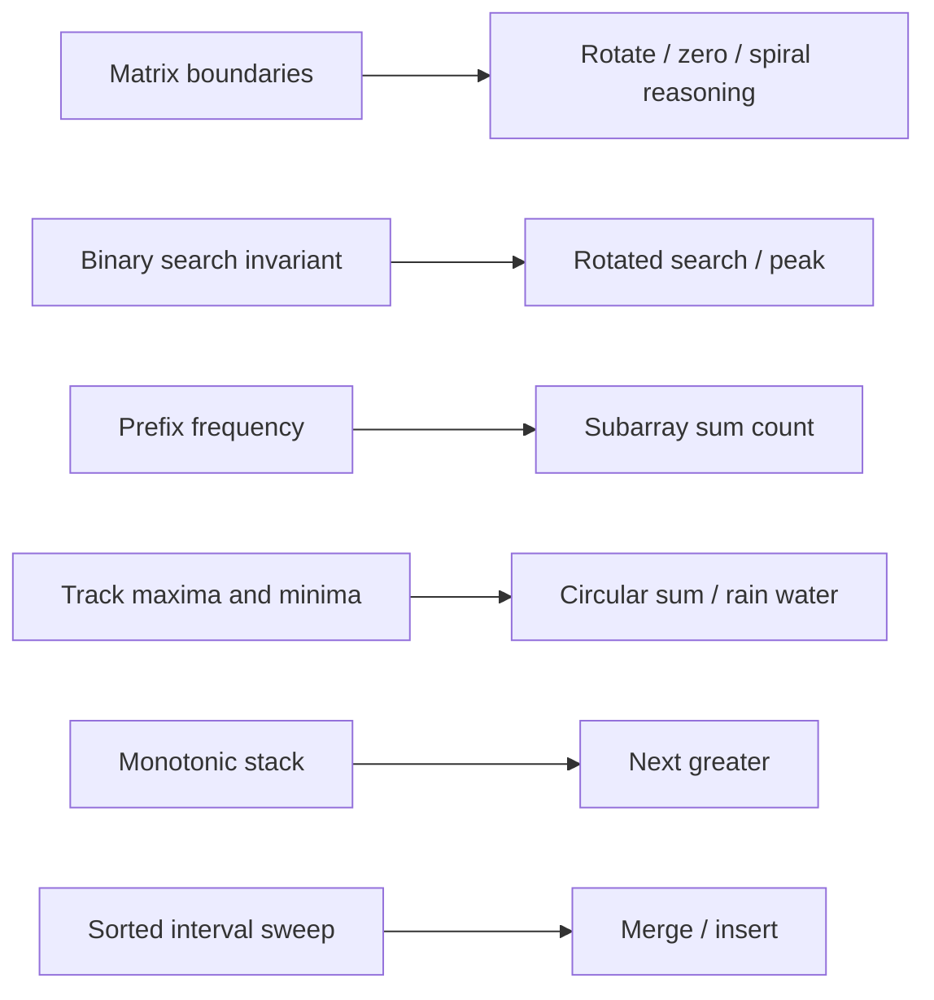

# Array Problems 21-30: Search, Prefix State, Stacks, And Intervals



## 21. Rotate Image 90 Degrees Clockwise

For a square matrix, transpose across the main diagonal, then reverse each row.

```java
static void rotateClockwise(int[][] matrix) {
    int n = matrix.length;
    for (int row = 0; row < n; row++) {
        if (matrix[row].length != n)
            throw new IllegalArgumentException("matrix must be square");
        for (int column = row + 1; column < n; column++) {
            int temporary = matrix[row][column];
            matrix[row][column] = matrix[column][row];
            matrix[column][row] = temporary;
        }
    }

    for (int[] row : matrix) {
        for (int left = 0, right = n - 1; left < right; left++, right--) {
            int temporary = row[left];
            row[left] = row[right];
            row[right] = temporary;
        }
    }
}
```

<ExpandableAnswer title="How matrix rotation works">

- Validate a square matrix because an in-place 90-degree rotation must keep the
  same dimensions.
- Transpose only cells above the main diagonal, swapping `[row][column]` with
  `[column][row]`; this reflects the matrix across that diagonal.
- Reverse every row to convert the transpose into a clockwise rotation.
- Each cell is touched a constant number of times: `O(n²)` time and `O(1)`
  extra space.

</ExpandableAnswer>

`O(n^2)` time, `O(1)` space, input mutated. Rectangular matrices require a new
matrix because their dimensions change.

<ExpandableAnswer title="Dry run: rotate [[1,2,3],[4,5,6],[7,8,9]]">

1. Transpose across the diagonal to get `[[1,4,7],[2,5,8],[3,6,9]]`.
2. Reverse every row.
3. The result is `[[7,4,1],[8,5,2],[9,6,3]]`.

</ExpandableAnswer>

## 22. Set Matrix Zeroes

Use the first row and column as marker storage, with separate flags for their
original zero state.

```java
static void setZeroes(int[][] matrix) {
    int rows = matrix.length;
    int columns = matrix[0].length;
    boolean zeroFirstRow = false;
    boolean zeroFirstColumn = false;

    for (int column = 0; column < columns; column++)
        if (matrix[0][column] == 0) zeroFirstRow = true;
    for (int row = 0; row < rows; row++)
        if (matrix[row][0] == 0) zeroFirstColumn = true;

    for (int row = 1; row < rows; row++) {
        for (int column = 1; column < columns; column++) {
            if (matrix[row][column] == 0) {
                matrix[row][0] = 0;
                matrix[0][column] = 0;
            }
        }
    }

    for (int row = 1; row < rows; row++) {
        for (int column = 1; column < columns; column++) {
            if (matrix[row][0] == 0 || matrix[0][column] == 0)
                matrix[row][column] = 0;
        }
    }

    if (zeroFirstRow) Arrays.fill(matrix[0], 0);
    if (zeroFirstColumn)
        for (int row = 0; row < rows; row++) matrix[row][0] = 0;
}
```

<ExpandableAnswer title="How Set Matrix Zeroes works">

- Save whether the original first row and first column contain zeroes because
  those cells will also serve as marker storage.
- Scan the interior; a zero marks its entire row through `matrix[row][0]` and
  its column through `matrix[0][column]`.
- A second interior pass zeroes cells whose row or column marker is zero.
- Finally apply the saved first-row/first-column flags. Reusing matrix borders
  gives `O(rows×columns)` time and `O(1)` extra space.

</ExpandableAnswer>

`O(rows * columns)` time, `O(1)` auxiliary space.

<ExpandableAnswer title="Dry run: [[1,1,1],[1,0,1],[1,1,1]]">

- The zero at row `1`, column `1` marks that row and column through the first row/column markers.
- In the second pass, every cell in row `1` or column `1` becomes zero.
- Result: `[[1,0,1],[0,0,0],[1,0,1]]`.

</ExpandableAnswer>

## 23. Search In Rotated Sorted Array

At least one half around `middle` is sorted. Determine which half is sorted, then
test whether the target lies inside its value range.

```java
static int searchRotated(int[] nums, int target) {
    int left = 0, right = nums.length - 1;
    while (left <= right) {
        int middle = left + (right - left) / 2;
        if (nums[middle] == target) return middle;

        if (nums[left] <= nums[middle]) {
            if (nums[left] <= target && target < nums[middle]) right = middle - 1;
            else left = middle + 1;
        } else {
            if (nums[middle] < target && target <= nums[right]) left = middle + 1;
            else right = middle - 1;
        }
    }
    return -1;
}
```

<ExpandableAnswer title="How rotated-array binary search works">

- Compute `middle`; if it is the target, return immediately.
- With distinct values, at least one half is normally sorted. Compare
  `nums[left]` and `nums[middle]` to identify that half.
- Check whether the target lies inside the sorted half's value bounds; keep that
  half if so, otherwise discard it.
- The candidate interval halves each iteration, giving `O(log n)` time. Duplicate
  boundary values can make the sorted side ambiguous.

</ExpandableAnswer>

`O(log n)` time for distinct values. Duplicates can make the sorted half ambiguous
and degrade the duplicate-aware variant to `O(n)`.

<ExpandableAnswer title="Dry run: [4, 5, 6, 7, 0, 1, 2], target = 0">

- `middle = 3` gives `7`; the left half is sorted, but `0` is not inside it, so search indices `4..6`.
- `middle = 5` gives `1`; the left part `[0,1]` is sorted and contains the target, so move left.
- Index `4` contains `0`; return `4`.

</ExpandableAnswer>

## 24. Find Peak Element

Compare `middle` with its right neighbor. An upward slope guarantees a peak to the
right; otherwise a peak exists at or left of `middle`.

```java
static int findPeak(int[] nums) {
    int left = 0, right = nums.length - 1;
    while (left < right) {
        int middle = left + (right - left) / 2;
        if (nums[middle] < nums[middle + 1]) left = middle + 1;
        else right = middle;
    }
    return left;
}
```

<ExpandableAnswer title="How peak binary search works">

- Compare `nums[middle]` with its right neighbor, which is safe because the loop
  runs only while `left < right`.
- An upward slope means some peak exists to the right, so discard through
  `middle`.
- A flat/downward slope guarantees a peak at `middle` or to its left, so retain
  `middle` with `right = middle`.
- The interval converges to one peak index in `O(log n)` time and `O(1)` space.

</ExpandableAnswer>

`O(log n)` time, `O(1)` space. This returns one peak, not necessarily the global maximum.

<ExpandableAnswer title="Dry run: [1, 2, 3, 1]">

- At `middle = 1`, `nums[1] < nums[2]`, so a peak must exist to the right.
- Search `2..3`; at `middle = 2`, `nums[2] > nums[3]`, so keep index `2`.
- The bounds meet at index `2`; value `3` is a peak.

</ExpandableAnswer>

## 25. Subarray Sum Equals K

If the current prefix is `p`, each earlier prefix `p - k` defines a subarray ending
now with sum `k`. Seed prefix zero once to count subarrays starting at index zero.

```java
static long countSubarraysWithSum(int[] nums, long k) {
    Map<Long, Integer> prefixFrequency = new HashMap<>();
    prefixFrequency.put(0L, 1);
    long prefix = 0;
    long count = 0;

    for (int value : nums) {
        prefix += value;
        count += prefixFrequency.getOrDefault(prefix - k, 0);
        prefixFrequency.merge(prefix, 1, Integer::sum);
    }
    return count;
}
```

<ExpandableAnswer title="How prefix-frequency subarray counting works">

- Seed prefix sum zero once so a subarray beginning at index zero can match.
- After including the current value, a previous prefix `prefix-k` marks a
  contiguous subarray whose difference is exactly `k`.
- Add its frequency because several earlier positions can share that prefix.
- Record the current prefix only after counting, so only earlier boundaries are
  used. Expected time and space are both `O(n)`.

</ExpandableAnswer>

Expected `O(n)` time, `O(n)` space. A normal sliding window is incorrect when
negative values are allowed because growing the window is not monotonic.

<ExpandableAnswer title="Dry run: [1, 1, 1], k = 2">

- Prefix `1` looks for `-1`; no match. Record prefix `1`.
- Prefix `2` looks for `0`; one stored occurrence gives subarray `[1,1]`.
- Prefix `3` looks for `1`; one stored occurrence gives the second `[1,1]`.
- Return count `2`.

</ExpandableAnswer>

## 26. Maximum Sum Circular Subarray

The best circular subarray is either the ordinary maximum or total sum minus the
minimum non-circular subarray. If every value is negative, the latter would select
an empty subarray and must not be used.

```java
static long maximumCircularSubarray(int[] nums) {
    long total = nums[0];
    long maxEnding = nums[0], maxSum = nums[0];
    long minEnding = nums[0], minSum = nums[0];

    for (int i = 1; i < nums.length; i++) {
        long value = nums[i];
        maxEnding = Math.max(value, maxEnding + value);
        maxSum = Math.max(maxSum, maxEnding);
        minEnding = Math.min(value, minEnding + value);
        minSum = Math.min(minSum, minEnding);
        total += value;
    }
    return maxSum < 0 ? maxSum : Math.max(maxSum, total - minSum);
}
```

<ExpandableAnswer title="How circular Kadane works">

- Run maximum Kadane for the best ordinary non-wrapping subarray.
- Simultaneously run minimum Kadane and accumulate the total array sum.
- A wrapping maximum contains everything except one minimum contiguous middle
  section, so its sum is `total - minSum`.
- If `maxSum < 0`, every value is negative and exclusion would select an empty
  range; return the ordinary maximum. The scan is `O(n)` and `O(1)` space.

</ExpandableAnswer>

`O(n)` time, `O(1)` space.

<ExpandableAnswer title="Dry run: [5, -3, 5]">

- Ordinary Kadane gives maximum non-wrapping sum `7`.
- Minimum Kadane gives `-3`; total sum is `7`.
- Wrapping sum is `total - minimum = 7 - (-3) = 10`.
- Return `max(7, 10) = 10`, representing the two boundary `5`s.

</ExpandableAnswer>

## 27. Trapping Rain Water

Whichever side has the smaller maximum is currently bounded by the other side.
Advance it and accumulate the difference from its running maximum.

```java
static long trappedWater(int[] height) {
    int left = 0, right = height.length - 1;
    int leftMaximum = 0, rightMaximum = 0;
    long water = 0;

    while (left < right) {
        if (height[left] <= height[right]) {
            leftMaximum = Math.max(leftMaximum, height[left]);
            water += leftMaximum - height[left];
            left++;
        } else {
            rightMaximum = Math.max(rightMaximum, height[right]);
            water += rightMaximum - height[right];
            right--;
        }
    }
    return water;
}
```

<ExpandableAnswer title="How the two-pointer rain-water code works">

- Water above a position is limited by the smaller of the best wall on each side.
- When the left height is no greater than the right height, the right side is
  already a sufficient boundary; update `leftMaximum` and settle the left cell.
- Otherwise settle the symmetric right cell using `rightMaximum`.
- Add the gap between the running maximum and current height, then move inward.
  Each position is settled once: `O(n)` time and `O(1)` space.

</ExpandableAnswer>

`O(n)` time, `O(1)` space. Be able to contrast this with prefix maxima and a
monotonic stack.

<ExpandableAnswer title="Dry run: [0,1,0,2,1,0,1,3,2,1,2,1]">

- The two pointers maintain the highest wall confirmed from each side.
- Each time the lower side advances, add `sideMaximum - currentHeight`.
- The trapped contributions at the interior valleys total `6` units.
- Return `6` without allocating prefix/suffix maximum arrays.

</ExpandableAnswer>

## 28. Next Greater Element I

Process the reference array once. The decreasing stack holds values whose next
greater value is unresolved.

```java
static int[] nextGreater(int[] query, int[] reference) {
    Map<Integer, Integer> nextByValue = new HashMap<>();
    Deque<Integer> decreasing = new ArrayDeque<>();

    for (int value : reference) {
        while (!decreasing.isEmpty() && decreasing.peek() < value)
            nextByValue.put(decreasing.pop(), value);
        decreasing.push(value);
    }

    int[] result = new int[query.length];
    for (int i = 0; i < query.length; i++)
        result[i] = nextByValue.getOrDefault(query[i], -1);
    return result;
}
```

<ExpandableAnswer title="How the monotonic-stack code works">

- `decreasing` stores earlier values whose next greater value is unresolved, in
  decreasing order from bottom to top.
- A new larger value resolves every smaller stack top; pop each and map it to
  this first greater value.
- Push the new value as unresolved. Values left after the scan have no greater
  value and default to `-1`.
- Each reference value is pushed and popped at most once, so preprocessing is
  `O(n)` and answering queries is `O(m)`.

</ExpandableAnswer>

`O(m + n)` time and `O(n)` space. This value-map formulation assumes distinct
values in the reference input; index-based variants support duplicates.

<ExpandableAnswer title="Dry run: query [4,1,2], reference [1,3,4,2]">

- Scanning the reference with a decreasing stack maps `1 -> 3` and `3 -> 4`.
- Values `4` and `2` have no greater value to their right, so each maps to `-1`.
- Look up the query values and return `[-1, 3, -1]`.

</ExpandableAnswer>

## 29. Merge Intervals

Sort by start, then merge into the last emitted interval whenever boundaries
overlap. Define whether touching intervals count as overlapping.

```java
static int[][] mergeIntervals(int[][] intervals) {
    if (intervals.length == 0) return new int[0][];
    Arrays.sort(intervals, Comparator.comparingInt(interval -> interval[0]));
    List<int[]> merged = new ArrayList<>();
    merged.add(Arrays.copyOf(intervals[0], 2));

    for (int i = 1; i < intervals.length; i++) {
        int[] last = merged.get(merged.size() - 1);
        if (intervals[i][0] <= last[1]) {
            last[1] = Math.max(last[1], intervals[i][1]);
        } else {
            merged.add(Arrays.copyOf(intervals[i], 2));
        }
    }
    return merged.toArray(int[][]::new);
}
```

<ExpandableAnswer title="How interval merging works">

- Sort by start so no later interval can begin before the current candidate.
- Copy the first interval into the result to avoid mutating its inner array.
- For each next interval, overlap exists when its start is at most the last
  merged end; extend that end to the farther boundary.
- Otherwise append a new copied interval. Sorting dominates at `O(n log n)`;
  the merge scan is linear.

</ExpandableAnswer>

`O(n log n)` time, `O(n)` output space. Sorting mutates outer-array order.

<ExpandableAnswer title="Dry run: [[1,3],[2,6],[8,10],[15,18]]">

- Sort by start time; the shown input is already sorted.
- `[2,6]` overlaps `[1,3]`, so extend the current interval to `[1,6]`.
- The remaining intervals do not overlap it or each other.
- Return `[[1,6],[8,10],[15,18]]`.

</ExpandableAnswer>

## 30. Insert Interval

Because existing intervals are sorted and non-overlapping, copy intervals before
the new range, merge overlaps, then copy intervals after it.

```java
static int[][] insertInterval(int[][] intervals, int[] incoming) {
    List<int[]> result = new ArrayList<>();
    int index = 0;

    while (index < intervals.length && intervals[index][1] < incoming[0])
        result.add(Arrays.copyOf(intervals[index++], 2));

    int start = incoming[0], end = incoming[1];
    while (index < intervals.length && intervals[index][0] <= end) {
        start = Math.min(start, intervals[index][0]);
        end = Math.max(end, intervals[index][1]);
        index++;
    }
    result.add(new int[]{start, end});

    while (index < intervals.length)
        result.add(Arrays.copyOf(intervals[index++], 2));

    return result.toArray(int[][]::new);
}
```

<ExpandableAnswer title="How interval insertion works">

- Copy every interval ending before `incoming` starts; these cannot overlap it.
- Initialize a mutable `[start,end]` candidate from `incoming`.
- While an existing interval starts before the candidate ends, merge it by
  taking the minimum start and maximum end.
- Append the merged candidate, then copy the untouched intervals after it.
  Sorted, non-overlapping input makes the whole operation `O(n)`.

</ExpandableAnswer>

`O(n)` time and `O(n)` output space.

<ExpandableAnswer title="Dry run: intervals [[1,3],[6,9]], new interval [2,5]">

- No interval finishes before `[2,5]` starts.
- `[1,3]` overlaps it, so merge them into `[1,5]`.
- `[6,9]` starts after the merged interval, so append both in order.
- Return `[[1,5],[6,9]]`.

</ExpandableAnswer>

## Review Questions

- Why do rotated-search duplicates weaken the logarithmic guarantee?
- Why is prefix zero seeded with frequency one?
- Why does circular Kadane need the all-negative guard?
- State the monotonic-stack invariant for Next Greater Element.
- Do touching intervals overlap in your contract?
- Which matrix and interval methods mutate caller-owned arrays?
