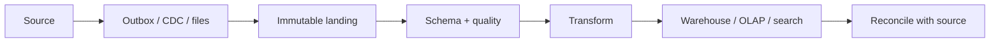

# Data Pipelines And Search Operations

## ETL, ELT, Batch, And Streaming

ETL transforms before loading; ELT loads controlled raw data then transforms in
the destination. Batch processes bounded snapshots efficiently. Streaming reduces
freshness delay but adds offsets, ordering, late data, replay, and continuous
operations. Many systems combine CDC/event streaming for freshness with periodic
batch reconciliation for correctness.

Define event identity, source ownership, schema compatibility, partition/order
scope, checkpointing, idempotent sinks, replay, backfill, deletion propagation,
and freshness SLO. Keep raw immutable inputs when policy permits so derived state
can be rebuilt. Quarantine invalid records without silently losing them.

Data-quality contracts cover completeness, uniqueness, validity, referential
integrity, timeliness, distribution drift, and reconciliation totals. Track
lineage from output to source and code/config version.

For windows and late events, define event time, watermark, allowed lateness,
retraction/update behavior, and finalization. “Exactly once” in one engine does
not automatically cover external effects; use idempotent keys and reconciliation.

## Search Modeling

Analyzers combine character filters, tokenizers, and token filters. Index-time
and query-time analysis must be compatible. Map exact identifiers to keyword
fields and human text to analyzed fields; avoid uncontrolled dynamic mappings.

Relevance commonly combines term statistics, field boosts, phrase/proximity,
freshness, popularity, and business rules. Evaluate with a labeled query set and
metrics such as precision, recall, MRR, or NDCG—not anecdotes.

## Search Operations

- Size primary shards from data, traffic, recovery time, and node capacity.
- Avoid oversharding, hot routing keys, unbounded fields, and expensive wildcards.
- Use replicas for availability/read scale with measured indexing cost.
- Monitor indexing/search latency, rejected work, refresh, merges, segments,
  heap, disk watermarks, shard recovery, cache, and query errors.
- Prefer `search_after` plus point-in-time context for deep pagination; avoid deep offsets.

For zero-downtime reindexing, create a versioned index, backfill from authoritative
data, dual-stream or catch up changes, validate counts/checksums/search quality,
atomically switch an alias, observe, and retain the old index for rollback. Treat
search as a rebuildable projection and revalidate price, stock, permissions, and
deletion against authoritative data.

## Recommended Next Page

Continue with [SRE, Disaster Recovery, And Chaos Engineering](../operations/SRE-DR-CHAOS.md).

## Official References

- [Apache Kafka design](https://kafka.apache.org/documentation/#design)
- [Elasticsearch aliases](https://www.elastic.co/guide/en/elasticsearch/reference/current/aliases.html)
- [OpenSearch index aliases](https://docs.opensearch.org/latest/im-plugin/index-alias/)
