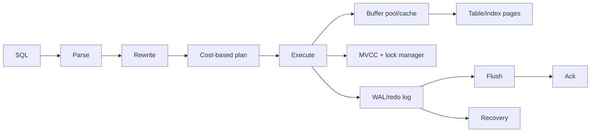

# Database Engine Internals

## Storage And Recovery

Row stores organize table/index pages; engines differ on heap versus clustered
organization. The buffer manager caches pages and coordinates dirty-page writes.
Write-ahead logging persists recovery information before acknowledging dependent
data-page writes. Checkpoints bound recovery work; they do not mean every logical
transaction is copied into its final page at that instant.

PostgreSQL uses heap tuples with MVCC versions and vacuum cleanup. InnoDB uses a
clustered primary index, undo records and redo. Oracle, Db2 and SQL Server expose
different implementations and tooling; compare behavior using their manuals and
plans rather than transferring one engine's terminology blindly.

## Concurrency

MVCC permits readers and writers to coexist by choosing visible versions, but old
transactions retain garbage and can block cleanup. Locks still protect schema,
uniqueness, foreign keys, write conflicts and explicit pessimistic operations.
Deadlock detection chooses a victim; applications retry only safe transactions
within a deadline.

## Optimizer And Execution

Statistics estimate cardinality/selectivity. Bad histograms, correlation, skew,
parameter sensitivity or stale stats produce wrong join order and algorithms.

| Operator | Natural fit | Risk |
|---|---|---|
| nested loop | small outer plus indexed inner | disastrous when outer estimate is wrong |
| hash join | large equality join | memory grant and disk spill |
| merge join | sorted equality/range-compatible inputs | sort cost and ordering assumptions |
| sort/hash aggregate | grouping | memory, temp spill and skew |

Compare estimates with actual rows, buffers/I/O, loops, spills, lock wait and total
time. Fast planning output without execution does not prove runtime performance.

## Index Structures

B-trees support equality/range/order and split pages under growth. Composite order
follows predicates and ordering; covering/index-only access still depends on engine
visibility/storage. Partial/expression, GIN/GiST/BRIN, bitmap and full-text indexes
serve different query models. Every index amplifies writes, logs, replication,
backup, cache pressure and migrations.

LSM systems buffer writes in memory, append logs and compact sorted files. Bloom
filters avoid many absent-key file reads but can return false positives. Tombstones,
compaction and hot partitions dominate Cassandra-style operations.

ClickHouse MergeTree writes immutable sorted parts and merges them; it is optimized
for analytical scans/batches rather than row OLTP. Vector HNSW/IVF indexes trade
recall, memory, build/update cost and filtering behavior.

## Lab Checklist

- inspect one query before/after statistics and correct index;
- force/observe join algorithms and spills on bounded data;
- show long transaction preventing cleanup;
- measure WAL/log and write cost from excessive indexes;
- crash a disposable database after acknowledged writes and validate recovery;
- model LSM partition/tombstone/compaction behavior;
- compare row-store OLTP aggregation with ClickHouse.

## Official References

- [PostgreSQL internals](https://www.postgresql.org/docs/current/internals.html)
- [PostgreSQL query planning](https://www.postgresql.org/docs/current/using-explain.html)
- [MySQL InnoDB architecture](https://dev.mysql.com/doc/refman/8.4/en/innodb-architecture.html)
- [Apache Cassandra storage engine](https://cassandra.apache.org/doc/latest/cassandra/architecture/storage-engine.html)
- [ClickHouse MergeTree](https://clickhouse.com/docs/engines/table-engines/mergetree-family/mergetree)

## Recommended Next Page

Continue with [Indexes And Query Plans](./database-selection/INDEXES-QUERY-PLANS.md).
