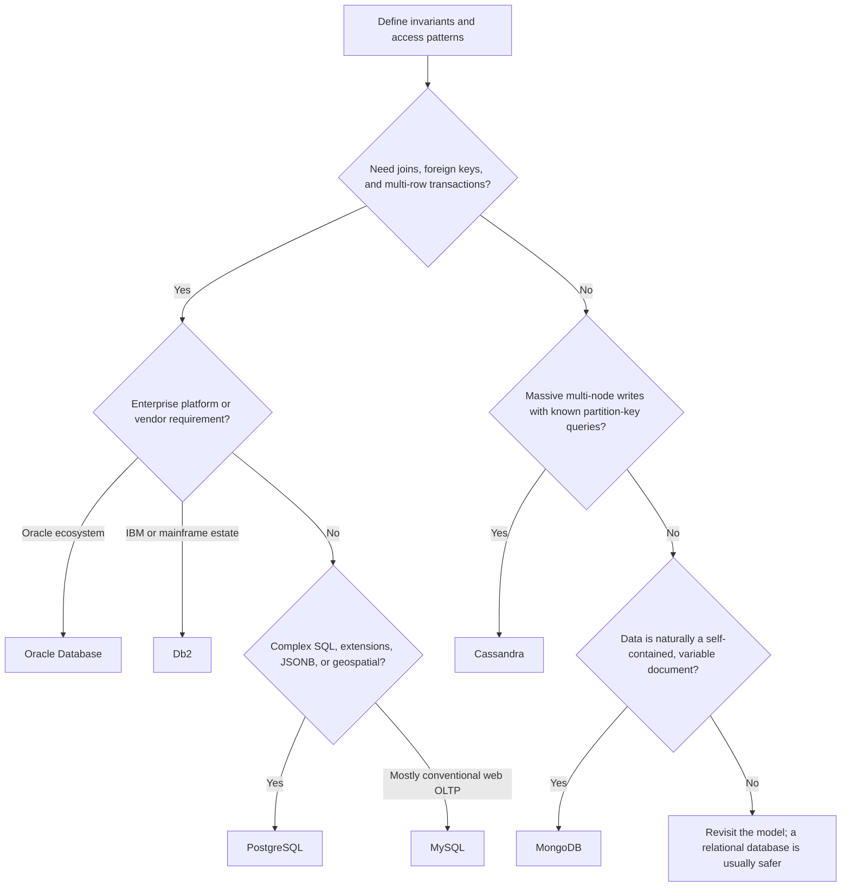

# Database Selection Guide

There is no universally best database. Choose the database whose consistency,
query, scale, security, and operational model match the workload. Start with the
data and access patterns—not a product name.

:::tip Default choice
For a new transactional application, begin with PostgreSQL or MySQL unless a
measured requirement points elsewhere. Choose Oracle Database or Db2 when their
enterprise ecosystem is a requirement. Choose Cassandra for predictable,
partition-key-driven traffic at very large scale and MongoDB for an aggregate-
oriented document model that genuinely benefits from schema flexibility.
:::

## Fast Decision Matrix

Scores are directional, not benchmarks. Deployment topology, schema, indexes,
hardware, query shape, and operator experience can change the result.

| Database | Model | Best fit | Reads | Writes | Horizontal scale | Transactions and joins | Operational cost |
|---|---|---|---|---|---|---|---|
| MySQL | relational | web OLTP, commerce, SaaS | excellent indexed reads; replicas scale reads | strong on a single primary | reads are straightforward; write sharding needs design | ACID; strong common SQL and join support | low–medium |
| PostgreSQL | object-relational | complex OLTP, geospatial, mixed relational/JSON | excellent for complex queries | strong; MVCC handles concurrency well | replicas scale reads; sharding commonly uses extensions/services | rich SQL, constraints, joins, ACID | medium |
| Db2 | relational | regulated enterprises, IBM and mainframe estates | excellent tuned OLTP and analytics | strong enterprise transaction processing | platform/edition dependent | rich SQL, ACID, mature optimizer | high |
| Oracle Database | object-relational | mission-critical enterprise OLTP, packaged enterprise systems | excellent at complex and concurrent workloads | excellent with careful design and licensing | mature clustering, replicas, and partitioning options | very rich SQL, ACID, PL/SQL | high |
| Cassandra | wide-column, distributed | massive write throughput, multi-region availability, time-series/event-like access | excellent by partition key; poor for ad hoc queries | excellent, distributed, append-friendly | native linear scale-out | limited transactions; no joins; denormalize by query | high unless managed |
| MongoDB | document | catalogs, content, profiles, variable aggregate-shaped data | excellent when a document satisfies the read | strong; document-local updates are efficient | native replica sets and sharding | ACID transactions exist, but frequent cross-document use signals a model mismatch | medium |

### Quick Selection Flow

## Decide From Requirements

Before comparing products, write down:

1. **Correctness invariants:** What must never be partially updated? Do changes
   span rows, tables, documents, services, or regions?
2. **Access patterns:** List the exact reads and writes, including filters,
   sorting, joins, aggregations, pagination, and batch jobs.
3. **Load shape:** Record average and peak requests per second, read/write ratio,
   row or document size, retained history, growth, and hot-key risk.
4. **Latency and availability:** Define p95/p99 targets, recovery time objective
   (RTO), recovery point objective (RPO), and regional failure expectations.
5. **Consistency:** Decide where stale reads are acceptable and where read-your-
   writes or serializable behavior is required.
6. **Governance:** Check encryption, access control, audit retention, data
   residency, masking, backup, and restore-testing requirements.
7. **Operations and cost:** Include licenses, managed-service charges, people,
   upgrades, observability, capacity headroom, and disaster-recovery exercises.

Use production-shaped data in a proof of concept. Test failure and recovery—not
only happy-path throughput.

## MySQL

### Choose It When

- the workload is conventional web or commerce OLTP;
- the schema is relational and transactions are important;
- queries are well understood and mostly use indexed lookups and joins;
- a broad hosting, tooling, and developer ecosystem matters;
- read replicas provide enough scale and one primary can handle write demand.

**Real-world scenario:** an online store stores customers, orders, order lines,
payments, and inventory reservations. Foreign keys and transactions protect
relationships, while replicas serve product and order-history reads.

### How It Works

MySQL is a relational SQL server with pluggable storage engines. InnoDB is the
normal transactional engine: it uses clustered primary-key indexes, secondary
indexes that reference the primary key, multi-version concurrency control
(MVCC), redo and undo logs, a buffer pool, and row-level locking. The optimizer
chooses access paths and join strategies from indexes and statistics.

### Load, Performance, and Data

- **Reads:** excellent for indexed point/range queries. Replicas scale read-heavy
  workloads, but asynchronous replicas can return stale data.
- **Writes:** efficient OLTP on a primary. Too many indexes, random large keys,
  hot rows, long transactions, or synchronous durability pressure reduce throughput.
- **Scale:** vertical scaling and replicas are simple. Multi-primary or sharded
  writes add conflict, routing, resharding, and distributed-transaction concerns.
- **Data:** structured relational data, numeric/text/binary values, JSON,
  spatial data, and full-text indexes. Prefer normal columns for frequently
  constrained, joined, or filtered attributes.

### Security and Audit

Use TLS, least-privilege accounts and roles, network isolation, encryption at
rest through the platform/edition, key rotation, and tested encrypted backups.
MySQL provides audit capabilities through edition/vendor plugins; verify the
exact distribution and license. Database logs are not a substitute for a
business audit table containing actor, action, target, time, correlation ID,
and safe before/after metadata.

### Avoid It When

- the application depends heavily on advanced SQL, custom types, or specialized
  extensions better served by PostgreSQL;
- one primary cannot meet the required write scale and application-level
  sharding is unacceptable;
- a mandated enterprise product/ecosystem is Oracle or IBM.

## PostgreSQL

### Choose It When

- correctness, rich SQL, complex joins, and strong constraints matter;
- one service mixes normalized relational data with selected JSONB fields;
- the workload needs geospatial, full-text, range, array, or extension support;
- query sophistication and data-model longevity matter more than minimum setup.

**Real-world scenario:** a marketplace stores orders relationally, uses JSONB
for category-specific product attributes, and uses PostGIS for nearby-seller
search. One database supports these needs without making all data schemaless.

### How It Works

PostgreSQL uses a process-oriented architecture, MVCC row versions, write-ahead
logging (WAL), shared buffers, background maintenance, and a cost-based planner.
Indexes include B-tree, hash, GIN, GiST, SP-GiST, and BRIN. Updates create new
row versions; `VACUUM` reclaims dead tuples and maintains visibility metadata.

### Load, Performance, and Data

- **Reads:** excellent for complex SQL, joins, aggregations, and specialized
  indexes. Read replicas help, with the usual replication-lag trade-off.
- **Writes:** strong concurrent OLTP. Autovacuum, transaction duration, indexes,
  connection counts, and checkpoint/WAL behavior require monitoring.
- **Scale:** scale up first, pool connections, add replicas, partition large
  tables, then adopt sharding/distributed services only when evidence requires it.
- **Data:** relational values plus JSON/JSONB, arrays, ranges, network types,
  geometric types, full text, and extension-defined types.

### Security and Audit

PostgreSQL supports TLS, role-based access, granular grants, row-level security,
host-based authentication rules, and encryption provided by storage/cloud layers
or selected extensions. Statement and connection logging can support audits;
`pgaudit` adds structured audit logging where available. Protect logs from
tampering and avoid recording secrets or sensitive bind values.

### Avoid It When

- Cassandra-style multi-region availability and write scaling are the primary
  requirement and queries can be strictly partition-key driven;
- an installed enterprise application requires Oracle or Db2;
- the team cannot operate vacuum, connection, replication, and query-plan health.

## IBM Db2

### Choose It When

- the organization has IBM Z, IBM i, AIX, or an established Db2 estate;
- high-value OLTP must integrate closely with mainframe data and operations;
- enterprise support, mature SQL, workload management, and governance matter;
- existing staff, tooling, contracts, and packaged applications favor Db2.

**Real-world scenario:** a bank processes account postings on IBM Z and exposes
selected account data to digital channels. Db2 fits the transaction platform,
security controls, operational tooling, and existing skills.

### How It Works

Db2 is a relational database family across several platforms; capabilities and
internals differ by product and edition. It uses buffer pools, transaction logs,
locking and isolation, cost-based optimization, indexes, compression, and table
partitioning. Some deployments provide pureScale clustering; mainframe
deployments have platform-specific data sharing and resilience facilities.

### Load, Performance, and Data

- **Reads:** mature optimizer, indexing, partitioning, materialized query tables,
  and workload controls support mixed enterprise workloads.
- **Writes:** built for durable, high-concurrency transactions; log, lock, buffer-
  pool, tablespace, and commit configuration determine performance.
- **Scale:** strong vertical scale and platform-specific clustering. Validate the
  exact Db2 product rather than assuming features transfer across editions.
- **Data:** structured relational data, LOBs, XML and JSON capabilities, temporal
  data, and platform-specific analytics features.

### Security and Audit

Db2 offerings provide authentication integration, authorities/roles, granular
privileges, encryption options, trusted contexts, label-based controls on some
platforms, and audit facilities. The precise feature, configuration, and license
depend on Db2 platform and edition. Align database audit events with centralized,
immutable retention and application-level business events.

### Avoid It When

- a small greenfield team needs the lowest-cost, simplest open-source stack;
- no IBM ecosystem, vendor, operational, or compliance requirement exists;
- the workload is naturally Cassandra-style or document-oriented and relational
  guarantees add little value.

## Oracle Database

### Choose It When

- mission-critical enterprise OLTP needs mature HA, recovery, governance, and support;
- packaged software or organizational standards require Oracle;
- advanced partitioning, clustering, workload controls, PL/SQL, or ecosystem
  integrations justify cost and operational complexity;
- the organization already has skilled DBAs and license governance.

**Real-world scenario:** a global airline reservation or financial settlement
platform needs high transaction concurrency, strict recovery procedures,
partitioned history, mature operational tooling, and enterprise vendor support.

### How It Works

Oracle Database uses a shared memory area, background processes, data files,
control files, online redo logs, undo segments, blocks, and a cost-based
optimizer. Its MVCC model uses undo to provide consistent reads. B-tree and
bitmap indexes, partitioning, PL/SQL, Data Guard, and Real Application Clusters
(RAC) address different query, recovery, and availability needs.

### Load, Performance, and Data

- **Reads:** strong optimizer, caching, partition pruning, indexing, and parallel
  execution support complex and highly concurrent workloads.
- **Writes:** excellent OLTP when redo, undo, commit behavior, hot blocks, indexes,
  sequences, and storage are designed well.
- **Scale:** scale up, partition, use replicas/standbys for recovery and selected
  reads, or RAC for clustered database instances. Each solves a different problem.
- **Data:** relational, JSON, XML, spatial, graph, LOB, and other specialized data;
  availability depends on database release and licensed options.

### Security and Audit

Oracle provides roles and privileges, profiles, TLS/network encryption, Transparent
Data Encryption, key management integrations, Unified Auditing, masking/redaction,
and options such as Database Vault. Capabilities and licenses must be checked
explicitly. Separate security administration, centralize protected audit records,
and test that privileged actions are captured.

### Avoid It When

- licensing, specialist operations, and platform complexity are not justified;
- a standard PostgreSQL/MySQL deployment satisfies the SLOs;
- native horizontal write distribution or a simple document model is the dominant need.

## Apache Cassandra

### Choose It When

- write volume and retained data must scale across many commodity/cloud nodes;
- the service must continue across node or regional failures;
- every important query is known in advance and has a good partition key;
- denormalization, eventual/tunable consistency, and asynchronous repair are acceptable;
- data resembles time-bucketed telemetry, activity feeds, IoT measurements, or events.

**Real-world scenario:** millions of devices send measurements continuously.
Rows are partitioned by `(device_id, day)` and clustered by timestamp, allowing
bounded writes and recent-reading queries without cross-partition scans.

### How It Works

Cassandra is a peer-to-peer, distributed wide-column database. A partitioner
maps partition keys to token ranges replicated across nodes. Writes go to a
commit log and memtable, then flush to immutable SSTables. Reads may consult
memtables and multiple SSTables using Bloom filters and indexes. Compaction
merges SSTables; repair reconciles replicas. Consistency is tunable per operation.

### Load, Performance, and Data

- **Reads:** fast and predictable when a query targets a bounded partition.
  Scatter/gather, filtering, unbounded partitions, and ad hoc analytics are poor fits.
- **Writes:** exceptionally strong sequential/append-oriented path. Tombstones,
  overwrites, large batches, materialized views, and poor compaction choices can hurt.
- **Scale:** add nodes to distribute storage and throughput. Capacity planning must
  include replication, compaction, repair, failure headroom, and hot partitions.
- **Data:** typed columns grouped into partitions and ordered clustering rows;
  collections and user-defined types exist, but it is not a join/document engine.

### Security and Audit

Configure client and internode TLS, authentication, role-based authorization,
network isolation, secret rotation, and encrypted disks/backups. Audit logging
and encryption capabilities vary between Apache Cassandra versions and vendor
distributions. Operational security includes repair health, backup validation,
topology controls, and preventing unrestricted expensive queries.

### Avoid It When

- the application needs joins, foreign keys, ad hoc queries, or frequent multi-row
  ACID transactions;
- the dataset and traffic comfortably fit one relational primary;
- the team cannot own partition modeling, compaction, repair, tombstones, and capacity.

## MongoDB

### Choose It When

- one aggregate is naturally read and written as a self-contained document;
- entities have optional or category-specific fields that evolve frequently;
- embedding removes joins and matches bounded one-to-few relationships;
- native replication and sharding are needed with a document query model.

**Real-world scenario:** a product catalog stores common identity fields plus
category-specific attributes: screen size for televisions, fabric for clothing,
and capacity for storage devices. Each product is retrieved as one document,
while validation enforces required common fields.

### How It Works

MongoDB stores BSON documents in collections. The WiredTiger storage engine
uses a cache, checkpoints, compression, write-ahead journaling, document-level
concurrency, and B-tree-style indexes. Replica sets elect a primary and copy an
operation log. Sharded clusters distribute documents by shard-key ranges or
hashes through routing and configuration services.

### Load, Performance, and Data

- **Reads:** strong when an indexed query returns one document or a bounded set.
  Aggregation pipelines are powerful, but unindexed scans and frequent `$lookup`
  joins need scrutiny.
- **Writes:** atomic per document and efficient for aggregate updates. Multi-
  document transactions are supported but cost more and should not replace sound modeling.
- **Scale:** replica sets improve availability and read options; sharding scales
  data and writes. Shard-key cardinality, distribution, query routing, and
  resharding determine success.
- **Data:** nested objects, arrays, strings, numbers, dates, binary data, geospatial
  values, and flexible documents. Schema validation should still protect invariants.

### Security and Audit

Use authentication, role-based authorization, TLS, network isolation, encryption
at rest, key management, field-level encryption where justified, and protected
backups. Auditing and advanced encryption features can depend on edition or
managed service tier. Flexible schema does not remove the need to classify fields,
redact logs, validate input, and restrict broad collection access.

### Avoid It When

- relationships are many-to-many and most requests require joins across aggregates;
- strict relational constraints and complex cross-entity transactions dominate;
- shard-key selection is unclear or documents can grow without a firm bound.

## Same ShopVerse System, Different Fits

Using several databases is justified only when each one owns a bounded domain and
the operational benefit exceeds the complexity.

| Capability | Sensible first choice | Why |
|---|---|---|
| users, roles, orders, payments | MySQL or PostgreSQL | relational invariants and ACID transactions |
| product catalog with diverse attributes | PostgreSQL with JSONB first; MongoDB if document access dominates | retain relational safety or adopt aggregate-shaped documents deliberately |
| inventory reservations | MySQL or PostgreSQL | conditional updates, constraints, and transaction correctness |
| global device/activity event history at extreme scale | Cassandra | partition-key reads, high write throughput, failure tolerance |
| geospatial seller search | PostgreSQL with PostGIS | mature spatial types, indexes, and SQL |
| IBM-hosted core ledger integration | Db2 | platform affinity and enterprise operations |
| enterprise ERP/settlement platform standardized on Oracle | Oracle Database | packaged ecosystem, HA, governance, and support |

Do not share one database schema across microservices. A service owns its data
and publishes changes through APIs or events. Polyglot persistence increases
backup, patching, monitoring, security, skills, incident, and consistency costs.

## Common Selection Mistakes

| Mistake | Better approach |
|---|---|
| “NoSQL is faster” | benchmark the exact schema, query, durability, and consistency settings |
| choosing from average traffic | size for peaks, skew, failures, compaction, replicas, and growth |
| treating MongoDB as schema-free | use validation, migrations, ownership, and compatibility rules |
| querying Cassandra like SQL | create tables from queries and bound every partition |
| adding replicas to scale writes | replicas normally scale reads/availability; partitioning scales write ownership |
| assuming a transaction solves cross-service consistency | use service ownership, idempotency, outbox/inbox, and sagas where appropriate |
| ignoring enterprise licenses | price HA, DR, encryption, audit, partitioning, support, and non-production environments |
| benchmarking only steady state | test failover, restore, rebalance, repair, index builds, and version upgrades |

## Proof-of-Concept Scorecard

Use weighted evidence instead of preference:

| Category | Example evidence | Suggested weight |
|---|---|---:|
| correctness | invariants, isolation tests, consistency during failure | 25% |
| query fit | all critical access patterns without fragile workarounds | 20% |
| performance | p95/p99 latency and throughput at peak plus headroom | 15% |
| resilience | failover, regional loss, RTO, RPO, restore results | 15% |
| security/governance | access model, encryption, audit completeness, residency | 10% |
| operability | upgrades, observability, backup, capacity, on-call skills | 10% |
| total cost | licenses, infrastructure, managed service, engineering time | 5% |

Document the decision in an architecture decision record (ADR), including the
rejected alternatives, workload assumptions, benchmark data, failure tests, and
conditions that would trigger reassessment.

## Final Rule of Thumb

- Choose **MySQL** for straightforward, well-understood relational web OLTP.
- Choose **PostgreSQL** for relational correctness plus advanced SQL, types, and extensions.
- Choose **Db2** for IBM-aligned, regulated enterprise and mainframe workloads.
- Choose **Oracle Database** for enterprise systems whose requirements and ecosystem justify it.
- Choose **Cassandra** for massive, always-on, partition-key-driven distributed writes.
- Choose **MongoDB** for bounded, self-contained documents with genuinely variable shape.

When uncertain, choose the simplest relational option your team can operate,
model it well, measure it, and postpone irreversible distribution complexity.
