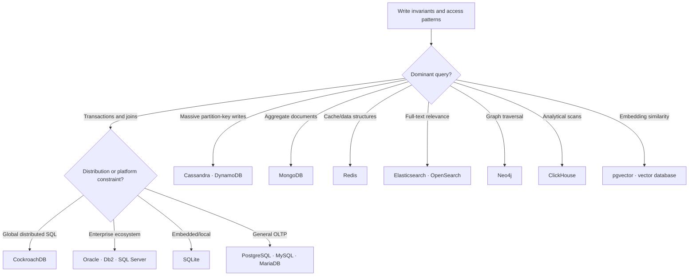

# Database Design And Selection

There is no universally best database. Start with correctness and access
patterns, choose a database category, and only then compare products.

:::tip Safe default
For a new transactional application, begin with PostgreSQL or MySQL unless a
measured requirement points elsewhere. Every additional database type adds
backup, security, monitoring, upgrade, incident, and data-consistency work.
:::

## Database Landscape

| Category | Databases | Primary purpose |
|---|---|---|
| relational OLTP | MySQL, PostgreSQL, Oracle Database, Db2, SQL Server, MariaDB | ACID transactions, constraints, relationships, and SQL |
| embedded relational | SQLite | application-local ACID storage without a server |
| distributed SQL | CockroachDB | relational transactions distributed across nodes and regions |
| wide-column | Cassandra | massive partition-key-driven distributed writes |
| document | MongoDB | nested, bounded aggregates with variable fields |
| key-value/serverless | DynamoDB | elastic managed access by partition/sort key |
| cache/in-memory | Redis | low-latency cache and data structures |
| search | Elasticsearch, OpenSearch | full-text relevance, filters, facets, and log exploration |
| graph | Neo4j | multi-hop relationship traversal |
| analytics/OLAP | ClickHouse | compressed columnar scans and aggregations |
| vector search | vector databases, PostgreSQL with pgvector | embedding similarity for RAG, semantic search, and recommendations |

## Learn In This Order

1. **[Database Quick Choice](./database-selection/DATABASE-QUICK-CHOICE.md):**
   compare OLTP, OLAP, reads, writes, queries, volume, sharding, partitioning, and support.
2. **[Database Decision Worksheet](./database-selection/DATABASE-DECISION-WORKSHEET.md):**
   turn requirements into a scored shortlist and record rejected alternatives.
3. **[Relational Databases](./database-selection/RELATIONAL-DATABASES.md):**
   understand the default choice and compare MySQL, PostgreSQL, Oracle, Db2,
   SQL Server, MariaDB, and SQLite.
4. **[Distributed SQL And NoSQL](./database-selection/DISTRIBUTED-SQL-NOSQL.md):**
   learn when CockroachDB, Cassandra, MongoDB, or DynamoDB justify their model.
5. **[Specialized Databases](./database-selection/SPECIALIZED-DATABASES.md):**
   use Redis, search engines, Neo4j, and ClickHouse for specific workloads.
6. **[Vector Databases](./database-selection/VECTOR-DATABASES.md):**
   compare dedicated vector stores, pgvector, and CockroachDB's different role.
7. **[Indexes And Query Plans](./database-selection/INDEXES-QUERY-PLANS.md):**
   design indexes and prove that the optimizer uses them effectively.
8. **[Database And Query Optimization](./database-selection/DATABASE-QUERY-OPTIMIZATION.md):**
   measure bottlenecks, optimize queries and engines, and understand Bloom filters.
9. **[Database Concurrency, Latency, And Backpressure](./database-selection/DATABASE-CONCURRENCY-BACKPRESSURE.md):**
   size connection pools, protect database capacity, and control overload.
10. **[Database Load Incident Runbook](./database-selection/DATABASE-LOAD-INCIDENT-RUNBOOK.md):**
    diagnose, contain, remediate, verify, and escalate database saturation.
11. **[Consistency Models And BASE](./database-selection/CONSISTENCY-MODELS-BASE.md):**
   distinguish strong, weak, eventual, session, causal, and bounded consistency.
12. **[Scaling, CAP, And Data Distribution](./database-selection/SCALING-CAP-DISTRIBUTION.md):**
   separate replication, partitioning, sharding, consistency, and availability.
13. **[System Design Scenarios](./database-selection/SYSTEM-DESIGN-SCENARIOS.md):**
   apply the choices to commerce, telemetry, search, analytics, graph, and RAG systems.
14. **[Database Migrations And Operations](./database-selection/DATABASE-MIGRATIONS-OPERATIONS.md):**
    plan safe schema evolution, recovery, replication, CDC, retention, and upgrades.
15. **[Database Hands-On Labs](./database-selection/DATABASE-HANDS-ON-LABS.md):**
    verify plans, indexes, pagination, overload, partition keys, OLAP, and vectors.
16. **[Database Interview Exercises](./database-selection/DATABASE-INTERVIEW-EXERCISES.md):**
    defend choices and rejected alternatives for four real-world-style systems.

## Quick Selection Flow

## Requirements Before Products

Record these before selecting a database:

- invariants, transaction boundaries, isolation, and acceptable staleness;
- exact reads, writes, filters, joins, sorting, aggregation, and batch operations;
- peak throughput, read/write ratio, p95/p99 latency, item size, growth, and skew;
- RTO, RPO, failure domains, regions, data residency, and restore expectations;
- authentication, authorization, encryption, auditing, masking, and retention;
- managed-service availability, team skills, upgrades, observability, and total cost.

Use production-shaped data in a proof of concept. Test failover, restore,
rebalancing, schema changes, and version upgrades—not only steady-state throughput.

## Fast Rules Of Thumb

- Use relational storage for money, orders, inventory, identities, and permissions.
- Replicas primarily improve read capacity and availability; they do not normally
  divide write ownership.
- Use Cassandra or DynamoDB only after queries and partition keys are known.
- Keep Redis, search, analytical, and vector stores rebuildable when possible.
- Add polyglot persistence only when its measured benefit exceeds operational cost.
- Record the decision, rejected options, benchmarks, and reassessment triggers in an ADR.

## Recommended Next Page

Continue with [Database Quick Choice](./database-selection/DATABASE-QUICK-CHOICE.md).
