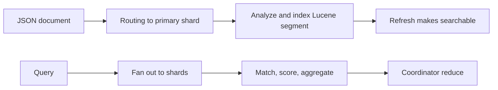

# Elasticsearch Architect Learning Path

Elasticsearch is a distributed search and analytics engine built on Lucene. It is not a
drop-in relational primary database. Correct design starts with search behavior, document
shape, mapping, analyzer, freshness, relevance, shard size, and recovery requirements.

## Complete Route

1. [Cluster, Shards, Lucene Segments, Indexing, And Mapping](./elasticsearch/ELASTICSEARCH-INTERNALS-MAPPING.md)
2. [Analyzers, Query DSL, Relevance, Aggregations, And Pagination](./elasticsearch/ELASTICSEARCH-QUERY-RELEVANCE.md)
3. [Capacity, ILM, Recovery, Security, Performance, And Incidents](./elasticsearch/ELASTICSEARCH-OPERATIONS.md)
4. [Spring Data Integration, Pipelines, Interviews, Labs, And Revision](./elasticsearch/ELASTICSEARCH-SPRING-INTERVIEW-REVISION.md)

## Completion Standard

You should be able to choose mappings/analyzers before indexing, explain refresh/merge and
near-real-time visibility, calculate shard/replica capacity, avoid deep pagination, diagnose
hot shards and slow queries, perform alias-based reindexing, operate lifecycle/recovery/
security controls, and design database-to-search consistency with replay/reconciliation.

## Official References

- [Elasticsearch Reference](https://www.elastic.co/guide/en/elasticsearch/reference/current/index.html)
- [Elasticsearch mapping](https://www.elastic.co/guide/en/elasticsearch/reference/current/mapping.html)
- [Spring Data Elasticsearch reference](https://docs.spring.io/spring-data/elasticsearch/reference/)

## Recommended Next

Begin with [Cluster, Shards, Lucene Segments, Indexing, And Mapping](./elasticsearch/ELASTICSEARCH-INTERNALS-MAPPING.md).

