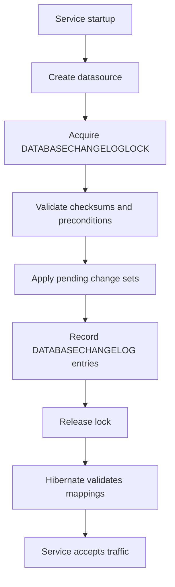

# Liquibase Database Migrations

Liquibase versions database schema and controlled data changes as ordered,
auditable change sets. It replaces manual production SQL and Hibernate schema
mutation with a repeatable migration history.

Shopverse runs Liquibase during application startup before JPA validates each
service-owned schema.

## Why Liquibase

- the same migration history is applied in development, test, and production;
- applied changes are recorded and checksummed;
- concurrent application instances coordinate through a database lock;
- schema changes can be reviewed with application code;
- tags and explicit rollback definitions support controlled recovery;
- services retain independent schema ownership.

Liquibase guarantees that the declared change sets are applied once to a
database. It does not guarantee that a migration is operationally safe,
backward compatible, or reversible. Those properties require migration design,
testing, backups, and deployment coordination.

## Service Layout

```text
src/main/resources/db/changelog/
  db.changelog-master.yml
  001-...
  002-...
```

The master changelog includes immutable, ordered files:

```yaml
databaseChangeLog:
  - include:
      file: db/changelog/001-create-order-tables.yml
  - include:
      file: db/changelog/002-add-idempotency-key.yml
```

Use `include` when order must be explicit. Use `includeAll` cautiously because
file-system ordering and accidental files can make execution less obvious.

User, Order, Inventory, and Payment each own a separate database and changelog
history.

## Changelog Formats

Liquibase supports YAML, XML, JSON, and formatted SQL:

| Format | Strength |
|---|---|
| YAML | readable structured changes and concise reviews |
| XML | mature schema validation and explicit structure |
| JSON | structured but usually more verbose |
| Formatted SQL | direct database-specific control |

Prefer structured change types for portability and rollback metadata. Use SQL
when database-specific behavior cannot be represented accurately.

## Startup Sequence

1. Spring creates the datasource.
2. Liquibase acquires a database lock.
3. It reads `DATABASECHANGELOG` and calculates change-set identity/checksums.
4. Unapplied change sets run in order.
5. Checksums, order, deployment ID, and execution metadata are stored.
6. the lock is released.
7. Hibernate `ddl-auto=validate` verifies entity/schema compatibility.

`DATABASECHANGELOGLOCK` prevents two replicas from migrating the same schema concurrently.

Spring Boot creates the Liquibase integration when the Liquibase dependency, a
datasource, and `spring.liquibase.enabled=true` are present. If migration
fails, application startup fails before the service accepts traffic.

Large production systems often run migrations as a dedicated deployment step
instead of allowing every replica to attempt startup migration. Either model
requires one controlled migration history and the same validated artifact.

## Change Set Example

```yaml
databaseChangeLog:
  - changeSet:
      id: 002-add-idempotency-key
      author: shopverse
      changes:
        - addColumn:
            tableName: orders
            columns:
              - column:
                  name: idempotency_key
                  type: varchar(100)
                  constraints:
                    nullable: false
        - addUniqueConstraint:
            tableName: orders
            columnNames: idempotency_key
            constraintName: uk_orders_idempotency_key
```

## Types Of Changes

- schema: tables, columns, indexes, constraints;
- reference data: roles, permissions, catalog seed rows;
- corrective data migration;
- custom SQL only when a structured change type cannot express the operation.

Common structured changes include `createTable`, `addColumn`, `createIndex`,
`addForeignKeyConstraint`, `addUniqueConstraint`, `renameColumn`, `sql`, and
`loadData`.

## Change-Set Identity

A change set is identified by:

```text
logical file path + id + author
```

IDs need to be unique only within the author and logical file path, but a
repository-wide sequential naming convention is easier to review.

Useful attributes include:

| Attribute | Meaning |
|---|---|
| `runAlways` | execute on every deployment; use sparingly |
| `runOnChange` | execute again when content changes; useful for views/procedures |
| `context` | select changes for an environment or purpose |
| `labels` | boolean labels used to select changes |
| `dbms` | restrict a change to selected databases |
| `failOnError` | controls failure behavior; normally keep `true` |

Do not use `runOnChange` for ordinary table evolution. Immutable migrations are
easier to audit and reproduce.

## Preconditions

Preconditions protect assumptions:

```yaml
preConditions:
  - onFail: HALT
  - tableExists:
      tableName: orders
  - not:
      - columnExists:
          tableName: orders
          columnName: idempotency_key
```

Use them for database version, object existence, or data assumptions. Avoid
turning errors into silent `MARK_RAN` behavior unless skipping the change is
explicitly safe and documented.

## Data Types

Portable definitions include:

```text
varchar(100)
boolean
int
bigint
decimal(19,2)
date
time
datetime
timestamp
blob
clob
uuid
```

Liquibase maps generic types to the target database where possible. Verify the
generated SQL for identity columns, timezone semantics, JSON, enum, UUID, and
large-object types because database behavior differs.

For money, use a fixed-precision decimal. Define string lengths and nullability
explicitly. Add indexes and constraints in the migration rather than relying
on ORM schema generation.

## Consistency

Liquibase identifies a change set by file path, ID, and author. It compares checksums and refuses unexpected edits to already-applied changes. Add a new change set instead of modifying migration history.

`DATABASECHANGELOG` records what ran. `DATABASECHANGELOGLOCK` coordinates
execution. Neither table should be edited manually during normal operation.

`clear-checksums` causes Liquibase to recalculate checksums on the next update.
It is not a routine fix for an edited production migration. First determine
why history differs and restore the expected migration where possible.

## Transactions And DDL

Liquibase normally executes each change set in a transaction when the database
supports transactional execution. The `runInTransaction` attribute can change
that behavior, but disabling it can leave a partially applied change set.

Database DDL behavior differs:

- some databases transactionally roll back DDL;
- some implicitly commit DDL;
- long index or table changes can hold locks;
- online/concurrent index syntax is database-specific.

Application `@Transactional` boundaries do not include Liquibase startup
migrations.

## Commands

Common CLI or build-pipeline operations are:

```text
liquibase validate
liquibase status
liquibase update
liquibase tag release-2026-06
liquibase rollback release-2026-06
liquibase rollback-count 1
liquibase rollback-to-date <date>
liquibase update-sql
liquibase rollback-sql <tag>
```

Command spelling can vary between Liquibase CLI versions. Generate and review
SQL before production changes, especially for rollback and large tables.

## Rollback

Automatic rollback support varies by change type. Production changes should include an explicit rollback when practical:

```yaml
rollback:
  - dropColumn:
      tableName: orders
      columnName: idempotency_key
```

Tag a known release before migration when tag-based rollback is part of the
operating procedure. Test rollback against a production-like backup.

Rollback is unsafe or incomplete when a change discarded or transformed data.
For destructive data changes, prefer forward fixes and verified database
backups. Application transaction rollback does not roll back a migration that
has already completed.

## Zero-Downtime Migration

Use expand-and-contract for rolling deployments:

1. Add a nullable column, new table, or compatible index.
2. Deploy code that can work with both old and new schema forms.
3. Backfill data in bounded batches.
4. Switch reads and writes to the new representation.
5. Verify no old application version depends on the old structure.
6. Remove the obsolete column or constraint in a later release.

Do not combine a breaking rename or drop with code that assumes only the new
schema while old replicas are still running.

## Reference Data

Small, deterministic roles, permissions, and configuration values can be
managed through change sets. Avoid treating Liquibase as a bulk production data
loader. Environment secrets and mutable business data do not belong in
changelogs.

## Production Practices

- one service owns one schema and migration history;
- keep applied change sets immutable;
- validate and generate SQL in CI;
- test update and rollback using a production-like database;
- back up before destructive or difficult-to-reverse changes;
- add indexes for foreign keys and frequent lookup columns;
- use database uniqueness for idempotency;
- use preconditions for important assumptions;
- keep migrations bounded and observable;
- estimate table scans, lock duration, and disk requirements;
- separate backfills from blocking DDL when data volume is large;
- keep `open-in-view=false`;
- review locking and table-scan impact before large changes;
- never use `ddl-auto=update` as the production migration strategy.

## Shopverse Example

Each persistent service owns its migrations and starts with Liquibase followed
by Hibernate validation. Database constraints support business guarantees such
as unique checkout idempotency keys and inventory product IDs.

Service-specific tables and migration commands remain in the corresponding
service README so this file stays reusable.



## Official Reference

- [Liquibase documentation](https://docs.liquibase.com/)
- [Spring Boot database initialization](https://docs.spring.io/spring-boot/how-to/data-initialization.html)

## Related Guides

- [Spring transactions](../spring/SPRING-TRANSACTIONS.md)
- [Shopverse transaction boundaries](../reliability/TRANSACTIONS.md)
- [Distributed systems](../architecture/DISTRIBUTED-SYSTEMS.md)
