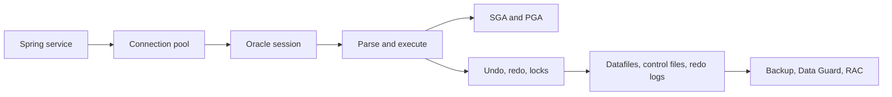

# Oracle Database Architect Learning Path

Oracle mastery is more than portable SQL. A lead engineer must connect a business
transaction to sessions, memory, undo, redo, locks, execution plans, files, recovery,
and application pools.

## At-A-Glance Topics

| Area | Why it matters |
|---|---|
| instance versus database | separates running processes and memory from durable files |
| SGA, PGA and processes | explains parse cost, caching, sorting, and session pressure |
| redo and undo | explains durability, rollback, read consistency, and recovery |
| optimizer and plans | turns slow-query diagnosis into evidence rather than guesswork |
| MVCC, locks and isolation | prevents lost updates, blocking chains, and unsafe retries |
| partitioning and materialized views | controls data pruning, lifecycle, and precomputation |
| RMAN, Data Guard and RAC | separates backup, disaster recovery, and instance availability |
| Spring/JDBC/JPA boundary | exposes pool, batching, fetch, timeout, and transaction behavior |

## Complete Route

1. [Architecture, Memory, Storage, Redo, And Undo](./oracle/ORACLE-ARCHITECTURE-STORAGE-INTERNALS.md)
2. [SQL, PL/SQL, Optimizer, Transactions, And Concurrency](./oracle/ORACLE-SQL-OPTIMIZER-CONCURRENCY.md)
3. [Partitioning, Availability, Recovery, Security, And Operations](./oracle/ORACLE-HA-OPERATIONS.md)
4. [Spring Integration, Production Scenarios, Labs, And Revision](./oracle/ORACLE-SPRING-INTERVIEW-REVISION.md)

## Completion Standard

You are ready when you can trace a commit, read a plan with actual row evidence,
diagnose a blocking chain, distinguish RAC from Data Guard, define RPO/RTO and test
restore, size connection pools from database capacity, and explain why an ORM query
is slow in Oracle-specific terms.

## Official References

- [Oracle Database Concepts](https://docs.oracle.com/en/database/oracle/oracle-database/23/cncpt/)
- [Oracle Database SQL Language Reference](https://docs.oracle.com/en/database/oracle/oracle-database/23/sqlrf/)
- [Oracle Database Performance Tuning Guide](https://docs.oracle.com/en/database/oracle/oracle-database/23/tgsql/)
- [Oracle Database Backup and Recovery](https://docs.oracle.com/en/database/oracle/oracle-database/23/bradv/)

## Recommended Next

Begin with [Architecture, Memory, Storage, Redo, And Undo](./oracle/ORACLE-ARCHITECTURE-STORAGE-INTERNALS.md).

