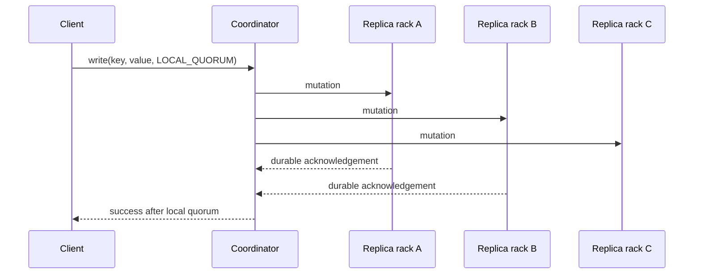

# Cassandra Architecture Replication And Consistency

Every Cassandra node can accept a client request. The receiving node becomes the
**coordinator** for that operation, locates replicas for the partition token, sends
requests, and applies the requested consistency level before responding.



There is no permanent primary for a partition. The coordinator role is per
request; token ownership and replication strategy determine storage replicas.

## Cluster Membership And Failure Detection

Nodes exchange membership and state through gossip. A failure detector estimates
whether peers are reachable, but suspicion is not proof of permanent failure.
Topology metadata includes data center, rack, token ownership, schema, and node
state. Seed nodes help new nodes discover the cluster; they are not leaders and do
not sit on every request path.

Use rack and data-center placement that matches real failure domains. A replication
factor of three provides little value if all three replicas share one host, rack,
zone, or correlated storage failure.

## Tokens, Partitions, And Consistent Hashing

The partition key is serialized and hashed by the configured partitioner. Its
token locates a range in the ring; the replication strategy selects additional
replicas according to data-center and rack topology.

Virtual nodes assign multiple token ranges to each physical node, improving load
distribution and movement granularity. They do not correct a poor application key:
a single huge or hot partition still belongs to one replica set.

```text
partition key -> hash -> token -> replica set -> coordinator fan-out
```

## Replication Strategy

Use `NetworkTopologyStrategy` for production keyspaces and specify replication per
data center:

```sql
CREATE KEYSPACE commerce
WITH replication = {
  'class': 'NetworkTopologyStrategy',
  'dc1': 3,
  'dc2': 3
};
```

Replication factor is the number of replicas per data center. It is not a backup:
operator deletion, malformed writes, and some corruption can replicate quickly.

## Consistency Levels

Consistency is selected per operation. Important levels include:

| Level | Requirement | Typical use |
|---|---|---|
| `ONE` | one replica responds | lowest latency, higher staleness risk |
| `TWO`/`THREE` | fixed replica count | uncommon topology-specific choice |
| `QUORUM` | majority across all replicas | single-DC or explicitly global quorum |
| `LOCAL_QUORUM` | majority in coordinator's local DC | common multi-DC application choice |
| `ALL` | every replica responds | strongest availability cost |
| `LOCAL_ONE` | one local replica | low-latency local read/write |
| `EACH_QUORUM` | quorum in every DC for writes | strict multi-DC write availability cost |
| `SERIAL`/`LOCAL_SERIAL` | Paxos serial phase | lightweight transaction condition |

For replication factor `RF`, quorum is:

```text
quorum = floor(RF / 2) + 1
```

`R + W > RF` suggests overlapping read and write acknowledgements, but it is not a
complete correctness proof. Timeouts, concurrent writes, timestamp conflict
resolution, topology, repair state, and which data center supplied responses still
matter.

## Write Conflict Resolution

Cassandra mutations carry timestamps and commonly resolve competing cell values by
last-write-wins rules. Clock error can therefore make an older business action win.
Synchronize clocks and avoid using timestamp ordering as a substitute for domain
versioning or conditional state transitions.

## Replica Convergence

- Hinted handoff stores a best-effort hint when a replica is unavailable and
  replays it if the node returns within the configured window.
- Read repair can reconcile replicas encountered by selected reads.
- Anti-entropy repair compares replica ranges and streams differences.

Hints and read repair reduce inconsistency duration but do not replace scheduled
repair. Repair must complete within the deletion/retention policy required to avoid
lost updates or resurrected deletes.

## Availability And CAP

Cassandra can remain available to consistency levels that enough reachable
replicas satisfy. A partition does not make the database universally AP or CP;
client-selected consistency, replication topology, and operation determine whether
the request succeeds and how current its result can be.

## Lightweight Transactions

Conditional CQL such as `IF NOT EXISTS` or compare-and-set uses Paxos/lightweight
transaction coordination:

```sql
UPDATE inventory_by_sku
SET available = 9
WHERE sku = 'SKU-7'
IF available = 10;
```

LWT provides linearizable conditional behavior for the affected partition but has
more round trips, contention, and latency than ordinary writes. It is not a general
cross-partition transaction engine. Model the invariant carefully and load-test
contention.

Logged batches make mutations across partitions eventually atomic in the sense
documented by Cassandra, not isolated relational transactions. Use batches to group
one logical mutation—especially within one partition—not to increase bulk ingestion
throughput.

## Interview Questions

**Is a seed node a leader?** No. Seeds aid discovery; all nodes are peers.

**Who is the coordinator?** The node receiving a request for that operation.

**Does `LOCAL_QUORUM` read plus write guarantee no stale result forever?** It creates
overlapping local acknowledgements under stated assumptions, but conflict
timestamps, failed/late replicas, topology, and repair remain relevant.

**Why is RF=3 not backup?** Replicas copy live mutations and deletion; backup must
protect independently against operator and correlated failures.

## Official References

- [Cassandra architecture overview](https://cassandra.apache.org/doc/latest/cassandra/architecture/overview.html)
- [Dynamo and replica synchronization](https://cassandra.apache.org/doc/latest/cassandra/architecture/dynamo.html)
- [Hints](https://cassandra.apache.org/doc/latest/cassandra/managing/operating/hints.html)
- [Repair](https://cassandra.apache.org/doc/latest/cassandra/managing/operating/repair.html)

## Recommended Next

Continue with [CQL And Query-First Data Modeling](./CASSANDRA-CQL-DATA-MODELING.md).

