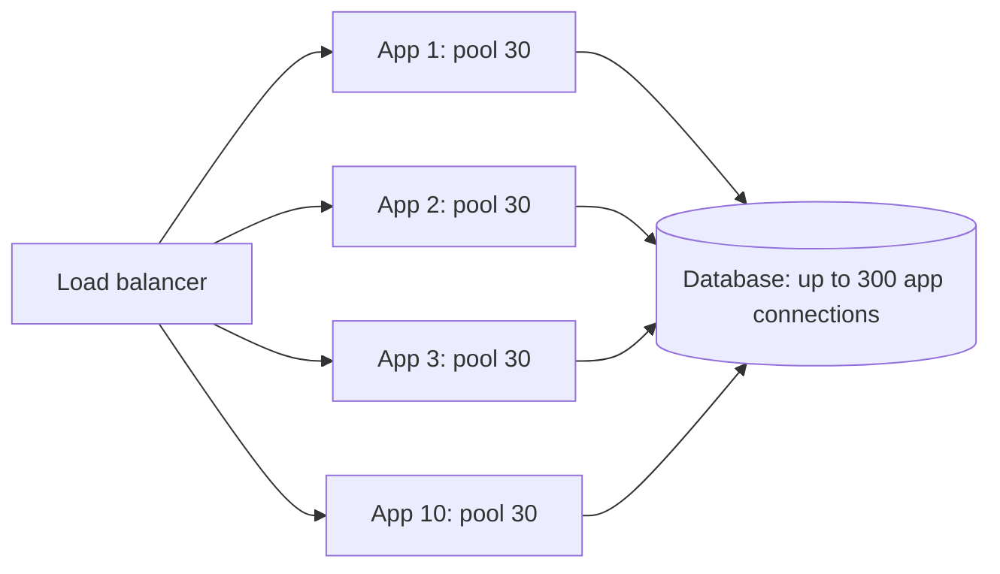
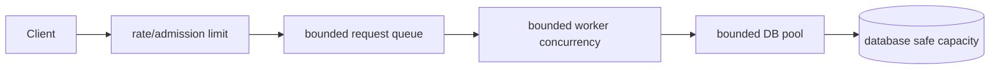

# Database Concurrency, Latency, And Backpressure


*The safe admission limit is normally before the saturation knee. Beyond it,
additional connections increase queueing, locks, memory, and tail latency.*

A database connection is permission to compete for finite CPU, memory, cache,
locks, log bandwidth, storage I/O, and network capacity. More connections create
more potential concurrency; they do not create more database capacity.

## Why Scaling The Application Can Kill The Database



Adding replicas may multiply:

- maximum open and active database connections;
- simultaneous queries, locks, temporary memory, and cache churn;
- retry volume after timeouts;
- cold-instance cache misses and startup queries;
- scheduler and consumer concurrency;
- connection-establishment and authentication work.

Once the database saturates, query latency rises. Connections remain busy
longer, pools queue, application timeouts trigger retries, and retries add more
load—a positive feedback loop that can collapse the system.

## Queueing Model

Little's Law gives a useful first estimate:

```text
average active DB concurrency ≈ DB operations/second × average hold time in seconds

400 operations/second × 0.025 seconds = 10 average active connections
```

This is an average, not a pool recommendation. Add measured headroom for bursts
and tail latency, then validate failure behavior. Across services:

```text
maximum potential app connections = Σ(instance count × pool size per instance)
```

Reserve capacity for administration, migrations, monitoring, background jobs,
failover, and rolling deployments.

## Is One Millisecond Slow?

It depends on what the query promises and how often it runs.

| Query | How to judge 1 ms |
|---|---|
| in-memory primary-key lookup on the database host | may be worth investigating at massive frequency |
| networked indexed read | often excellent |
| durable transaction with WAL/redo flush | generally excellent |
| replicated/quorum write | exceptionally low in many topologies |
| complex join/aggregation returning useful data | likely excellent |
| accidental query executed one million times | still 1,000 seconds of aggregate DB time |

Optimize **total resource consumption and tail latency**, not a universal per-query
threshold. A 1 ms query at 50,000 QPS can consume more capacity than a 500 ms
report run once per hour.

## Does 64 Cores Mean 64 Queries?

No universal one-query-per-core rule exists.

- CPU-bound queries can saturate near available execution capacity, and parallel
  plans may use several workers for one query.
- I/O-bound queries may wait while other queries use CPU, so useful concurrency
  can exceed core count.
- lock-bound workloads can degrade well below core count.
- memory bandwidth, shared buffers, storage, WAL/redo, network, NUMA, and hot
  rows/index pages may become the limit first.
- the database also runs background work such as checkpoints, vacuum, compaction,
  replication, backup, and statistics.

Find the **knee of the curve** with a closed-loop load test: increase admitted
concurrency until throughput stops rising proportionally or p95/p99 latency,
queueing, errors, or resource saturation rises sharply. Operate below that point
with failure and maintenance headroom.

## Latency Percentiles Versus Maximum

| Metric | Meaning | Use |
|---|---|---|
| p50 | half of observations are at or below it | typical experience |
| p95 | 95% are at or below it; 5% are slower | common tail SLO and capacity signal |
| p99 | 99% are at or below it; 1% are slower | severe tail and cascading-risk signal |
| maximum | single slowest observation in the window | incident clue, but unstable and window-sensitive |

A maximum changes with sample count, timeout, pauses, maintenance, and one
outlier. Never replace percentile SLOs with maximum alone. Also publish request
count and window; p95 from ten samples has little statistical value.

## Bound Concurrency At Every Entry Point



- cap HTTP, batch, scheduler, Kafka, and async concurrency independently;
- make pool acquisition timeouts shorter than the end-to-end deadline;
- reject or shed excess work rather than queueing without limit;
- retry only transient, idempotent operations with bounded exponential backoff and jitter;
- coordinate retry layers so gateway, client, service, driver, and job do not all retry;
- use circuit breakers to stop sending hopeless work, not to manufacture capacity;
- use a queue for absorbable bursts only when backlog age and drain time are acceptable.

## Pool-Sizing Process

1. Measure database safe throughput and concurrency with production-shaped queries.
2. Measure connection hold-time distribution, not only method duration.
3. Allocate a total connection/concurrency budget across services and jobs.
4. Divide by maximum simultaneous instances, including deployment surge and failover.
5. Configure bounded pool size, acquisition timeout, max lifetime, leak detection,
   and readiness behavior appropriate to the driver/database.
6. Load test normal peak, one-node loss, slow queries, lock contention, and database failover.
7. Recalculate whenever replica count or workload changes.

Do not copy a pool size from another system. A smaller pool can increase throughput
by reducing context switches, lock competition, and cache churn.

## Read Replicas, Cache, And Async Work

- Read replicas can offload stale-tolerant reads but add replication lag and do
  not scale the primary's write/commit capacity.
- Cache repeatable read-heavy work only with explicit freshness, invalidation,
  stampede protection, and safe fallback.
- Batch compatible writes to reduce round trips without creating huge locks/log units.
- Move analytical scans to an analytical store or replica when isolation justifies it.
- Use asynchronous processing to smooth bursts, not to hide an indefinitely
  growing backlog or violate a synchronous business invariant.

## Diagnose Saturation

Correlate application and database evidence:

| Application | Database |
|---|---|
| pool active/idle/pending and acquisition latency | active/runnable/waiting sessions |
| request/consumer concurrency and queue age | CPU, run queue, I/O latency, cache hit |
| p50/p95/p99 and timeouts | query latency and total execution load |
| retry count and circuit state | locks, deadlocks, hot rows/pages, log waits |
| instance count and pool configuration | connections by service/user and memory use |
| deploy/startup timestamps | plan changes, checkpoints, vacuum/compaction, backups |

The remedy follows the bottleneck: fix query/index/schema, reduce calls, shorten
transactions, remove contention, limit admission, tune maintenance/resources,
or scale the correct database component. Adding app replicas is not a database fix.

## Overload Test

Verify that overload is controlled:

1. establish the safe steady-state load;
2. raise arrival rate above database capacity for a bounded period;
3. confirm admission limits and pool queues remain bounded;
4. confirm retries do not amplify traffic;
5. observe latency/errors/backlog and recovery time after load stops;
6. repeat with a slow query, lock holder, replica lag, and one application node loss.

Success is not “zero errors at any cost.” It is bounded resource use, predictable
degradation, protected critical work, and fast recovery.

## Official References

- [PostgreSQL documentation](https://www.postgresql.org/docs/current/)
- [MySQL Reference Manual](https://dev.mysql.com/doc/refman/8.4/en/)
- [Apache Cassandra documentation](https://cassandra.apache.org/doc/latest/)
