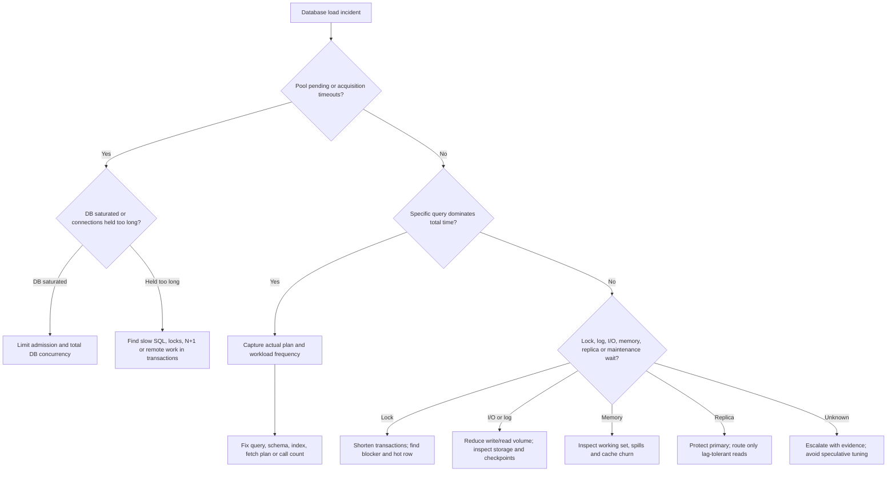

# Database Load Incident Runbook

<DocLabels items={[
  {label: 'Incident response', tone: 'production'},
  {label: 'Database capacity', tone: 'advanced'},
  {label: 'Spring Boot', tone: 'intermediate'},
]} />

Use this runbook when database latency, errors, connection waits, CPU, I/O,
locks, replication lag, or application timeouts rise under load. The goal is to
protect correctness and critical traffic, stop load amplification, identify the
actual constrained resource, and recover with evidence.

## Safety Rules

- Assign an incident owner and record a timeline before making changes.
- Prefer reversible containment over unbounded capacity changes.
- Preserve query, pool, lock, plan, host and deployment evidence.
- Do not kill sessions, restart the database, clear caches, add indexes, fail
  over, or enlarge pools without understanding the correctness and load effect.
- Never weaken durability, isolation, authentication, backups or constraints as
  an improvised performance fix.
- Change one controlled factor at a time when service survival permits.

## Trigger And Severity

Trigger investigation from user/SLO impact plus corroborating resource evidence,
not one noisy metric. Typical signals include:

| Signal | Examples |
|---|---|
| client impact | rising p95/p99, timeouts, `5xx`, checkout failures |
| application pressure | Hikari pending/acquisition time, saturated worker queues, retry growth |
| database pressure | CPU/run queue, I/O latency/queue, memory/cache misses, log/flush waits |
| concurrency | active sessions, lock waits, deadlocks, long transactions, hot rows |
| query workload | higher calls, total execution time, rows examined, spills, plan change |
| topology/operations | replica lag, failover, backup, checkpoint, vacuum/compaction, schema change |

Declare a high severity when critical writes cannot complete, correctness is at
risk, failover capacity is exhausted, or overload is cascading between services.

## First Ten Minutes

1. Confirm the customer-visible symptom and affected operations.
2. Freeze nonessential deployments, migrations and batch jobs.
3. Compare incident start time with releases, traffic shifts, jobs, backups,
   failovers, configuration changes and dependency incidents.
4. Capture current dashboards and database snapshots before the state changes.
5. Reduce retry amplification and shed low-priority work if saturation is confirmed.
6. Keep a path for health checks, administration and critical transactions.

Do not immediately add application replicas. Each new instance can add a full
connection pool, cold-cache queries, consumers and schedulers, increasing load
on the already constrained database.

## Evidence Bundle

Capture a common time window and correlate these layers:

| Layer | Evidence to retain |
|---|---|
| API/business | affected routes/commands, RPS, error codes, p50/p95/p99, tenant or key skew |
| Spring application | instance count, threads, Hikari active/idle/pending/max, acquisition timeouts, transaction duration |
| SQL workload | normalized query identifier, calls, total/mean/tail time, rows read/returned/changed, exact bind class |
| query plan | estimated versus actual rows, access path, joins, sorts/spills, buffers/I/O, plan/hash change |
| transactions | oldest transactions, blockers/waiters, deadlocks, isolation, rows locked, retry count |
| database host | CPU/run queue, memory/cache hit, swap, IOPS/latency/queue, network, disk/log headroom |
| topology | primary/replica role, lag, connections per service, failover/maintenance state |
| change history | application/config/schema release, statistics, index build, backup, maintenance, autoscaling |

Redact literal secrets and personal data. Prefer normalized query identities and
bounded parameter classes over copying raw production values into tickets.

## Diagnose The Bottleneck



### CPU Bound

Look for high runnable CPU plus queries consuming high total CPU, excessive
calls, bad cardinality estimates, expensive sorts/aggregations, N+1 access, and
plan regression. A fast query executed extremely often can dominate total load.

### I/O Or Log Bound

Correlate storage latency/queue with buffer misses, large scans, temporary spills,
checkpoints, redo/WAL flushes, backups and write amplification. More connections
usually worsen an I/O queue. Bound scans and writes before buying concurrency.

### Connection Or Queue Bound

Hikari exhaustion is a symptom, not proof that the pool is too small. Calculate:

```text
total possible DB connections = sum(instance count x pool maximum)
average active concurrency ~= DB operations/second x connection hold time
```

If the database is below capacity and acquisition waits are caused by an
undersized application allocation, a measured pool adjustment may help. If the
database is saturated or transactions hold connections too long, enlarging the
pool increases competition and tail latency.

### Lock Bound

Identify the root blocker, transaction age, statement, rows/access path and
waiting chain. Long user/network work inside a transaction, inconsistent update
order, unindexed update/delete predicates and hot rows are common causes. Kill a
session only through the approved database procedure after assessing rollback
time and business impact.

### Memory Or Cache Bound

Inspect database buffer/cache hit, working set, temporary memory, sort/hash
spills, plan concurrency, swap and per-connection memory. A high host-memory
percentage alone is not failure; databases deliberately use memory for caching.

## Contain Without Amplifying

Choose containment that matches the bottleneck:

| Condition | Safer containment |
|---|---|
| retry storm | disable or reduce redundant retry layers; retain bounded backoff/jitter for safe operations |
| excessive optional traffic | rate-limit or shed low-priority routes with explicit retry guidance |
| batch/scheduler spike | pause or reduce concurrency; preserve checkpoints and ownership semantics |
| analytical scan on primary | cancel through approved procedure and route future stale-tolerant work appropriately |
| hot endpoint/query | temporarily cap concurrency, bound page size or use a verified feature flag |
| cache stampede | coalesce loads, add bounded jitter/TTL and protect the database on cache failure |
| lock blocker | stop the source of new blockers; resolve the root transaction deliberately |
| replica lag | stop routing read-after-write/consistency-sensitive work to lagging replicas |

Circuit breakers stop hopeless downstream work but do not create database
capacity. Queues absorb bounded bursts only when backlog age and drain time stay
within the business SLO.

## Remediate By Root Cause

Apply fixes in this evidence-based order:

1. remove duplicate calls, retry amplification, over-fetching and N+1 behavior;
2. correct predicates, types, joins, result bounds and transaction boundaries;
3. refresh or correct statistics/cardinality estimation where appropriate;
4. add or consolidate the smallest proven index, including a partial/filtered
   index or MySQL alternative when the hot subset justifies it;
5. batch compatible writes and use keyset pagination for deep traversal;
6. size pools and concurrency from the database-wide budget across all replicas;
7. cache repeatable stale-tolerant reads with invalidation, stampede and outage policy;
8. route eligible reads to replicas while honoring lag and read-your-writes needs;
9. archive/partition or move analytical workloads only with lifecycle and recovery design;
10. scale hardware/topology, introduce CQRS, or shard only after simpler changes
    cannot meet the measured SLO.

Every index adds write, storage, cache, replication, backup and recovery cost.
Every cache and replica introduces consistency behavior. Every shard creates
routing, rebalancing, constraint, transaction and operational complexity.

## Verify Recovery And The Fix

Before declaring recovery:

- customer errors and p95/p99 meet the recovery target;
- Hikari pending/acquisition time and queues are bounded;
- database CPU, I/O, log, memory and locks have returned to sustainable levels;
- throughput recovers without growing retries or backlog;
- replication lag and maintenance headroom are acceptable;
- no Order, Payment, reservation or outbox invariant was violated;
- paused work can drain without causing a second saturation wave.

For the permanent fix, reproduce a production-shaped dataset and concurrency.
Compare before/after correctness, actual plans, calls, total resource time,
rows/buffers/I/O, write amplification and p50/p95/p99. Test normal peak, overload,
one application-node loss, slow query, lock holder, cache outage, replica lag and
database failover. Define rollback thresholds before deployment.

## Escalation

Escalate to the database/platform owner when privileged session termination,
failover, storage/log exhaustion, corruption risk, engine defects, restore, or
capacity/topology changes are possible. Escalate to application owners for query,
transaction, ORM, retry, scheduler and traffic-shape causes. Include:

- impact, severity, start time and incident owner;
- exact affected operations and normalized query IDs;
- timeline of releases/jobs/maintenance and containment actions;
- pool, database, host, lock, replica and plan evidence;
- current hypothesis, rejected hypotheses and correctness risks;
- requested decision, approver and rollback plan.

If evidence remains ambiguous, preserve stability and escalate rather than
stacking speculative changes.

## After The Incident

1. Write a blameless timeline and root/contributing causes.
2. Add the missing SLO, pool, query, lock, replica or maintenance alert.
3. Create a regression/load test using the production-shaped failure mode.
4. Record capacity budgets, safe concurrency and overload behavior.
5. Automate evidence capture and reversible containment where safe.
6. Review retention, indexes, query ownership, retry policies and runbook access.

## Related Guides

- [Database And Query Optimization](./DATABASE-QUERY-OPTIMIZATION.md)
- [Database Concurrency, Latency, And Backpressure](./DATABASE-CONCURRENCY-BACKPRESSURE.md)
- [Indexes And Query Plans](./INDEXES-QUERY-PLANS.md)
- [JPA Fetching Performance And N Plus One](../../spring/jpa/JPA-FETCHING-PERFORMANCE.md)
- [Spring Resource Pools, Concurrency And Capacity](../../spring/production/RESOURCE-POOL-CONCURRENCY-CAPACITY.md)
- [Spring Cache](../../spring/SPRING-CACHE.md)
- [Database Migrations And Operations](./DATABASE-MIGRATIONS-OPERATIONS.md)

## Official References

- [MySQL Optimization](https://dev.mysql.com/doc/refman/8.4/en/optimization.html)
- [MySQL Performance Schema](https://dev.mysql.com/doc/refman/8.4/en/performance-schema.html)
- [PostgreSQL Performance Tips](https://www.postgresql.org/docs/current/performance-tips.html)
- [PostgreSQL Monitoring Database Activity](https://www.postgresql.org/docs/current/monitoring-stats.html)
- [HikariCP Configuration](https://github.com/brettwooldridge/HikariCP#configuration-knobs-baby)
