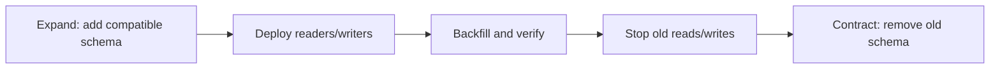

# Database Migrations And Operations

Choosing a database is only the beginning. Production safety depends on changing,
recovering, monitoring, and upgrading it without violating business invariants.
This chapter is vendor-neutral; verify locking, replication, DDL, and rollback
behavior for the exact engine and version you operate.

## Operational Objectives

Define these before writing a runbook:

| Objective | Meaning | Evidence |
|---|---|---|
| availability SLO | acceptable successful-request and latency target | service metrics and error budget |
| RPO | maximum acceptable committed data loss | recovery design and drill result |
| RTO | maximum acceptable recovery duration | timed restore/failover drill |
| freshness SLO | permitted replica, search, analytics, or CDC delay | end-to-end lag metric |
| retention | how long each data class and backup is kept | policy plus deletion evidence |

A backup existing is not proof of recoverability. A replica is not a backup: an
accidental delete, corrupt migration, or malicious change can replicate too.

## Schema Evolution With Expand And Contract

During a rolling deployment, old and new application versions run together.
Every intermediate schema must work with both.

### Safe Sequence

1. **Expand:** add nullable columns, new tables, or compatible indexes without
   changing old behavior.
2. **Deploy compatible code:** read old data and write the new representation.
   If dual writing is unavoidable, make it observable, idempotent, and temporary.
3. **Backfill:** process small resumable batches using a stable key; throttle on
   replication lag, lock waits, latency, and database load.
4. **Verify:** compare counts, checksums, null rates, business invariants, and samples.
5. **Switch reads:** use a feature flag or separately deploy the new read path.
6. **Stop old writes:** prove no supported application still depends on them.
7. **Contract later:** remove old columns, constraints, code, and compatibility
   logic in a separate release after the rollback window.

Avoid combining column rename/drop, type rewrite, full-table backfill, new
non-null constraint, and application rollout in one release. For a required
column, add it as nullable, backfill, validate, then enforce the constraint using
the least-blocking mechanism supported by the engine.

## DDL And Index Safety

Before production DDL, determine whether it takes a metadata/table lock, rewrites
the table, scans all rows, generates large WAL/redo, blocks reads/writes, or causes
replica lag. Test with production-shaped volume and long-running transactions.

- Set lock and statement timeouts so a migration fails safely instead of waiting
  indefinitely behind traffic.
- Build large indexes with the engine's online/concurrent facility where suitable;
  understand its extra time, space, and failure cleanup.
- Keep migrations immutable and ordered in Liquibase or an equivalent tool.
- Run heavyweight migrations as a controlled deployment job, not concurrently
  from every application replica.
- Prefer forward recovery. A rollback script is useful only when tested and when
  reverting does not discard data written by the new version.

See [Liquibase Database Migrations](../LIQUIBASE-GENERIC.md) for change-set mechanics.

## Backup Strategy

Use layered protection appropriate to the RPO:

- periodic full/base backups;
- incremental/differential backups when supported and operationally justified;
- transaction-log/WAL/binlog archiving for point-in-time recovery;
- encrypted, access-controlled copies in a separate failure/security domain;
- immutable copies when required for ransomware and compliance resilience;
- a catalog recording scope, time, version, encryption key, checksum, and expiry.

Monitor backup age, duration, size, failures, log-archive continuity, storage
capacity, and encryption-key availability. Protect backup access as strictly as
production because backups contain the same sensitive data.

## Restore Drills

Run scheduled drills into an isolated environment:

1. Select a backup and target recovery timestamp without choosing the easiest case.
2. Provision clean infrastructure and obtain keys through the real access process.
3. Restore the base backup and replay logs to the target time.
4. Validate schema/version compatibility, row counts, checksums, invariants, and
   critical application journeys.
5. Measure detection, decision, provisioning, transfer, replay, validation, and
   service-recovery time separately.
6. Record achieved RPO/RTO, gaps, owner, remediation, and next drill date.
7. Destroy or sanitize restored sensitive data according to policy.

Exercise corrupt/lost backups, missing logs, expired keys, large datasets, and a
restore performed by someone other than the runbook author.

## Replication Lag

Track both byte/position lag and end-to-end time lag. A replica can report a
small queue while replay is stalled by a lock, long transaction, storage issue,
or conflict. Alert against the application's freshness and recovery SLO, not one
universal number.

Lag can cause stale reads, broken read-after-write expectations, delayed CDC,
larger failover loss with asynchronous replication, and retained logs filling
disk. Typical causes include write bursts, large transactions, DDL/backfills,
slow replica I/O/CPU, network loss, replay conflicts, and insufficient capacity.

Throttle batch work, route read-your-writes to the primary or use a consistency
token, shed stale-tolerant work deliberately, and preserve headroom. Do not scale
application writers when the database or replicas are already saturated.

## Failover And Failback

Automated failover still needs fencing: only one writable primary may serve a
given ownership domain. The runbook should cover detection, quorum/election,
promotion, client discovery/DNS, connection-pool refresh, transaction outcomes,
replica reconfiguration, and communication.

After failover:

- verify the old primary cannot accept writes;
- determine the last durable transaction and any RPO loss;
- validate critical reads/writes, background jobs, CDC, and replicas;
- watch error rate, p95/p99, locks, saturation, and lag;
- reconcile uncertain requests through idempotency and business records.

Failback is a separate risky change. Re-seed/rejoin the former primary, prove it
is caught up, schedule the switch, and retain a rollback path. Test node, zone,
region, network, storage, and control-plane failures—not only clean process stops.

## Change Data Capture

CDC reads committed database changes, usually from transaction logs, and emits
them to downstream consumers. It is useful for search, analytics, cache
invalidation, migrations, and integration, but it introduces another recoverable
pipeline.

Operate CDC with:

- durable offsets/checkpoints and monitored source-log retention;
- stable event identity and idempotent consumers because duplicates can occur;
- ordering guarantees documented per table/key/partition, not assumed globally;
- schema compatibility, default/null handling, and staged breaking changes;
- snapshot plus streaming handoff without gaps;
- lag, error, retry, dead-letter, and end-to-end freshness metrics;
- replay/rebuild procedures and reconciliation against authoritative data;
- access controls, encryption, PII minimization, deletion propagation, and audit.

The transactional outbox is preferable when downstream consumers need a stable
business event rather than every physical row change. CDC can publish the outbox
without making application code perform a synchronous dual write.

## Retention And Deletion

Classify operational rows, events, audit evidence, PII, logs, derived indexes,
and backups separately. For each class record purpose, owner, legal basis,
minimum/maximum retention, archive location, deletion method, hold process, and
proof of deletion.

Use time partitioning when it makes lifecycle deletion predictable, but size
partitions for query pruning and maintenance—not merely calendar convenience.
Dropping an expired partition is usually safer and cheaper than a huge row-by-row
delete. Account for replicas, CDC streams, caches, search/vector indexes,
analytics, snapshots, and backups; document delayed deletion where immutable
backup policy requires it.

## Database Upgrades

Read release notes across every skipped version and inventory extensions,
drivers, collations, authentication, deprecated features, parameter changes,
query-planner changes, replication formats, and backup compatibility.

1. Rehearse against a restored production-shaped copy.
2. Run integrity checks, migrations, critical queries, and application regression tests.
3. Capture plans and p95/p99 before and after; detect plan regressions explicitly.
4. Test backup/restore, replicas, failover, CDC connectors, monitoring, and rollback.
5. Prefer a canary replica/cluster or blue-green migration when supported.
6. Freeze unrelated changes, confirm capacity, owners, abort thresholds, and communications.
7. Upgrade, validate, observe through peak load, then remove the rollback environment.

A logical export/import, in-place binary upgrade, replica promotion, and
blue-green replication migration have different downtime, validation, rollback,
and storage requirements. Choose from measured constraints.

## Production Change Checklist

### Before

- approved plan, owner, maintenance risk, dependency map, and communication;
- production-shaped rehearsal with measured duration and resource impact;
- recent verified backup, point-in-time recovery continuity, and restore evidence;
- compatibility matrix, rollback/forward-recovery plan, and explicit abort thresholds;
- dashboards for latency, errors, locks, connections, CPU/I/O, disk, and lag.

### During

- one controlled operator/automation path and an event timeline;
- observe user SLOs and database health continuously;
- pause backfills or abort when thresholds are crossed;
- avoid unrelated deployments and preserve evidence.

### After

- validate invariants and critical journeys, not only process health;
- confirm replicas, backups, CDC, jobs, and derived stores recovered;
- compare plans/performance/cost and monitor through a peak period;
- close temporary permissions, flags, dual writes, and excess capacity;
- update the runbook and record lessons, evidence, and follow-up owners.

## Recommended Next Page

Run the disposable operations lab from
`documentation/labs/database-operations/run-lab.ps1`, practice query behavior in
[Database Hands-On Labs](./DATABASE-HANDS-ON-LABS.md),
and use [Database Concurrency, Latency, And Backpressure](./DATABASE-CONCURRENCY-BACKPRESSURE.md)
to set safe migration throttles and abort thresholds.

## Official References

- [PostgreSQL backup and restore](https://www.postgresql.org/docs/current/backup.html)
- [PostgreSQL high availability](https://www.postgresql.org/docs/current/high-availability.html)
- [Liquibase documentation](https://docs.liquibase.com/)
