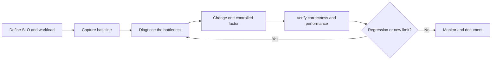
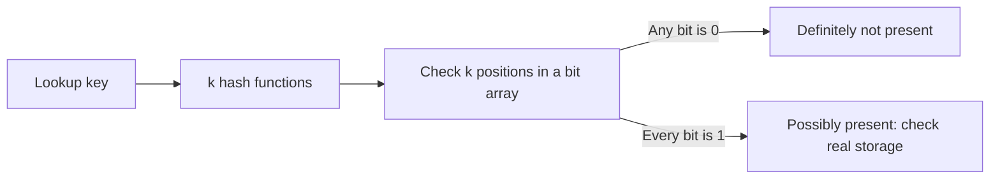

# Database And Query Optimization

Optimization is a feedback loop:



Do not begin with a cache, index, shard, or configuration knob. A database can
be slow because of application round trips, a poor data model, wrong cardinality
estimates, locks, CPU, memory, storage, network, replication, maintenance, or load skew.

## Establish A Baseline

Capture a representative business cycle and peak period:

| Area | Evidence |
|---|---|
| service level | throughput, errors, p50/p95/p99 latency, timeout budget |
| query workload | calls, total time, mean/tail latency, rows returned, parameters/classes |
| compute | database and client CPU, run queue, context switches |
| memory | buffer/cache hit ratio, working set, eviction, spills, swap |
| storage | latency, IOPS, throughput, queue depth, free space, write amplification |
| concurrency | active/queued sessions, pool wait, locks, deadlocks, long transactions |
| distribution | hot keys/partitions/shards, replica lag, rebalance/repair/merge work |
| maintenance | vacuum, compaction, checkpoints, statistics, backups, index builds |

Optimize total load as well as the single slowest query. A 10 ms query executed
100,000 times can matter more than one 5-second report.

## Optimize In A Safe Order

1. Remove unnecessary calls, retries, duplicate queries, and over-fetching.
2. Correct the query, data types, predicates, and transaction boundary.
3. Refresh/fix statistics and cardinality estimation.
4. Add or consolidate the smallest useful index.
5. Improve batching, pagination, caching, and connection management.
6. Tune engine resources and maintenance for the measured bottleneck.
7. Partition, replicate, or shard only when simpler measures cannot meet the SLO.

## Query Optimization Patterns

### Return Only What Is Needed

```sql
-- Avoid wide rows and accidental large-object reads.
SELECT * FROM orders WHERE customer_id = :customerId;

-- Return the required projection and bound the result.
SELECT id, status, total, created_at
FROM orders
WHERE customer_id = :customerId
ORDER BY created_at DESC, id DESC
LIMIT 50;
```

### Keep Predicates Sargable

A sargable predicate can use an index search boundary.

```sql
-- Function on the indexed column can prevent an ordinary index range scan.
WHERE DATE(created_at) = :day

-- Use a half-open range.
WHERE created_at >= :dayStart
  AND created_at <  :nextDayStart
```

Also avoid implicit casts, incompatible collations, leading-wildcard searches,
and arithmetic on indexed columns unless a matching expression index is deliberate.

### Use Keyset Pagination For Deep Pages

```sql
-- Cost grows as the database skips more rows.
ORDER BY created_at DESC, id DESC
LIMIT 50 OFFSET 500000;

-- Continue after the last stable sort key from the prior page.
WHERE (created_at, id) < (:lastCreatedAt, :lastId)
ORDER BY created_at DESC, id DESC
LIMIT 50;
```

Use a deterministic unique tie-breaker. Keyset pagination trades arbitrary page
jumps for stable latency and better behavior under concurrent inserts.

### Remove N+1 Round Trips

Fetch related data with a bounded join, batch lookup, projection, or intentionally
designed second query. Do not replace N+1 with one unbounded join that multiplies
rows and memory. Measure network round trips, returned bytes, and ORM behavior.

### Simplify Expensive Work

- remove unnecessary `DISTINCT`, sorting, grouping, and repeated expressions;
- replace broad `OR` conditions only when a measured `UNION ALL` rewrite is equivalent;
- pre-aggregate stable analytical views rather than burdening OLTP on every request;
- batch inserts/updates within safe transaction and statement-size limits;
- push filters before large joins while preserving semantics;
- avoid fetching full documents/LOBs when only identifiers or metadata are needed.

## Bloom Filters

A Bloom filter is a memory-efficient **probabilistic set-membership** structure.
It answers: “might this value be present?”



### Properties

- A negative answer is definitive under the filter's normal assumptions.
- A positive answer can be a **false positive**, so authoritative storage must be checked.
- A correctly constructed filter normally has no false negatives; stale, corrupted,
  incorrectly rebuilt, or improperly deleted state can violate that operational assumption.
- More bits per item and an appropriate number of hashes lower false positives
  but consume memory and CPU.
- A standard Bloom filter cannot safely delete an item because bits are shared.
  Counting Bloom filters use counters to support deletion at higher memory cost.

For approximately `n` inserted items, `m` bits, and `k` hash functions, the
false-positive probability is approximately:

```text
p ≈ (1 - e^(-kn/m))^k
optimal k ≈ (m/n) ln(2)
```

Capacity must be sized for expected inserted items. Overfilling increases false
positives and silently erodes the benefit.

### How Databases Use Bloom Filters

In an LSM-tree engine such as Cassandra, one logical row lookup may otherwise
check several immutable SSTables. Each SSTable's Bloom filter can say that a key
is definitely absent, avoiding unnecessary disk/index work. A “possibly present”
result continues to the partition index and data. Bloom filters therefore reduce
negative-read I/O; they do not return the row and do not replace partition-key design.

Other engines and extensions use Bloom-like filters for block/segment pruning,
join filtering, or specialized indexes. Exact behavior is product/version
specific. PostgreSQL's optional `bloom` extension, for example, is a signature
index access method for certain multi-column equality workloads—not the same
thing as Cassandra's per-SSTable membership filter.

### When A Bloom Filter Helps

- many lookups are for absent keys;
- checking authoritative storage is expensive;
- the key set and target false-positive rate are known;
- stale/rebuild behavior cannot produce unsafe negative answers;
- the filter fits memory and is monitored.

It helps little when most lookups exist, storage checks are cheap, the filter is
overfilled, keys churn with deletions, or false positives approach a scan. It is
not a substitute for a B-tree, unique constraint, authorization check, cache, or database.

## Engine And Database Optimization

### Schema And Data

- use the smallest correct types and identical join-key types;
- enforce invariants in the database instead of repairing corruption later;
- normalize transactional truth, then denormalize measured read paths deliberately;
- bound rows/documents/partitions and move large blobs to appropriate object storage;
- choose keys that avoid random-write or hot-partition pathologies for the engine.

### Transactions And Concurrency

- keep transactions short and avoid user/network waits inside them;
- update rows in a consistent order to reduce deadlocks;
- use the weakest isolation level that still preserves the required invariants;
- replace read-then-write races with atomic conditional updates where possible;
- investigate blockers, long snapshots, lock escalation, deadlocks, and retries.

### Connections And Batching

A database connection is not free. Size the application pool from database
capacity, number of application replicas, query latency, and required concurrency.
An oversized pool increases context switching, memory, lock competition, and
failure storms. Use bounded queues, acquisition timeouts, leak detection, and
backpressure. Batch enough to reduce round trips without creating huge locks,
logs, statements, or rollback units.

### Cache Carefully

Cache expensive, repeatable, read-heavy data with explicit TTL, invalidation,
stampede protection, negative-cache policy, and fallback behavior. Measure hit
ratio and saved database load. Never cache security decisions longer than their
revocation requirement or use stale inventory/balance data to make final allocations.

### Maintenance And Storage

- PostgreSQL: monitor vacuum, bloat, checkpoints/WAL, statistics, and long snapshots.
- MySQL/InnoDB: monitor buffer pool, redo, flush pressure, undo/history, and locks.
- Cassandra/LSM: monitor compaction, tombstones, repair, SSTable count, and disk headroom.
- MongoDB: monitor working set/cache, indexes, replication lag, document growth, and sharding balance.
- all engines: test backup/restore, index builds, statistics refresh, upgrades, and failure headroom.

## Verify The Improvement

Use an actual plan and production-shaped parameters where safe. Compare before
and after under the same dataset, concurrency, cache state, and durability:

- correctness and returned rows;
- p50/p95/p99 latency, throughput, errors, and timeouts;
- CPU, logical/physical reads, bytes, rows examined versus returned, and spills;
- locks, deadlocks, transaction duration, pool waits, and retries;
- WAL/redo, replication lag, compaction/merge load, storage, and backup size;
- behavior during peak load, node loss, maintenance, and recovery.

Keep a regression test and document why each important optimization exists.
See [Indexes And Query Plans](./INDEXES-QUERY-PLANS.md) for engine-specific plan
and index-usage checks.

See [Database Concurrency, Latency, And Backpressure](./DATABASE-CONCURRENCY-BACKPRESSURE.md)
for pool sizing, query-latency context, overload collapse, admission control, and
why adding application replicas can make a saturated database worse.
