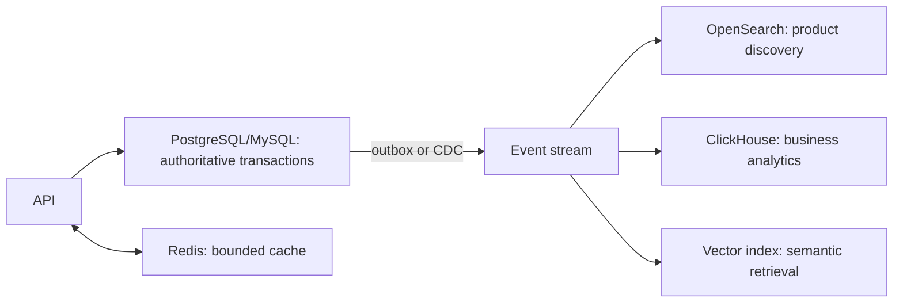

# Database System Design Scenarios

Use these as starting hypotheses, then validate with requirements and benchmarks.

| Scenario | Sensible first choice | Why |
|---|---|---|
| users, roles, orders, payments | PostgreSQL or MySQL | relational invariants, joins, and ACID |
| enterprise ERP/settlement | Oracle, Db2, or SQL Server when standardized | packaged ecosystem, governance, skills, and support |
| globally distributed relational SaaS | CockroachDB | distributed ACID with explicit locality/consensus cost |
| product catalog with varied attributes | PostgreSQL JSONB first; MongoDB if document access dominates | relational safety or bounded aggregate documents |
| inventory reservations | PostgreSQL/MySQL | conditional updates and transaction correctness |
| device telemetry at extreme write scale | Cassandra | time-bucketed partition-key writes and bounded reads |
| bursty cart/session state | DynamoDB or Redis, based on durability | managed key persistence or in-memory latency |
| product full-text discovery | Elasticsearch/OpenSearch read model | relevance, filters, facets, and rebuildable indexes |
| fraud-ring analysis | Neo4j | multi-hop relationship traversal |
| business-event analytics | ClickHouse | compressed columnar scans and aggregation |
| semantic product/document retrieval | pgvector first; dedicated vector store when justified | nearest-neighbor embedding search |
| mobile/desktop local state | SQLite | embedded ACID without a database server |

## Commerce With Derived Read Models

The OLTP database owns correctness. Search, analytics, vectors, and cache are
purpose-built projections with explicit freshness, deletion, replay, and rebuild
procedures. Never implement a synchronous distributed transaction across them.

## Proof-Of-Concept Scorecard

| Category | Evidence | Weight |
|---|---|---:|
| correctness | invariant/isolation tests and consistency during failure | 25% |
| query fit | all critical access patterns without fragile workarounds | 20% |
| performance | p95/p99 at peak plus failure and maintenance headroom | 15% |
| resilience | failover, regional loss, RTO/RPO, and restore results | 15% |
| security/governance | access, encryption, audit, deletion, and residency | 10% |
| operability | monitoring, upgrades, backup, capacity, and on-call skills | 10% |
| total cost | license, infrastructure, egress, service, and people | 5% |

## Common Mistakes

- claiming “NoSQL is faster” without workload-shaped evidence;
- sizing for averages rather than peaks, skew, failures, and maintenance;
- treating MongoDB as schema-free or Cassandra as ad hoc SQL;
- assuming replicas scale writes;
- adding Redis, search, or vectors as authoritative truth without a recovery design;
- ignoring licenses, non-production, backups, egress, and specialist staffing;
- benchmarking steady state without failover, restore, rebalance, or upgrade tests.

Document the decision, rejected alternatives, assumptions, benchmark data,
failure tests, and conditions that would trigger reassessment in an ADR.

## Recommended Next Page

Practice defending those trade-offs in [Database Interview Exercises](./DATABASE-INTERVIEW-EXERCISES.md),
or validate them experimentally in [Database Hands-On Labs](./DATABASE-HANDS-ON-LABS.md).
