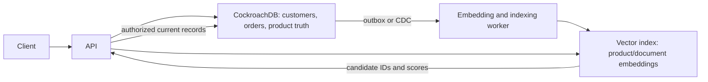

# Vector Databases

A vector index finds embeddings that are near a query vector. It supports RAG,
semantic search, recommendations, image/audio similarity, and deduplication.
It is usually a derived retrieval index, not the transactional source of truth.

## pgvector Or A Dedicated Vector Database?

| Choice | Prefer it when | Trade-off |
|---|---|---|
| PostgreSQL with pgvector | relational metadata, transactions, simpler operations, and moderate vector scale matter | vector work competes with OLTP for CPU, memory, I/O, storage, and vacuum |
| dedicated vector database | vector count/query rate, distributed ingestion, isolation, filtering, or index operations exceed the practical primary-database envelope | another security, backup, monitoring, consistency, and cost domain |

Start with pgvector unless tests demonstrate a reason to separate. Benchmark
vector count, dimensions, metadata-filter selectivity, concurrent queries,
ingestion/update rate, p95/p99 latency, memory, and acceptable recall.

## Index Internals

Approximate nearest-neighbor structures trade exactness for speed:

- **HNSW:** graph-based search with strong query performance and recall, but
  meaningful memory and build/update cost.
- **IVF:** clusters vectors into lists and probes selected lists; training and
  probe count affect recall, latency, and operational behavior.
- **exact/flat search:** compares all candidates; simple and accurate but becomes
  expensive as the filtered candidate set grows.

Embedding model and version, distance metric, normalization, dimensions, chunking,
metadata filters, deletion propagation, and reindexing must be explicit.

## Vector Database vs CockroachDB

They are not direct alternatives.

| Concern | CockroachDB | Vector database / pgvector |
|---|---|---|
| primary job | globally distributed relational transactions | embedding similarity search |
| authoritative data | customers, orders, balances, inventory | normally a derived index plus metadata |
| query style | SQL predicates, joins, ranges, transactions | nearest neighbors plus metadata filters |
| correctness | serializable distributed ACID | relevance and recall; source consistency is external |
| scale pressure | consensus, hot ranges, cross-region latency | vector count, dimensions, recall, memory, and query rate |

The API must re-fetch authorized current records from CockroachDB. A stale or
deleted vector entry must never become authoritative.

## Security And Audit

Enforce tenant filters, row/document authorization, TLS, encryption, protected
API keys, model/version lineage, deletion propagation, and input/output logging
that excludes sensitive content. Audit which identity retrieved which source
records—not only which vector IDs matched.

## Recommended Next Page

Continue with [Database Hands-On Labs](./DATABASE-HANDS-ON-LABS.md).
