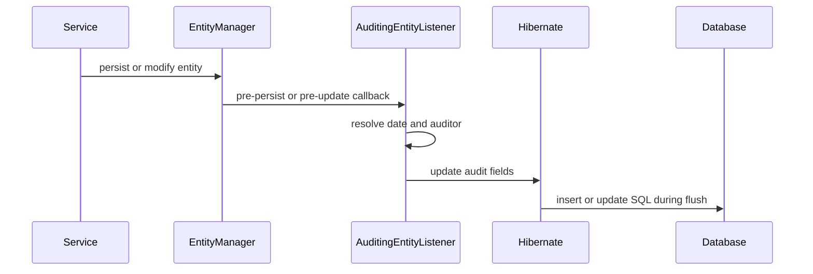

---
title: Hibernate Auditing And Validation
---

# Hibernate Auditing And Validation

Mapped superclasses, Spring Data audit metadata, audit table strategies, and Jakarta Bean Validation.

[Back to Hibernate](../HIBERNATE.md).

## `@MappedSuperclass`

A mapped superclass contributes mappings to entity subclasses but has no table
and cannot be queried as an entity:

```java
@MappedSuperclass
public abstract class AuditedEntity {

    @CreatedDate
    @Column(nullable = false, updatable = false)
    private Instant createdAt;

    @LastModifiedDate
    @Column(nullable = false)
    private Instant updatedAt;
}
```

```java
@Entity
@Table(name = "orders")
public class OrderEntity extends AuditedEntity {
}
```

The `orders` table contains the inherited audit columns.


## Audit Metadata With Spring Data JPA

Enable auditing:

```java
@Configuration(proxyBeanMethods = false)
@EnableJpaAuditing
class JpaAuditingConfiguration {
}
```

Register the listener:

```java
@MappedSuperclass
@EntityListeners(AuditingEntityListener.class)
public abstract class AuditedEntity {

    @CreatedDate
    @Column(nullable = false, updatable = false)
    private Instant createdAt;

    @LastModifiedDate
    @Column(nullable = false)
    private Instant updatedAt;

    @CreatedBy
    @Column(updatable = false)
    private String createdBy;

    @LastModifiedBy
    private String updatedBy;
}
```

Supply the current principal:

```java
@Bean
AuditorAware<String> auditorAware() {
    return () -> Optional.ofNullable(
            SecurityContextHolder.getContext().getAuthentication()
    )
    .filter(Authentication::isAuthenticated)
    .map(Authentication::getName)
    .or(() -> Optional.of("SYSTEM"));
}
```

### Audit Lifecycle



`@CreatedDate` and `@LastModifiedDate` describe row metadata. They do not
provide a complete history of previous values.


## Audit Table Strategies

### Current-Row Audit Columns

```text
created_at
created_by
updated_at
updated_by
```

Best for operational metadata, but cannot reconstruct old states.

### Domain Audit Event Table

```text
audit_event
  event_id
  aggregate_type
  aggregate_id
  action
  actor
  correlation_id
  occurred_at
  metadata_json
```

Best for meaningful business actions such as `PAYMENT_REFUNDED`. Store events
transactionally when they must align with the domain change.

### Hibernate Envers

Envers creates revision tables and records entity changes:

```gradle
implementation 'org.hibernate.orm:hibernate-envers'
```

```java
@Entity
@Audited
class PaymentEntity {
}
```

Typical tables:

```text
payment
payment_AUD
REVINFO
```

Envers is useful for entity history and revision queries. It adds write,
storage, migration, and query complexity.

### Database Triggers Or CDC

Triggers can audit changes regardless of application path. Change Data Capture
can stream database changes. Both are operationally powerful but have weaker
domain meaning unless enriched elsewhere.

Choose according to the question:

| Requirement | Suitable strategy |
|---|---|
| who last changed this row? | audit columns |
| what business action occurred? | domain audit event |
| what was every historical entity state? | Envers/history table |
| capture changes from all writers | trigger or CDC |

Do not store passwords, bearer tokens, full payment credentials, or secrets in
audit records.


## Jakarta Bean Validation With Hibernate

Hibernate Validator is a common Jakarta Validation implementation. Validation
annotations can protect API DTOs, method parameters, and entities:

```gradle
implementation 'org.springframework.boot:spring-boot-starter-validation'
```

```java
public record CreateProductRequest(
        @NotBlank
        @Size(max = 120)
        String name,

        @NotNull
        @Positive
        BigDecimal price
) {
}
```

```java
@Entity
class ProductEntity {

    @NotBlank
    @Column(nullable = false, length = 120)
    private String name;
}
```

DTO validation gives good client errors. Entity validation is an additional
guard before persistence. Database constraints remain the final invariant:

```text
DTO validation
  -> service business validation
  -> entity validation
  -> database constraints
```

Use `@Valid` for nested validation:

```java
public record OrderRequest(
        @NotEmpty
        List<@Valid OrderItemRequest> items
) {
}
```

Use validation groups sparingly; separate request types are often clearer for
create and update contracts.

Do not perform remote calls or expensive database queries in ordinary
constraint validators. Stateful business rules belong in services.


