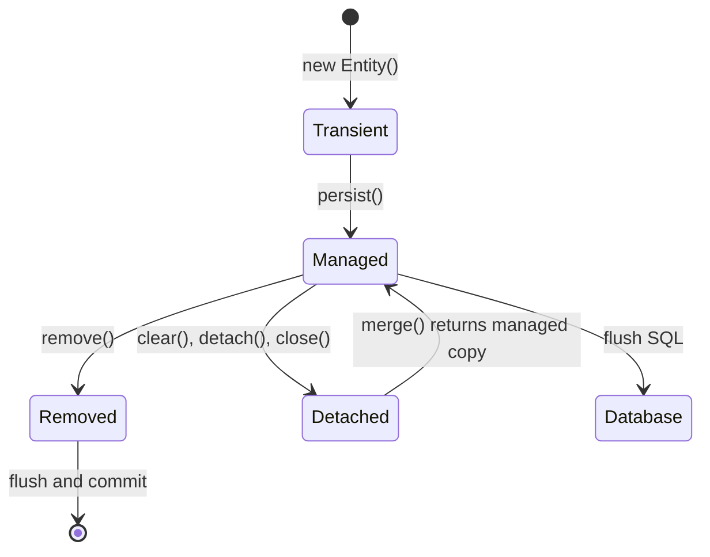

---
title: Hibernate Basics And Lifecycle
---

# Hibernate Basics And Lifecycle

Dependencies, main components, persistence context, object lifecycle, detached objects, persistence methods, loading APIs, and flush versus commit.

[Back to Hibernate](../HIBERNATE.md).

## Dependencies In Spring Boot

```gradle
implementation 'org.springframework.boot:spring-boot-starter-data-jpa'
runtimeOnly 'com.mysql:mysql-connector-j'
```

The JPA starter supplies Spring Data JPA, Hibernate ORM, transaction
integration, and connection-pool support through Spring Boot dependency
management.

```yaml
spring:
  jpa:
    hibernate:
      ddl-auto: validate
    open-in-view: false
```

Use Liquibase or Flyway for production migrations. `ddl-auto=validate` checks
mapping compatibility without letting Hibernate mutate the production schema.


## Main Hibernate Components

| Component | Responsibility |
|---|---|
| `SessionFactory` | thread-safe factory and metadata holder; normally one per persistence unit |
| `Session` | Hibernate persistence context and unit-of-work API |
| `EntityManagerFactory` | standard JPA equivalent of the factory boundary |
| `EntityManager` | standard JPA persistence-context API |
| Persistence context | identity map and managed-entity change tracker |
| `Transaction` / transaction manager | commit and rollback coordination |
| Mapping metadata | entity, table, column, association, identifier, and type mappings |
| Dialect | database-specific SQL capabilities |
| JDBC connection provider | obtains and releases database connections |
| Query engine | parses HQL/JPQL, criteria, and native SQL |
| First-level cache | mandatory session-scoped entity cache |
| Second-level cache | optional shared cache across sessions |

In Spring applications, code normally injects repositories or an
`EntityManager`; Spring manages the underlying factory, session binding, and
transaction lifecycle.


## Persistence Context

A persistence context guarantees one managed Java object per entity identity:

```java
@Transactional
public void demonstrateIdentity(Long id) {
    ProductEntity first = entityManager.find(ProductEntity.class, id);
    ProductEntity second = entityManager.find(ProductEntity.class, id);

    assert first == second;
}
```

The second lookup can be satisfied by the first-level cache without another
database query. This cache is scoped to the persistence context and cannot be
disabled.

Do not treat a persistence context as a general application cache. It should
usually live for one transaction or bounded request use case.


## Hibernate Object Lifecycle



### Transient

A newly created entity not associated with a persistence context:

```java
ProductEntity product = new ProductEntity("SKU-1", "Keyboard");
```

No SQL is generated merely because the object exists.

### Managed Or Persistent

An entity associated with the current persistence context:

```java
entityManager.persist(product);
```

Hibernate tracks managed state. Changes can be written through dirty checking:

```java
@Transactional
public void rename(Long id, String name) {
    ProductEntity product =
            entityManager.find(ProductEntity.class, id);
    product.rename(name);
}
```

Hibernate detects the changed field and issues an `UPDATE` at flush time.

### Detached

An entity with database identity that is no longer managed:

```java
ProductEntity product =
        entityManager.find(ProductEntity.class, id);
entityManager.detach(product);
```

It can also become detached when the persistence context is cleared or closed.

### Removed

An entity scheduled for deletion:

```java
entityManager.remove(product);
```

The SQL `DELETE` normally occurs during flush.


## What Happens If A Detached Object Changes?

Changing a detached object does not trigger dirty checking:

```java
ProductEntity detached = loadOutsideCurrentContext();
detached.rename("New name");
```

No update occurs merely because the field changed.

To copy detached state into a managed instance:

```java
@Transactional
public ProductEntity updateDetached(ProductEntity detached) {
    ProductEntity managed = entityManager.merge(detached);
    return managed;
}
```

Important:

- `merge()` returns the managed instance;
- the argument remains detached;
- Hibernate copies state from the detached object;
- using the returned managed instance avoids later confusion.

```java
ProductEntity managed = entityManager.merge(detached);
assert managed != detached;
```

A safer web application pattern is to load the managed entity and apply
allowed request fields explicitly:

```java
@Transactional
public ProductResponse update(Long id, UpdateProductRequest request) {
    ProductEntity managed = repository.findById(id).orElseThrow();
    managed.rename(request.name());
    managed.changePrice(request.price());
    return mapper.toResponse(managed);
}
```

This prevents over-posting, stale detached graphs, and accidental relationship
replacement.


## `persist()`, `merge()`, `save()`, And `saveOrUpdate()`

This is frequently asked using older Hibernate terminology.

| Method | Meaning | Modern recommendation |
|---|---|---|
| `EntityManager.persist(entity)` | makes a new entity managed; the same object becomes managed | preferred for new JPA entities |
| `EntityManager.merge(entity)` | copies state into a managed instance and returns that instance | use selectively for detached state |
| legacy Hibernate `save(entity)` | historically scheduled insert and returned an identifier | not a modern JPA API |
| legacy Hibernate `saveOrUpdate(entity)` | historically chose insert or reattachment/update | avoid in new code; use explicit state semantics |
| `JpaRepository.save(entity)` | delegates to `persist` for new entities and `merge` otherwise | repository convenience, not Hibernate `save()` |

Modern example:

```java
@Transactional
public ProductEntity create(ProductEntity product) {
    entityManager.persist(product);
    return product;
}
```

Merge example:

```java
@Transactional
public ProductEntity attachChanges(ProductEntity detached) {
    return entityManager.merge(detached);
}
```

Spring Data JPA determines whether an entity is new using version/ID metadata
or `Persistable.isNew()`, then calls `persist()` or `merge()`. Therefore,
`repository.save()` should not be described as identical to Hibernate's old
`Session.save()`.

Do not call `save()` repeatedly on an already managed entity just to force an
update. Dirty checking is sufficient.


## `get()`, `load()`, `find()`, `getReference()`, And Fetching

Older interviews often compare Hibernate `get()` and `load()`. Modern
JPA-oriented equivalents are `find()` and `getReference()`.

| Operation | Result | Missing row |
|---|---|---|
| `EntityManager.find()` | initialized entity or managed instance | returns `null` |
| `Session.get()` / modern `find()` | initialized entity | returns `null` |
| `EntityManager.getReference()` | reference/proxy whose state may load later | may fail when accessed |
| older `Session.load()` terminology | proxy/reference semantics | commonly fails on initialization |

```java
ProductEntity product =
        entityManager.find(ProductEntity.class, id);
```

Use `find()` when entity data is required.

```java
ProductEntity reference =
        entityManager.getReference(ProductEntity.class, id);
order.assignProduct(reference);
```

Use `getReference()` when only an association reference or identifier is
needed and loading the row immediately would be unnecessary.

There is no general JPA entity retrieval method named `fetch()` equivalent to
`get()` or `load()`. "Fetch" usually refers to a fetch plan:

- lazy versus eager mapping;
- JPQL `join fetch`;
- entity graphs;
- batch fetching;
- explicit initialization.

```java
@Query("""
        select order
        from OrderEntity order
        join fetch order.items
        where order.id = :id
        """)
Optional<OrderEntity> findWithItems(Long id);
```


## Flush Versus Commit

Flush synchronizes persistence-context changes to SQL:

```java
entityManager.flush();
```

Commit makes the transaction durable. A flush can happen:

- before commit;
- before a query whose result might depend on pending changes;
- when explicitly requested;
- according to the flush mode.

```text
managed change
  -> dirty checking
  -> flush generates SQL
  -> database constraints execute
  -> commit makes transaction durable
```

An exception after flush can still roll back the transaction.


