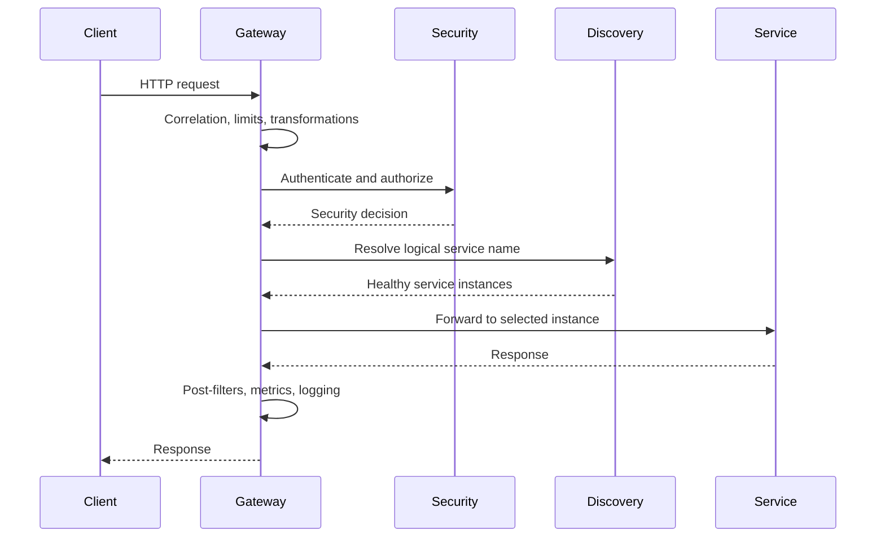
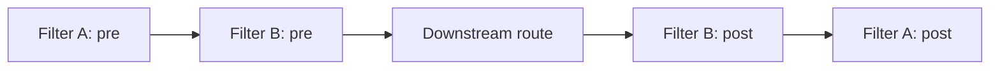
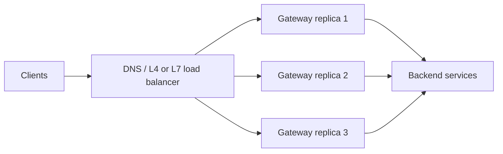

# API Gateway Architecture

<DocLabels items={[{label: 'Advanced', tone: 'advanced'}, {label: 'Shopverse', tone: 'shopverse'}, {label: 'Production', tone: 'production'}]} />

## Common Responsibilities

An API Gateway commonly provides:

- path, host, header, or method-based routing;
- authentication and coarse-grained authorization;
- TLS termination;
- request and response header transformation;
- CORS policy;
- rate limiting and quotas;
- retries, timeouts, and circuit breakers;
- service discovery and load-balanced routing;
- request correlation, metrics, logs, and tracing;
- API version routing;
- payload or protocol adaptation where justified.

Business rules should remain in the owning service. A gateway should not
become a central domain service or a large orchestration layer.

## Gateway, Reverse Proxy, And Load Balancer

| Component | Primary purpose |
|---|---|
| Reverse proxy | Forward client traffic to backend servers and hide backend addresses |
| Load balancer | Distribute traffic across multiple healthy instances |
| API Gateway | Apply API-aware routing, security, policy, and transformations |
| Service mesh | Manage service-to-service networking and policy inside the platform |

One product can perform several of these roles. Spring Cloud Gateway acts as a
reactive API gateway and uses Spring Cloud LoadBalancer for `lb://` routes.

## Generic Request Flow



## Spring Cloud Gateway

Spring Cloud Gateway Server WebFlux is built on Spring WebFlux, Project
Reactor, and Reactor Netty. Routes contain:

- an ID;
- a destination URI;
- predicates that decide whether a route matches;
- filters that modify or observe the exchange.

Example:

```yaml
spring:
  cloud:
    gateway:
      server:
        webflux:
          routes:
            - id: order-service
              uri: lb://ORDER-SERVICE
              predicates:
                - Path=/api/v1/orders/**
```

`Path` is a route predicate. `lb://ORDER-SERVICE` asks the load-balancer
integration to resolve a service instance before forwarding the request.

Typical dependencies:

```gradle
implementation 'org.springframework.boot:spring-boot-starter-webflux'
implementation 'org.springframework.cloud:spring-cloud-starter-gateway-server-webflux'
implementation 'org.springframework.cloud:spring-cloud-starter-netflix-eureka-client'
implementation 'org.springframework.boot:spring-boot-starter-actuator'
```

Add security, circuit-breaker, metrics, tracing, and configuration
dependencies only when those capabilities are used.

## Gateway Filter Types

Spring Cloud Gateway provides:

- `GlobalFilter`: applies across routes;
- route-specific `GatewayFilter`: applies to one route;
- built-in filter factories configured in YAML;
- WebFlux `WebFilter`: operates in the wider reactive web chain.

Built-in filter factories cover concerns such as header mutation, retries,
request-size limits, circuit breakers, path rewriting, and rate limiting.

Use a custom filter when the behavior is genuinely application-specific, such
as Shopverse correlation handling and structured gateway request logging.

## Pre-Filter And Post-Filter Order

Filters wrap the remaining chain:



Pre-filter behavior runs toward the downstream service. Completion behavior
unwinds in the reverse direction through reactive callbacks.

## Gateway Security Boundaries

The gateway is useful for rejecting invalid requests early, but downstream
services should still validate tokens and enforce domain authorization.
Relying only on gateway security allows a caller that bypasses the gateway to
reach an unprotected service.

See [Spring Security](../security/SPRING-SECURITY-GENERIC.md) for servlet and
reactive filter chains, bearer-token authentication, JWT validation, security
contexts, method security, and OAuth2 flows.

Production gateways should:

- validate issuer, audience, signature, and token timestamps;
- use route-specific authorization where appropriate;
- restrict direct service exposure;
- sanitize forwarded headers;
- remove untrusted identity headers before setting trusted ones;
- limit request size and request rate;
- avoid logging tokens, cookies, credentials, or sensitive bodies.

## Resilience At The Gateway

Timeouts, retries, and circuit breakers protect clients from indefinitely
waiting on unhealthy dependencies. Their use must remain bounded:

- retry only safe or idempotent methods;
- avoid retrying authentication and permanent validation failures;
- keep the total retry budget inside the client deadline;
- prevent gateway retries from multiplying service-level retries;
- return an explicit degraded or unavailable response.

Shopverse retries only selected `GET` failures at the gateway.

See [Resilience4j patterns](../reliability/RESILIENCE4J-GENERIC.md) for
Circuit Breaker states, retry safety, Time Limiter semantics, Bulkhead and
Rate Limiter behavior, pattern ordering, and retry amplification.

For Gateway filter factories, Redis token-bucket rate limiting, route-specific
circuit breakers and fallbacks, filter ordering, capacity calculations, and
failure handling, see
[Advanced Spring Cloud Gateway](SPRING-CLOUD-GATEWAY-ADVANCED.md).

## Deployment Patterns

An API Gateway normally runs with multiple stateless replicas behind an
external load balancer:



Keep gateway replicas stateless. Store durable sessions, quotas, or distributed
rate-limit state in an appropriate shared system when required.

## Common Anti-Patterns

- putting business workflows into gateway filters;
- blocking calls in a reactive filter;
- retrying non-idempotent requests without an idempotency strategy;
- trusting caller-supplied identity headers;
- exposing backend services publicly while assuming all traffic uses the
  gateway;
- adding correlation IDs, user IDs, or raw paths as metric labels;
- applying one global timeout and retry policy to every dependency;
- using the gateway as a replacement for service-level authorization.

---

## Recommended Next

Return to [API Gateway Engineering](./API-GATEWAY-GENERIC.md) to select the next focused guide.


## Official References

- [Spring Framework reference](https://docs.spring.io/spring-framework/reference/)
- [Spring Boot reference](https://docs.spring.io/spring-boot/reference/)
