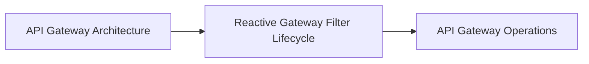

<!-- split-guide-index -->
# API Gateway Engineering

<DocLabels items={[{label: 'Focused guides', tone: 'advanced'}, {label: 'Shopverse', tone: 'shopverse'}, {label: 'Architect route', tone: 'production'}]} />

Understand gateway responsibilities, reactive execution, and production operations. The original long-form material is preserved without duplication across the focused pages below.

<TopicCards items={[
  {title: 'API Gateway Architecture', href: '/development/API-GATEWAY-ARCHITECTURE', description: 'Part 1 of the focused API Gateway Engineering learning route.', icon: 'route', tags: ['Focused', 'Advanced']},
  {title: 'Reactive Gateway Filter Lifecycle', href: '/development/API-GATEWAY-REACTIVE-FILTER-LIFECYCLE', description: 'Part 2 of the focused API Gateway Engineering learning route.', icon: 'layers', tags: ['Focused', 'Advanced']},
  {title: 'API Gateway Operations', href: '/development/API-GATEWAY-OPERATIONS', description: 'Part 3 of the focused API Gateway Engineering learning route.', icon: 'security', tags: ['Focused', 'Advanced']},
]} />

<DocCallout type="tip" title="Use the index as the stable entry point">

Each focused page owns one concern. Cross-links point to the canonical explanation instead of repeating the same material.

</DocCallout>

## Recommended Learning Order

1. [API Gateway Architecture](./API-GATEWAY-ARCHITECTURE.md)
2. [Reactive Gateway Filter Lifecycle](./API-GATEWAY-REACTIVE-FILTER-LIFECYCLE.md)
3. [API Gateway Operations](./API-GATEWAY-OPERATIONS.md)

## Reading Strategy

Use **API Gateway Engineering** as a decision and verification guide inside **API Gateway Engineering**. Start by naming the invariant or operational outcome, then follow the runtime flow and identify the owning component. For every example, record the expected success evidence, the most important failure mode, and the metric or test that proves recovery. This keeps the material useful for implementation reviews, production incidents, and architect interviews instead of treating it as isolated syntax.

Within **API Gateway Engineering**, apply the Shopverse guidance incrementally: verify the current behavior, introduce one bounded change, test the unhappy path, and preserve a rollback or reconciliation route. Follow links to canonical pages when a concept belongs to another track; do not copy that explanation into this page. This ownership rule keeps the focused guides short while retaining technical depth and traceability.

## Official References

- [Spring Framework reference](https://docs.spring.io/spring-framework/reference/)
- [Spring Boot reference](https://docs.spring.io/spring-boot/reference/)
