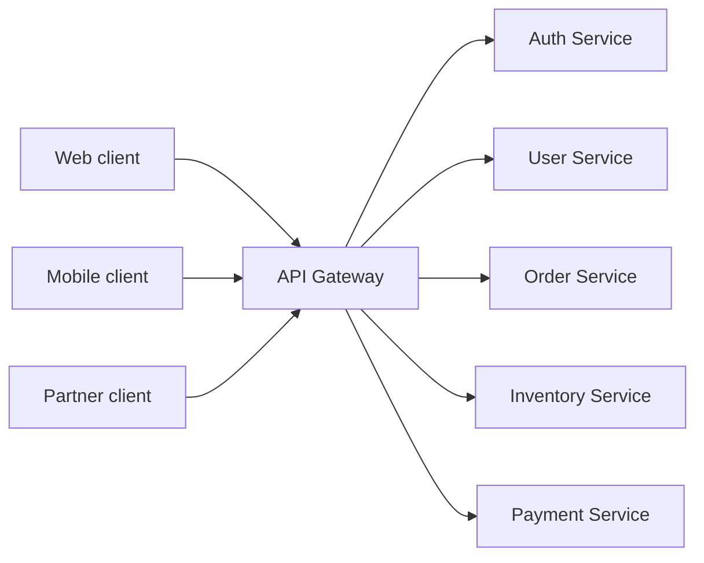
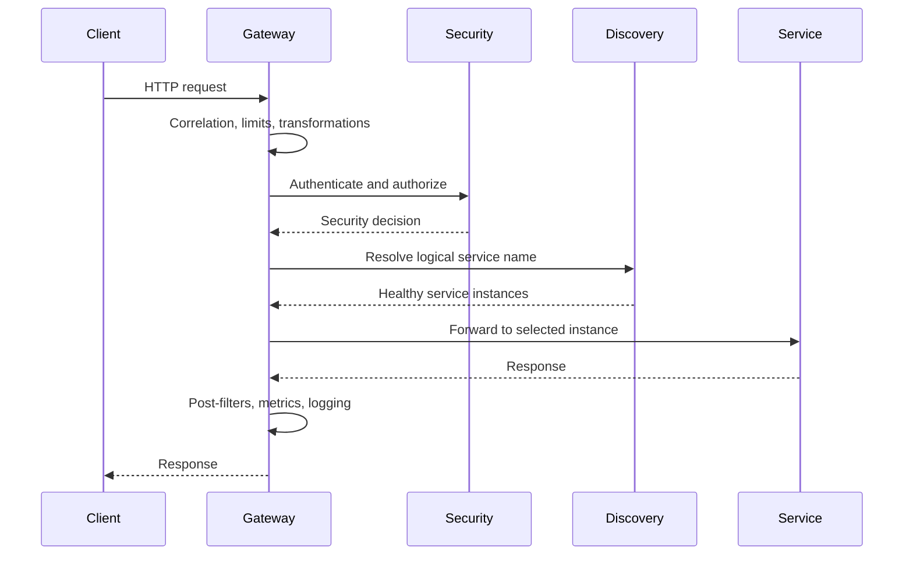
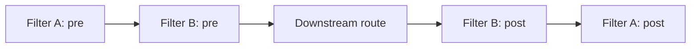
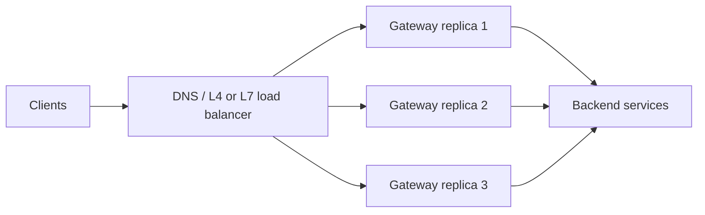
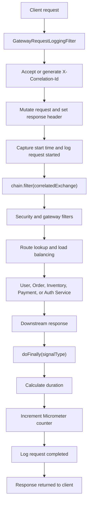

# API Gateway

An API Gateway is a single managed entry point placed between clients and
backend services. It accepts external requests, applies cross-cutting policy,
selects a route, and forwards the request to the appropriate service.

Read this page if you want to understand:

- what an API Gateway does and what it should not own;
- how gateway filters fit into request processing;
- how correlation IDs, logs, and metrics are added at the edge;
- how routing, service discovery, and load balancing work together;
- which gateway concerns should still be enforced inside downstream services.



Without a gateway, every client must know each service address, security
policy, and versioning rule. A gateway centralizes external routing and common
edge concerns while services retain their domain responsibilities.

## Common Responsibilities

An API Gateway commonly provides:

- path, host, header, or method-based routing;
- authentication and coarse-grained authorization;
- TLS termination;
- request and response header transformation;
- CORS policy;
- rate limiting and quotas;
- retries, timeouts, and circuit breakers;
- service discovery and load-balanced routing;
- request correlation, metrics, logs, and tracing;
- API version routing;
- payload or protocol adaptation where justified.

Business rules should remain in the owning service. A gateway should not
become a central domain service or a large orchestration layer.

## Gateway, Reverse Proxy, And Load Balancer

| Component | Primary purpose |
|---|---|
| Reverse proxy | Forward client traffic to backend servers and hide backend addresses |
| Load balancer | Distribute traffic across multiple healthy instances |
| API Gateway | Apply API-aware routing, security, policy, and transformations |
| Service mesh | Manage service-to-service networking and policy inside the platform |

One product can perform several of these roles. Spring Cloud Gateway acts as a
reactive API gateway and uses Spring Cloud LoadBalancer for `lb://` routes.

## Generic Request Flow



## Spring Cloud Gateway

Spring Cloud Gateway Server WebFlux is built on Spring WebFlux, Project
Reactor, and Reactor Netty. Routes contain:

- an ID;
- a destination URI;
- predicates that decide whether a route matches;
- filters that modify or observe the exchange.

Example:

```yaml
spring:
  cloud:
    gateway:
      server:
        webflux:
          routes:
            - id: order-service
              uri: lb://ORDER-SERVICE
              predicates:
                - Path=/api/v1/orders/**
```

`Path` is a route predicate. `lb://ORDER-SERVICE` asks the load-balancer
integration to resolve a service instance before forwarding the request.

Typical dependencies:

```gradle
implementation 'org.springframework.boot:spring-boot-starter-webflux'
implementation 'org.springframework.cloud:spring-cloud-starter-gateway-server-webflux'
implementation 'org.springframework.cloud:spring-cloud-starter-netflix-eureka-client'
implementation 'org.springframework.boot:spring-boot-starter-actuator'
```

Add security, circuit-breaker, metrics, tracing, and configuration
dependencies only when those capabilities are used.

## Gateway Filter Types

Spring Cloud Gateway provides:

- `GlobalFilter`: applies across routes;
- route-specific `GatewayFilter`: applies to one route;
- built-in filter factories configured in YAML;
- WebFlux `WebFilter`: operates in the wider reactive web chain.

Built-in filter factories cover concerns such as header mutation, retries,
request-size limits, circuit breakers, path rewriting, and rate limiting.

Use a custom filter when the behavior is genuinely application-specific, such
as Shopverse correlation handling and structured gateway request logging.

## Pre-Filter And Post-Filter Order

Filters wrap the remaining chain:



Pre-filter behavior runs toward the downstream service. Completion behavior
unwinds in the reverse direction through reactive callbacks.

## Gateway Security Boundaries

The gateway is useful for rejecting invalid requests early, but downstream
services should still validate tokens and enforce domain authorization.
Relying only on gateway security allows a caller that bypasses the gateway to
reach an unprotected service.

See [Spring Security](../security/SPRING-SECURITY-GENERIC.md) for servlet and
reactive filter chains, bearer-token authentication, JWT validation, security
contexts, method security, and OAuth2 flows.

Production gateways should:

- validate issuer, audience, signature, and token timestamps;
- use route-specific authorization where appropriate;
- restrict direct service exposure;
- sanitize forwarded headers;
- remove untrusted identity headers before setting trusted ones;
- limit request size and request rate;
- avoid logging tokens, cookies, credentials, or sensitive bodies.

## Resilience At The Gateway

Timeouts, retries, and circuit breakers protect clients from indefinitely
waiting on unhealthy dependencies. Their use must remain bounded:

- retry only safe or idempotent methods;
- avoid retrying authentication and permanent validation failures;
- keep the total retry budget inside the client deadline;
- prevent gateway retries from multiplying service-level retries;
- return an explicit degraded or unavailable response.

Shopverse retries only selected `GET` failures at the gateway.

See [Resilience4j patterns](../reliability/RESILIENCE4J-GENERIC.md) for
Circuit Breaker states, retry safety, Time Limiter semantics, Bulkhead and
Rate Limiter behavior, pattern ordering, and retry amplification.

For Gateway filter factories, Redis token-bucket rate limiting, route-specific
circuit breakers and fallbacks, filter ordering, capacity calculations, and
failure handling, see
[Advanced Spring Cloud Gateway](SPRING-CLOUD-GATEWAY-ADVANCED.md).

## Deployment Patterns

An API Gateway normally runs with multiple stateless replicas behind an
external load balancer:



Keep gateway replicas stateless. Store durable sessions, quotas, or distributed
rate-limit state in an appropriate shared system when required.

## Common Anti-Patterns

- putting business workflows into gateway filters;
- blocking calls in a reactive filter;
- retrying non-idempotent requests without an idempotency strategy;
- trusting caller-supplied identity headers;
- exposing backend services publicly while assuming all traffic uses the
  gateway;
- adding correlation IDs, user IDs, or raw paths as metric labels;
- applying one global timeout and retry policy to every dependency;
- using the gateway as a replacement for service-level authorization.

---

## Shopverse Reactive Filter Chain

Spring Cloud Gateway uses a reactive filter chain to process requests before
and after routing them to downstream services.

Shopverse uses `GatewayRequestLoggingFilter`, a Spring Cloud Gateway
`GlobalFilter`, to:

- create or reuse a correlation ID;
- forward the correlation ID downstream;
- return it to the client;
- log request start and completion;
- measure total gateway duration;
- publish a Micrometer request counter;
- skip noisy Actuator request logging.

## What `chain` Represents

In a filter method:

```java
public Mono<Void> filter(
        ServerWebExchange exchange,
        GatewayFilterChain chain
) {
    return chain.filter(exchange);
}
```

`chain` represents the remaining filters and the eventual downstream route.
Calling `chain.filter(exchange)` passes the exchange to the next filter.

It is conceptually similar to the Servlet API:

```java
filterChain.doFilter(request, response);
```

The execution models are different:

| Servlet | Spring Cloud Gateway |
|---|---|
| `FilterChain#doFilter(...)` | `GatewayFilterChain#filter(...)` |
| blocking call | returns a reactive `Mono<Void>` |
| servlet request/response | `ServerWebExchange` |
| completion after method returns | completion signalled by the reactive publisher |
| usually one worker thread per request | execution may move between threads |

## Request Lifecycle



## Before And After The Chain

Code before `chain.filter(...)` runs while the request is entering the
gateway:

```java
long startedAt = System.nanoTime();

log.atInfo()
        .addKeyValue("correlationId", correlationId)
        .addKeyValue("method", method)
        .addKeyValue("path", path)
        .log("Gateway request started");

return chain.filter(correlatedExchange);
```

Calling `chain.filter(...)` does not synchronously wait for the downstream
service. It returns a `Mono<Void>` representing future completion.

To run code after downstream processing, attach a reactive operator:

```java
return chain.filter(correlatedExchange)
        .doFinally(signalType -> {
            // completion work
        });
```

`doFinally` runs once when the reactive sequence:

- completes successfully;
- terminates with an error;
- is cancelled.

This makes it suitable for cleanup and final duration measurement.

## Correlation ID Handling

The gateway accepts a caller-provided identifier or creates a UUID:

```java
String correlationId = Optional
        .ofNullable(exchange.getRequest()
                .getHeaders()
                .getFirst("X-Correlation-Id"))
        .filter(value -> !value.isBlank())
        .orElseGet(() -> UUID.randomUUID().toString());
```

WebFlux request objects are immutable. The gateway creates a mutated exchange:

```java
ServerWebExchange correlatedExchange = exchange.mutate()
        .request(request -> request.headers(headers ->
                headers.set("X-Correlation-Id", correlationId)))
        .build();
```

The same value is returned to the client:

```java
correlatedExchange.getResponse()
        .getHeaders()
        .set("X-Correlation-Id", correlationId);
```

The downstream service can put this value into its logging context and
propagate it through Feign calls or Kafka events.

Caller-provided correlation IDs should be validated for length and allowed
characters before being copied into logs and downstream headers.

For the complete Shopverse flow from gateway header creation through servlet
MDC, Feign forwarding, Kafka events, and trace propagation, see
[MDC, correlation IDs, and tracing](../observability/MDC-CORRELATION-TRACING.md#end-to-end-propagation).

## Duration Measurement

The filter uses a monotonic clock:

```java
long startedAt = System.nanoTime();
```

After processing:

```java
long durationMs =
        (System.nanoTime() - startedAt) / 1_000_000;
```

`System.nanoTime()` is appropriate for elapsed duration because it is not
affected by system clock adjustments. It should not be used as a timestamp.

The measured duration includes gateway filters, route resolution, network
time, downstream processing, and response completion visible to the gateway.

## Completion Logging

```java
log.atInfo()
        .addKeyValue("correlationId", correlationId)
        .addKeyValue("method", method)
        .addKeyValue("path", path)
        .addKeyValue("status", status)
        .addKeyValue("durationMs", durationMs)
        .log("Gateway request completed");
```

`log.atInfo()` starts an SLF4J fluent INFO event. Each
`addKeyValue(...)` call adds a structured field, and `.log(...)` emits the
event. The configured structured encoder can produce JSON such as:

```json
{
  "message": "Gateway request completed",
  "correlationId": "123",
  "method": "GET",
  "path": "/api/users",
  "status": 200,
  "durationMs": 45
}
```

See
[Application logging](../observability/LOGGING-GENERIC.md#traditional-and-fluent-slf4j-logging)
for fluent logging internals and encoder behavior.

Structured key/value logging allows Loki to query fields independently:

```logql
{application="API-GATEWAY"}
| json
| correlationId="abc-123"
```

Logs answer questions about one request. Metrics answer aggregate questions
such as request rate, failures, and outcome trends.

## Gateway Metrics

Shopverse records:

```java
meterRegistry.counter(
        "shopverse.gateway.requests.logged",
        "method", method,
        "status", String.valueOf(status),
        "outcome", outcome(status)
).increment();
```

Prometheus exposes the counter approximately as:

```text
shopverse_gateway_requests_logged_total{
  method="GET",
  status="200",
  outcome="SUCCESS"
}
```

Example queries:

```promql
sum(rate(shopverse_gateway_requests_logged_total[5m]))
```

```promql
sum by (outcome) (
  rate(shopverse_gateway_requests_logged_total[5m])
)
```

```promql
sum(
  rate(shopverse_gateway_requests_logged_total{status=~"5.."}[5m])
)
```

Method, status, and outcome are bounded tags. Path, correlation ID, trace ID,
username, and order number must not be metric tags because they create
high-cardinality time series.

See [Micrometer metrics](../observability/MICROMETER-METRICS.md#what-is-a-counter-metric)
for the detailed counter lifecycle, `MeterRegistry` lookup behavior, exported
Prometheus format, queries, dependencies, and tag guidance.

Request counts do not describe latency. See
[Gateway duration Timer](../observability/MICROMETER-METRICS.md#gateway-duration-timer)
for when to use a custom Timer, how histogram buckets enable p95/p99 queries,
and why built-in HTTP timing should be preferred when it already provides the
required signal.

## Actuator Exclusion

Health probes and Prometheus scrapes occur frequently. Shopverse bypasses
custom gateway logging and counting for `/actuator/**`:

```java
if (path.startsWith("/actuator/")) {
    return chain.filter(correlatedExchange);
}
```

The correlation header is still established before this condition. Only the
custom start/completion logs and counter are skipped.

This avoids allowing probe traffic to hide application requests or distort the
custom business-facing gateway metric.

## Filter Ordering

The filter implements `Ordered`:

```java
@Override
public int getOrder() {
    return Ordered.HIGHEST_PRECEDENCE;
}
```

Running early makes the correlation ID available to later gateway filters and
the routed request. Filter order should be intentional because pre-filter code
runs in ascending order while completion callbacks effectively unwind around
the downstream chain.

## Error And Cancellation Details

`doFinally` receives a `SignalType`, such as completion, error, or cancellation:

```java
.doFinally(signalType -> {
    log.debug("Gateway sequence terminated signal={}", signalType);
});
```

Important production considerations:

- a cancelled request may not have a meaningful HTTP status;
- an exception can terminate before a response status is committed;
- assuming status `200` when the status is absent can misclassify errors or
  cancellations;
- `doOnError` can record exception-specific information;
- `doOnSuccess` can handle only successful completion;
- `doFinally` should remain lightweight because it runs for every termination.

The current Shopverse filter defaults a missing status to `200`. This keeps
the POC simple, but a production implementation should classify missing
statuses using the termination signal rather than reporting every missing
status as success.

## Reactive Context And MDC

Traditional MDC is thread-associated. A reactive request may execute on more
than one thread, so placing a value in MDC once and assuming it remains
available throughout a WebFlux pipeline is unsafe.

At the gateway:

- keep correlation data in the immutable exchange and headers;
- use Reactor Context or Micrometer Context Propagation when logging requires
  context across reactive operators;
- let Micrometer tracing manage trace propagation;
- do not call blocking database, network, or filesystem APIs inside a gateway
  filter.

Downstream servlet services can establish a scoped MDC value in their request
filters.

## Production Value

### Request Tracing

The client, gateway, and downstream services share:

```text
X-Correlation-Id: abc-123
```

Operators can use the value to find one business journey across centralized
logs.

### Performance Monitoring

Completion logs contain:

```text
durationMs=2500
```

This identifies slow requests and provides a starting point for checking
downstream Zipkin spans.

### Metrics

Prometheus can calculate request rate, client errors, server errors, and
outcome trends from the gateway counter.

### Client-Assisted Debugging

The gateway returns the correlation ID in the response. A frontend or caller
can provide that value in a support report without receiving internal stack
traces or implementation details.

## Production Practices

1. Keep global filters non-blocking and inexpensive.
2. establish correlation before routing.
3. validate externally supplied correlation IDs.
4. return the correlation ID in the response.
5. use `System.nanoTime()` for elapsed duration.
6. classify completion, error, and cancellation accurately.
7. keep metric labels bounded.
8. never log authorization headers, cookies, tokens, or request bodies by
   default.
9. avoid duplicating Spring's built-in HTTP metrics without a clear business
   reason.
10. exclude or separately classify probes and scrape traffic.
11. use structured logs for request identifiers.
12. use traces for latency relationships and logs for business detail.

## Related Guides

- [Spring Boot internals](SPRING-BOOT-INTERNALS.md)
- [MDC generic guide](../observability/MDC-GENERIC.md)
- [Shopverse correlation and tracing](../observability/MDC-CORRELATION-TRACING.md)
- [Micrometer metrics](../observability/MICROMETER-METRICS.md)
