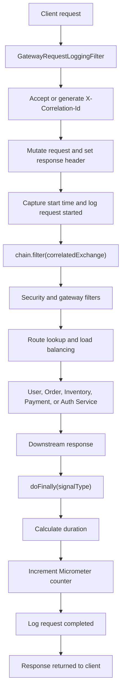

# Reactive Gateway Filter Lifecycle

<DocLabels items={[{label: 'Advanced', tone: 'advanced'}, {label: 'Shopverse', tone: 'shopverse'}, {label: 'Production', tone: 'production'}]} />

## Shopverse Reactive Filter Chain

Spring Cloud Gateway uses a reactive filter chain to process requests before
and after routing them to downstream services.

Shopverse uses `GatewayRequestLoggingFilter`, a Spring Cloud Gateway
`GlobalFilter`, to:

- create or reuse a correlation ID;
- forward the correlation ID downstream;
- return it to the client;
- log request start and completion;
- measure total gateway duration;
- publish a Micrometer request counter;
- skip noisy Actuator request logging.

## What `chain` Represents

In a filter method:

```java
public Mono<Void> filter(
        ServerWebExchange exchange,
        GatewayFilterChain chain
) {
    return chain.filter(exchange);
}
```

`chain` represents the remaining filters and the eventual downstream route.
Calling `chain.filter(exchange)` passes the exchange to the next filter.

It is conceptually similar to the Servlet API:

```java
filterChain.doFilter(request, response);
```

The execution models are different:

| Servlet | Spring Cloud Gateway |
|---|---|
| `FilterChain#doFilter(...)` | `GatewayFilterChain#filter(...)` |
| blocking call | returns a reactive `Mono<Void>` |
| servlet request/response | `ServerWebExchange` |
| completion after method returns | completion signalled by the reactive publisher |
| usually one worker thread per request | execution may move between threads |

## Request Lifecycle



## Before And After The Chain

Code before `chain.filter(...)` runs while the request is entering the
gateway:

```java
long startedAt = System.nanoTime();

log.atInfo()
        .addKeyValue("correlationId", correlationId)
        .addKeyValue("method", method)
        .addKeyValue("path", path)
        .log("Gateway request started");

return chain.filter(correlatedExchange);
```

Calling `chain.filter(...)` does not synchronously wait for the downstream
service. It returns a `Mono<Void>` representing future completion.

To run code after downstream processing, attach a reactive operator:

```java
return chain.filter(correlatedExchange)
        .doFinally(signalType -> {
            // completion work
        });
```

`doFinally` runs once when the reactive sequence:

- completes successfully;
- terminates with an error;
- is cancelled.

This makes it suitable for cleanup and final duration measurement.

## Correlation ID Handling

The gateway accepts a caller-provided identifier or creates a UUID:

```java
String correlationId = Optional
        .ofNullable(exchange.getRequest()
                .getHeaders()
                .getFirst("X-Correlation-Id"))
        .filter(value -> !value.isBlank())
        .orElseGet(() -> UUID.randomUUID().toString());
```

WebFlux request objects are immutable. The gateway creates a mutated exchange:

```java
ServerWebExchange correlatedExchange = exchange.mutate()
        .request(request -> request.headers(headers ->
                headers.set("X-Correlation-Id", correlationId)))
        .build();
```

The same value is returned to the client:

```java
correlatedExchange.getResponse()
        .getHeaders()
        .set("X-Correlation-Id", correlationId);
```

The downstream service can put this value into its logging context and
propagate it through Feign calls or Kafka events.

Caller-provided correlation IDs should be validated for length and allowed
characters before being copied into logs and downstream headers.

For the complete Shopverse flow from gateway header creation through servlet
MDC, Feign forwarding, Kafka events, and trace propagation, see
[MDC, correlation IDs, and tracing](../observability/CORRELATION-IDENTIFIERS-HTTP-PROPAGATION.md#end-to-end-propagation).

## Duration Measurement

The filter uses a monotonic clock:

```java
long startedAt = System.nanoTime();
```

After processing:

```java
long durationMs =
        (System.nanoTime() - startedAt) / 1_000_000;
```

`System.nanoTime()` is appropriate for elapsed duration because it is not
affected by system clock adjustments. It should not be used as a timestamp.

The measured duration includes gateway filters, route resolution, network
time, downstream processing, and response completion visible to the gateway.

## Completion Logging

```java
log.atInfo()
        .addKeyValue("correlationId", correlationId)
        .addKeyValue("method", method)
        .addKeyValue("path", path)
        .addKeyValue("status", status)
        .addKeyValue("durationMs", durationMs)
        .log("Gateway request completed");
```

`log.atInfo()` starts an SLF4J fluent INFO event. Each
`addKeyValue(...)` call adds a structured field, and `.log(...)` emits the
event. The configured structured encoder can produce JSON such as:

```json
{
  "message": "Gateway request completed",
  "correlationId": "123",
  "method": "GET",
  "path": "/api/users",
  "status": 200,
  "durationMs": 45
}
```

See
[Application logging](../observability/LOGGING-GENERIC.md#traditional-and-fluent-slf4j-logging)
for fluent logging internals and encoder behavior.

Structured key/value logging allows Loki to query fields independently:

```logql
{application="API-GATEWAY"}
| json
| correlationId="abc-123"
```

Logs answer questions about one request. Metrics answer aggregate questions
such as request rate, failures, and outcome trends.

## Recommended Next

Return to [API Gateway Engineering](./API-GATEWAY-GENERIC.md) to select the next focused guide.


## Official References

- [Spring Framework reference](https://docs.spring.io/spring-framework/reference/)
- [Spring Boot reference](https://docs.spring.io/spring-boot/reference/)
