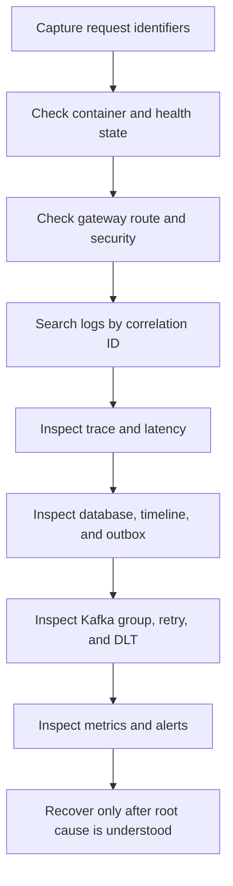

# Debugging Requests And Platform Dependencies

<DocLabels items={[{label: 'Advanced', tone: 'advanced'}, {label: 'Shopverse', tone: 'shopverse'}, {label: 'Production', tone: 'production'}]} />

## First Five Minutes

Capture:

```text
exact timestamp and timezone
endpoint and HTTP method
response status and error body
username or role, without credentials
X-Correlation-Id
traceId when available
order ID and order number
idempotency key, when relevant
affected service/container
```

Do not immediately restart everything, delete volumes, reset Kafka offsets, or
edit database rows. Those actions can destroy the evidence needed to identify
the failure.

## Symptom Map

| Symptom | First checks |
|---|---|
| `400` or validation error | request body, headers, Jakarta Validation |
| `401` | token presence, expiry, issuer, signature/JWKS |
| `403` | role, permission, ownership, method security |
| `404` | gateway route, resource identity, service data |
| `409` | idempotency, uniqueness, optimistic lock |
| `429` | rate limiter and traffic volume |
| `5xx` | correlation logs, trace, service/database dependency |
| checkout stuck | timeline, outbox, Kafka lag, retry/DLT |
| stock incorrect | reservations, version conflicts, expiry/compensation |
| payment uncertain | payment state, simulation mode, reconciliation |
| no logs in Loki | source log, Promtail target/positions/pipeline, Loki |
| no metric | actuator endpoint, Prometheus target, name/tags |
| no trace | sampling, instrumentation, exporter, Zipkin |
| startup failure | Config Server, datasource, Liquibase, Eureka, dependency |
| tests hang | Testcontainers, Docker resources, Awaitility, executors |

## Investigation Order



## Container And Process State

<CommandTabs
  powershell={<pre><code>{`docker compose ps
docker compose logs --tail=200 order-service
docker inspect --format '{{json .State.Health}}' shopverse-order-service
docker stats --no-stream`}</code></pre>}
  bash={<pre><code>{`docker compose ps
docker compose logs --tail=200 order-service
docker inspect --format '{{json .State.Health}}' shopverse-order-service
docker stats --no-stream`}</code></pre>}
/>

Check one affected dependency chain first. Streaming every container can hide
the useful event in probe and startup noise.

For startup order:

```text
MySQL and Kafka
Config Server
Discovery Server
business services
API Gateway
observability stack
```

## Health And Actuator

<CommandTabs
  powershell={<pre><code>{`curl.exe http://localhost:8083/actuator/health
curl.exe http://localhost:8083/actuator/prometheus`}</code></pre>}
  bash={<pre><code>{`curl http://localhost:8083/actuator/health
curl http://localhost:8083/actuator/prometheus`}</code></pre>}
/>

`UP` means configured health contributors pass. It does not prove that a full
checkout, Kafka consumer, or external dependency is working.

## Correlate The Request

Prefer a caller-supplied identifier:

```http
X-Correlation-Id: debug-order-1003
```

Loki:

```logql
{log_type="application"}
| json
| correlationId="debug-order-1003"
```

One service:

```logql
{application="ORDER-SERVICE"}
| json
| correlationId="debug-order-1003"
```

Use `traceId` in Zipkin for one technical call tree. Use correlation ID for a
SAGA that can span several traces.

## Gateway And Routing

When the service works directly but not through port `8080`:

1. Confirm the exact route predicate in `cloud-configs/API-GATEWAY.yml`.
2. Confirm Eureka contains the logical service name.
3. Check gateway logs for route and status.
4. Check the downstream service received the same correlation ID.
5. Check rate limiter, circuit breaker, and timeout behavior.

Useful endpoints:

```text
Gateway health: http://localhost:8080/actuator/health
Eureka:         http://localhost:8761
```

## Authentication And Authorization

### `401 Unauthorized`

Check:

- `Authorization: Bearer <token>` format;
- expiry (`exp`);
- issuer (`iss`);
- signature key ID (`kid`) and JWKS;
- Auth Service JWKS reachability;
- system clock;
- public path matchers at both gateway and service.

Do not paste a real token into logs or documentation.

### `403 Forbidden`

Authentication succeeded. Check:

- authorities extracted from the `roles` claim;
- `ROLE_` prefix expectations;
- permission names used by `@PreAuthorize`;
- ownership lookup for Order/Payment;
- authenticated username versus resource owner;
- administrator authority.

## Config Server

```powershell
curl.exe http://localhost:8888/ORDER-SERVICE/default
docker compose logs --tail=200 config-server
```

Check:

- application name and config filename match;
- active profile;
- Git/native search location;
- Config Server health;
- property source precedence;
- environment variable override;
- whether the property is refreshable or requires restart.

A successful refresh endpoint does not mean every infrastructure bean was
rebuilt.

## Eureka And Load Balancing

If Feign reports no available instance:

1. Confirm the target service is registered under the expected uppercase
   logical name.
2. Check its health and network reachability.
3. Check Eureka default-zone configuration.
4. Inspect lease renewal and stale instances.
5. Check Feign connect/read timeout and circuit state.

Do not replace logical names with hard-coded container IPs.

## Recommended Next

Return to [Shopverse Debugging](./DEBUGGING.md) to select the next focused guide.


## Official References

- [Spring Framework reference](https://docs.spring.io/spring-framework/reference/)
- [Spring Boot reference](https://docs.spring.io/spring-boot/reference/)
