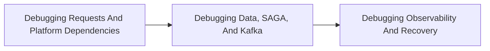

<!-- split-guide-index -->
# Shopverse Debugging

<DocLabels items={[{label: 'Focused guides', tone: 'advanced'}, {label: 'Shopverse', tone: 'shopverse'}, {label: 'Architect route', tone: 'production'}]} />

Evidence-first diagnosis across routing, security, data, messaging, and observability. The original long-form material is preserved without duplication across the focused pages below.

<TopicCards items={[
  {title: 'Debugging Requests And Platform Dependencies', href: '/development/DEBUGGING-REQUEST-PLATFORM', description: 'Part 1 of the focused Shopverse Debugging learning route.', icon: 'route', tags: ['Focused', 'Advanced']},
  {title: 'Debugging Data, SAGA, And Kafka', href: '/development/DEBUGGING-DATA-SAGA-KAFKA', description: 'Part 2 of the focused Shopverse Debugging learning route.', icon: 'layers', tags: ['Focused', 'Advanced']},
  {title: 'Debugging Observability And Recovery', href: '/development/DEBUGGING-OBSERVABILITY-RECOVERY', description: 'Part 3 of the focused Shopverse Debugging learning route.', icon: 'security', tags: ['Focused', 'Advanced']},
]} />

<DocCallout type="tip" title="Use the index as the stable entry point">

Each focused page owns one concern. Cross-links point to the canonical explanation instead of repeating the same material.

</DocCallout>

## Recommended Learning Order

1. [Debugging Requests And Platform Dependencies](./DEBUGGING-REQUEST-PLATFORM.md)
2. [Debugging Data, SAGA, And Kafka](./DEBUGGING-DATA-SAGA-KAFKA.md)
3. [Debugging Observability And Recovery](./DEBUGGING-OBSERVABILITY-RECOVERY.md)

## Reading Strategy

Use **Shopverse Debugging** as a decision and verification guide inside **Shopverse Debugging**. Start by naming the invariant or operational outcome, then follow the runtime flow and identify the owning component. For every example, record the expected success evidence, the most important failure mode, and the metric or test that proves recovery. This keeps the material useful for implementation reviews, production incidents, and architect interviews instead of treating it as isolated syntax.

Within **Shopverse Debugging**, apply the Shopverse guidance incrementally: verify the current behavior, introduce one bounded change, test the unhappy path, and preserve a rollback or reconciliation route. Follow links to canonical pages when a concept belongs to another track; do not copy that explanation into this page. This ownership rule keeps the focused guides short while retaining technical depth and traceability.

## Official References

- [Spring Framework reference](https://docs.spring.io/spring-framework/reference/)
- [Spring Boot reference](https://docs.spring.io/spring-boot/reference/)
