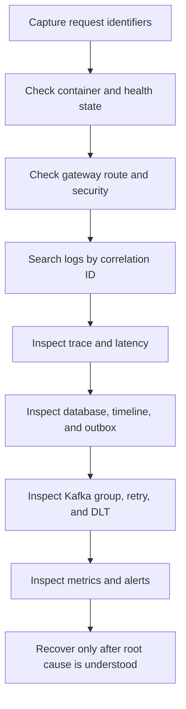

# Shopverse Debugging Runbook

Use this guide to preserve evidence, isolate the failing layer, and recover
without creating duplicate business effects.

## First Five Minutes

Capture:

```text
exact timestamp and timezone
endpoint and HTTP method
response status and error body
username or role, without credentials
X-Correlation-Id
traceId when available
order ID and order number
idempotency key, when relevant
affected service/container
```

Do not immediately restart everything, delete volumes, reset Kafka offsets, or
edit database rows. Those actions can destroy the evidence needed to identify
the failure.

## Symptom Map

| Symptom | First checks |
|---|---|
| `400` or validation error | request body, headers, Jakarta Validation |
| `401` | token presence, expiry, issuer, signature/JWKS |
| `403` | role, permission, ownership, method security |
| `404` | gateway route, resource identity, service data |
| `409` | idempotency, uniqueness, optimistic lock |
| `429` | rate limiter and traffic volume |
| `5xx` | correlation logs, trace, service/database dependency |
| checkout stuck | timeline, outbox, Kafka lag, retry/DLT |
| stock incorrect | reservations, version conflicts, expiry/compensation |
| payment uncertain | payment state, simulation mode, reconciliation |
| no logs in Loki | source log, Promtail target/positions/pipeline, Loki |
| no metric | actuator endpoint, Prometheus target, name/tags |
| no trace | sampling, instrumentation, exporter, Zipkin |
| startup failure | Config Server, datasource, Liquibase, Eureka, dependency |
| tests hang | Testcontainers, Docker resources, Awaitility, executors |

## Investigation Order



## Container And Process State

```powershell
docker compose ps
docker compose logs --tail=200 order-service
docker inspect --format '{{json .State.Health}}' shopverse-order-service
docker stats --no-stream
```

Check one affected dependency chain first. Streaming every container can hide
the useful event in probe and startup noise.

For startup order:

```text
MySQL and Kafka
Config Server
Discovery Server
business services
API Gateway
observability stack
```

## Health And Actuator

```powershell
curl.exe http://localhost:8083/actuator/health
curl.exe http://localhost:8083/actuator/prometheus
```

`UP` means configured health contributors pass. It does not prove that a full
checkout, Kafka consumer, or external dependency is working.

## Correlate The Request

Prefer a caller-supplied identifier:

```http
X-Correlation-Id: debug-order-1003
```

Loki:

```logql
{log_type="application"}
| json
| correlationId="debug-order-1003"
```

One service:

```logql
{application="ORDER-SERVICE"}
| json
| correlationId="debug-order-1003"
```

Use `traceId` in Zipkin for one technical call tree. Use correlation ID for a
SAGA that can span several traces.

## Gateway And Routing

When the service works directly but not through port `8080`:

1. Confirm the exact route predicate in `cloud-configs/API-GATEWAY.yml`.
2. Confirm Eureka contains the logical service name.
3. Check gateway logs for route and status.
4. Check the downstream service received the same correlation ID.
5. Check rate limiter, circuit breaker, and timeout behavior.

Useful endpoints:

```text
Gateway health: http://localhost:8080/actuator/health
Eureka:         http://localhost:8761
```

## Authentication And Authorization

### `401 Unauthorized`

Check:

- `Authorization: Bearer <token>` format;
- expiry (`exp`);
- issuer (`iss`);
- signature key ID (`kid`) and JWKS;
- Auth Service JWKS reachability;
- system clock;
- public path matchers at both gateway and service.

Do not paste a real token into logs or documentation.

### `403 Forbidden`

Authentication succeeded. Check:

- authorities extracted from the `roles` claim;
- `ROLE_` prefix expectations;
- permission names used by `@PreAuthorize`;
- ownership lookup for Order/Payment;
- authenticated username versus resource owner;
- administrator authority.

## Config Server

```powershell
curl.exe http://localhost:8888/ORDER-SERVICE/default
docker compose logs --tail=200 config-server
```

Check:

- application name and config filename match;
- active profile;
- Git/native search location;
- Config Server health;
- property source precedence;
- environment variable override;
- whether the property is refreshable or requires restart.

A successful refresh endpoint does not mean every infrastructure bean was
rebuilt.

## Eureka And Load Balancing

If Feign reports no available instance:

1. Confirm the target service is registered under the expected uppercase
   logical name.
2. Check its health and network reachability.
3. Check Eureka default-zone configuration.
4. Inspect lease renewal and stale instances.
5. Check Feign connect/read timeout and circuit state.

Do not replace logical names with hard-coded container IPs.

## Database And Liquibase

Check service logs for:

```text
connection refused
access denied
unknown database
pool timeout
checksum validation
DATABASECHANGELOGLOCK
schema validation
deadlock
optimistic locking
unique constraint
```

For a stuck Liquibase lock, first prove no migration process is active. Preserve
startup logs and inspect `DATABASECHANGELOGLOCK`. Clearing a live lock can allow
concurrent schema changes.

For query/load issues, inspect:

- Hikari active, idle, and pending connections;
- slow queries and indexes;
- transaction duration;
- lock waits and deadlocks;
- unbounded list endpoints;
- N+1 query patterns.

## Checkout And SAGA

Inspect in this order:

1. `orders`
2. `order_items`
3. `order_timeline_events`
4. Order `outbox_events`
5. Inventory `inventory_reservations`
6. Inventory `outbox_events`
7. `payments`
8. Payment `outbox_events`
9. each service's `failed_kafka_events`

Interpretation:

| Last evidence | Likely area |
|---|---|
| Order exists, no outbox | local transaction/code defect |
| Order outbox pending | publisher or Kafka |
| Order outbox published, no reservation | Inventory consumer/group/schema |
| reservation exists, no Inventory outbox | Inventory transaction defect |
| inventory event published, no payment | Payment consumer |
| payment captured, Order not confirmed | Payment outbox or Order consumer |
| payment failed, stock still reserved | compensation consumer |

Never create a second checkout to “unstick” the first with a new idempotency
key until its state is understood.

## Outbox Failure

PromQL:

```promql
sum by (outcome) (increase(shopverse_outbox_publish_total[15m]))
```

Check:

- scheduler is running;
- outbox status and attempts;
- Kafka DNS/network/topic;
- broker acknowledgement timeout;
- row-lock errors;
- serialization;
- repeated unbounded retries.

The current implementation lacks a complete terminal/backoff policy. During a
long Kafka outage, monitor resource use and log volume.

## Kafka

List and describe topics:

```powershell
docker compose exec kafka kafka-topics.sh `
  --bootstrap-server localhost:9092 `
  --list

docker compose exec kafka kafka-topics.sh `
  --bootstrap-server localhost:9092 `
  --describe `
  --topic shopverse.order.created
```

Inspect groups and lag:

```powershell
docker compose exec kafka kafka-consumer-groups.sh `
  --bootstrap-server localhost:9092 `
  --describe --all-groups
```

Growing lag can mean slow handlers, failures, too few active consumers, hot
partitions, database contention, or rebalance loops.

Check retry and DLT topics before declaring a message lost.

## DLT And Replay

1. Confirm attempts were exhausted.
2. Inspect the DLT handler log.
3. Inspect `failed_kafka_events`.
4. Identify whether the cause is malformed data, incompatible schema, missing
   state, or unavailable dependency.
5. Fix the cause.
6. Replay through the admin API.
7. Confirm replay audit and downstream idempotency.

Do not repeatedly replay unchanged poison data.

## Duplicate Requests

For duplicate checkout:

- verify the same idempotency key was reused;
- inspect the unique constraint failure;
- confirm the key is associated with the same logical request;
- inspect one order/reservation/payment result;
- distinguish HTTP retry from duplicate Kafka delivery.

Different keys intentionally represent different commands.

## Inventory Conflicts

An optimistic-lock exception means concurrent updates used the same entity
version. Confirm:

- available and reserved quantities;
- reservation uniqueness/order association;
- retry count and idempotency;
- transaction boundaries;
- whether a stale entity was retained outside a transaction.

Retry with fresh state only when the complete business operation is idempotent.

## Payment Problems

Check:

- current simulation mode;
- payment status;
- failure reason;
- order owner;
- outgoing outbox row;
- completion/failure event;
- reconciliation/refund audit.

`TIMED_OUT` is an uncertain outcome, not automatically a decline. Use the
reconciliation API rather than creating a second charge.

## Prometheus

Target health:

```promql
up{job="shopverse-services"}
```

Errors:

```promql
sum by (application) (
  rate(http_server_requests_seconds_count{status=~"5.."}[5m])
)
```

Latency:

```promql
histogram_quantile(
  0.95,
  sum by (le, application) (
    rate(http_server_requests_seconds_bucket[5m])
  )
)
```

If a metric is missing:

1. open the service `/actuator/prometheus`;
2. search the normalized metric name;
3. check Prometheus target state and scrape error;
4. check the query's labels and time range;
5. trigger the code path that creates lazy custom meters.

## Promtail And Loki

Pipeline:

```text
source file/stdout -> Promtail discovery -> JSON parsing -> labels
-> positions file -> Loki push -> Grafana query
```

If logs are missing:

1. confirm the line exists in the source file or `docker compose logs`;
2. check Promtail container logs;
3. check mounted path and `__path__`;
4. check the positions file behavior;
5. verify valid JSON and timestamp parsing;
6. query by broad `job` before narrowing labels;
7. check Loki readiness and retention window.

Because the POC collects stdout and files, duplicate records can appear.
Choose one job when counting.

## Grafana

Grafana queries other systems. An empty panel can mean:

- wrong datasource;
- invalid PromQL/LogQL;
- wrong dashboard variable;
- time range excludes data;
- no traffic created the metric;
- datasource or backend unavailable.

Run the raw query in Explore or the Prometheus/Loki UI before changing the
dashboard.

## Zipkin

If no trace appears:

- verify tracing is enabled and sampling probability;
- confirm Zipkin endpoint from inside the service network;
- inspect exporter errors;
- trigger an instrumented HTTP/Feign/Kafka path;
- search the exact trace ID and correct time window.

Correlation ID is not the Zipkin trace identifier.

## Testcontainers And CI

For hanging or slow tests:

- confirm Docker is available;
- check image pull and container startup;
- use reusable shared containers per test suite;
- bound Awaitility and process timeouts;
- stop leaked executors/listeners;
- avoid full application context for simple unit tests;
- inspect Gradle test reports rather than rerunning blindly.

CI config validation failures often come from exact filename/application-name
mismatches in `cloud-configs`.

## Safe Recovery Principles

1. Preserve logs, correlation ID, trace, offsets, and database state.
2. Fix the cause before replay.
3. Prefer normal APIs and outbox replay over direct database mutation.
4. Never delete a pending outbox row to hide an error.
5. Never reset a consumer group without estimating duplicate business effects.
6. Back up before destructive database repair.
7. Record who performed recovery and why.
8. Verify business state, not only HTTP success.

## Related Guides

- [System design](../architecture/SYSTEM-DESIGN.md)
- [Distributed systems](../architecture/DISTRIBUTED-SYSTEMS.md)
- [Spring Kafka](../spring/SPRING-KAFKA.md)
- [Observability](../observability/OBSERVABILITY.md)
- [Features and demos](../reference/FEATURES-AND-DEMOS.md)
