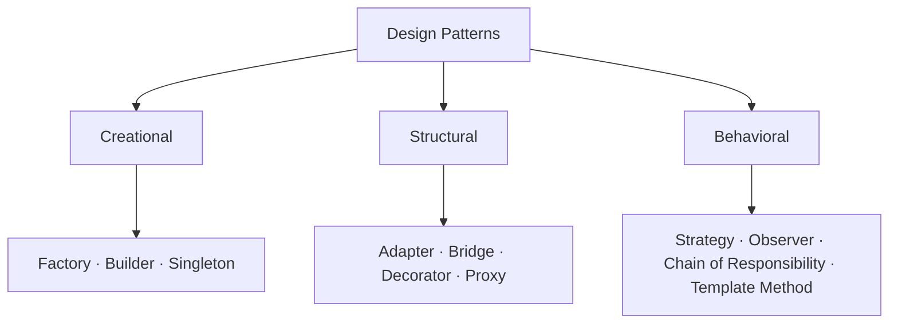

<!-- split-guide-index -->
# Design Patterns

<DocLabels items={[{label: 'Pattern catalog', tone: 'advanced'}, {label: 'Shopverse', tone: 'shopverse'}, {label: 'Architect route', tone: 'production'}]} />

Select and apply object, behavioral, integration, and reliability patterns. Use the
category guides for comparison and the dedicated pattern pages for implementation,
runtime mechanics, trade-offs, testing, and interview preparation.

## Start With The Design Pressure

A pattern is a named response to a recurring design pressure, not a target for
the codebase. Before choosing one, write down:

1. **The problem:** what change, dependency, or invariant is difficult today?
2. **The variation point:** what must be allowed to change independently?
3. **The stable boundary:** what should callers be able to rely on?
4. **The simplest baseline:** would a constructor, method, or small composition
   solve the problem without a pattern?
5. **The cost:** which new types, indirection, lifecycle rules, or debugging
   difficulties will the pattern introduce?
6. **The evidence:** which test proves the pattern protects the intended
   behavior?

Every dedicated guide uses this reasoning model: **problem → naive design →
pattern implementation → alternatives → drawbacks → mitigations → tests**.

## Browse by Pattern Family

<TopicCards items={[
  {title: 'Pattern Selection Cheat Sheet', href: '/development/design-patterns/DESIGN-PATTERN-SELECTION-CHEATSHEET', description: 'Choose across all GoF patterns from the design pressure, trade-off, and closest alternatives.', icon: 'brain', tags: ['Decision guide', 'GoF']},
  {title: 'Creational Patterns', href: '/development/design-patterns/CREATIONAL-PATTERNS', description: 'Control how objects are selected, assembled, copied, and scoped.', icon: 'boxes', tags: ['Five GoF patterns', 'Java + Spring']},
  {title: 'Structural Patterns', href: '/development/design-patterns/STRUCTURAL-PATTERNS', description: 'Compose objects and adapt boundaries without rigid inheritance.', icon: 'layers', tags: ['Adapter', 'Bridge', 'Decorator', 'Proxy']},
  {title: 'Behavioral Patterns', href: '/development/design-patterns/BEHAVIORAL-PATTERNS', description: 'Organize algorithms, events, workflows, and ordered responsibility.', icon: 'route', tags: ['Strategy', 'Observer', 'Chain', 'Template Method']},
]} />

<DocCallout type="production" title="Highest-priority patterns for Spring interviews">

Give extra attention to **Strategy, Factory, Proxy, Observer, Chain of
Responsibility, Adapter, and Template Method**. They appear repeatedly in Spring
architecture discussions because the container, AOP infrastructure, event model,
web stack, and extension points make these patterns visible in real applications.

For each one, be ready to explain the problem it solves, a Spring implementation,
one framework example, its main trade-off, and when a simpler design is better.

</DocCallout>

## Spring Interview Deep Dives

<TopicCards items={[
  {title: 'Strategy', href: '/development/design-patterns/strategy', description: 'Select interchangeable behavior with injected Spring beans.', icon: 'route', tags: ['Interview priority', 'Behavioral']},
  {title: 'Factory', href: '/development/design-patterns/factory', description: 'Centralize creation or runtime implementation selection.', icon: 'boxes', tags: ['Interview priority', 'Creational']},
  {title: 'Proxy', href: '/development/design-patterns/proxy', description: 'Understand AOP, transactions, caching, security, and self-invocation.', icon: 'security', tags: ['Interview priority', 'Structural']},
  {title: 'Observer', href: '/development/design-patterns/observer', description: 'Publish in-process events and choose safe transaction boundaries.', icon: 'network', tags: ['Interview priority', 'Behavioral']},
  {title: 'Chain of Responsibility', href: '/development/design-patterns/chain-of-responsibility', description: 'Build ordered handlers like filters, validators, and security chains.', icon: 'layers', tags: ['Interview priority', 'Behavioral']},
  {title: 'Adapter', href: '/development/design-patterns/adapter', description: 'Keep vendor APIs and DTOs outside the application core.', icon: 'code', tags: ['Interview priority', 'Structural']},
  {title: 'Template Method', href: '/development/design-patterns/template-method', description: 'Hold a workflow stable while selected steps vary.', icon: 'brain', tags: ['Interview priority', 'Behavioral']},
]} />

## Recommended Learning Order

1. [Pattern Selection Cheat Sheet](./design-patterns/DESIGN-PATTERN-SELECTION-CHEATSHEET.md)
2. [Creational Patterns](./design-patterns/CREATIONAL-PATTERNS.md)
3. [Structural Patterns](./design-patterns/STRUCTURAL-PATTERNS.md)
4. [Behavioral Patterns](./design-patterns/BEHAVIORAL-PATTERNS.md)

## Reading Strategy

Use **Design Patterns** as a decision and verification guide inside **Design Patterns**. Start by naming the invariant or operational outcome, then follow the runtime flow and identify the owning component. For every example, record the expected success evidence, the most important failure mode, and the metric or test that proves recovery. This keeps the material useful for implementation reviews, production incidents, and architect interviews instead of treating it as isolated syntax.

Within **Design Patterns**, apply the Shopverse guidance incrementally: verify the current behavior, introduce one bounded change, test the unhappy path, and preserve a rollback or reconciliation route. Follow links to canonical pages when a concept belongs to another track; do not copy that explanation into this page. This ownership rule keeps the focused guides short while retaining technical depth and traceability.

## Official References

- [Spring Framework reference](https://docs.spring.io/spring-framework/reference/)
- [Spring Boot reference](https://docs.spring.io/spring-boot/reference/)
